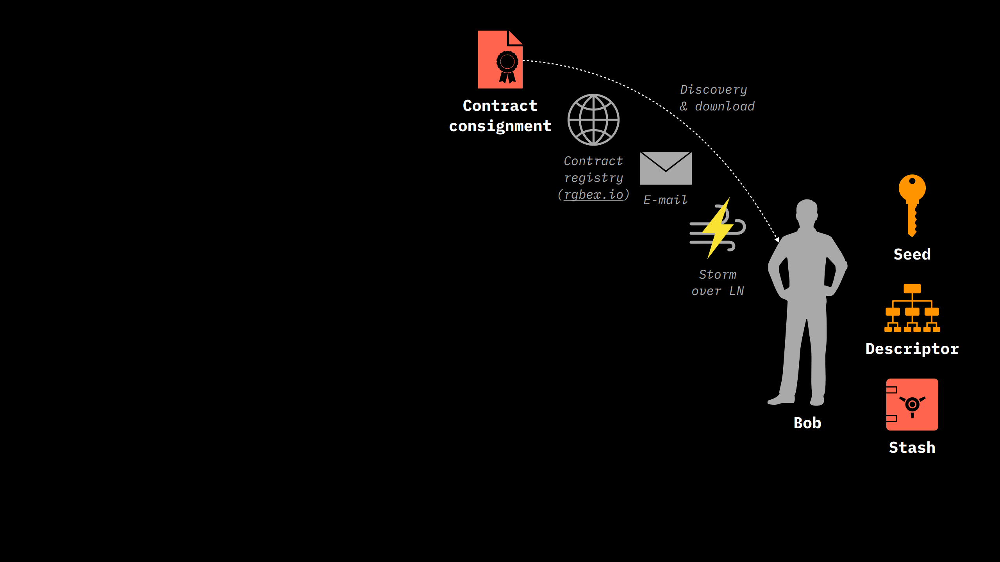

# Contract Transfers

In this section we will be guided through a step by steps RGB Contract Transfer operation, again with the cooperation of our cryptographic couple: Alice and Bob. We will also provide some coding sections of both our charcters, which uses the `rgb` Command Line Interface Tool which can be installed from the dedicated [RGB library](rgb-library-map.md#rgb-cli).

Let consider the case of Bob, who owns a Bitcoin wallet but has not yet started using RGB technology.

1. To begin operating with RGB protocol, **Bob must install an RGB wallet** and add a contract to it. This startup process involves installing the RGB wallet software, which usually, by default, contains no contracts. The RGB wallet software, in addition, require the ability to interact with Bitcoin UTXO through a Bitcoin wallet and a Bitcoin Blockchain node tool (a full node or an [Electrum Server](https://thebitcoinmanual.com/articles/btc-electrum-server/)). These tools are a mandatory requirement because, as we learned [previously](../rgb-state-and-operations/state-transitions.md#state-transitions-and-their-mechanics), [owned states ](glossary.md#owned-state)are defined over Bitcoin UTXO and represent a necessary item for [state transitions](glossary.md#state-transition) implementing transfer of contract in RGB.
2.  Then, Bob has the task of acquiring the **necessary information about the contracts.** These data, in RGB ecosystem, can be sourced through various channels, such as specific websites, e-mails, or Telegram messages etc, following the [contract issuer](glossary.md#contract-participant)'s choice. These data are distributed using a [contract consignment ](glossary.md#consignment)which is data package containing [Genesis](glossary.md#genesis), [Schema](glossary.md#schema), [Interface](glossary.md#interface) and [Interface Implementation](glossary.md#interface-implementation).

    Each of these parts, usually, consists of as little as 200 bytes of data, meaning **a consignment is typically on the order of a few KiBs**. The contract consignment can also be encoded in Base58 format and sent in a format similar to that of a PGP key or as a QR code. These kind of formats In the future will also easily adaptable to censorship-resistant transmission media such as **Nostr**, through the use of relay servers, or over the Lightning Network.

    At this regards, it's useful to point out that the RGB ecosystem fosters innovation and competition among various wallets by allowing the freedom to propose new methods of contract interaction and transfer. This openness to experimentation and the adoption of new technologies, such as decentralized, censorship-resistant networks, promises to further enrich the capabilities offered by RGB.

<figure><figcaption><p><strong>All the various possible channels for acquiring an RGB contract in the form of consignment in a wallet.</strong></p></figcaption></figure>

3. Once a contract is obtained in consignment format, Bob is able to import it in his RGB wallet and validate the data contained herein.  The next thing he can do, is to find someone possessing the contract / asset he is interested to receive in his wallet. In our example, Alice possesses the asset in hes wallet. So, similarly to Bitcoin Transaction **they can setup an RGB Transfer.** The mechanism for discovering stakeholders who have owned state in the contract, such as Alice, remains up to the receiving party, just as the process for discovering who can pay in Bitcoin.
4. I**n order to initiate a transition**, Bob must act first. It does so by **issuing an** [invoice](glossary.md#invoice) which call the specific **transfer method** encoded in the [Schema](glossary.md#schema) of the contract and which he will hand over to Alice. **This invoice generation**, which precede the effective asset transfer, guarantee that the invoice contains **all the relevant instruction needed by Alice to make the transfer**, containing in particular Bob's UTXO derived from his Bitcoin wallet encoded in [blinded form](../rgb-state-and-operations/components-of-a-contract-operation.md#revealed-concealed-form). To generate the Invoice to be handled to Alice, he can use the `rgb` command line tool issuing requesting e.g. over interface `RGB20` 100 USDT, which will be [assigned](glossary.md#assignment) to one of his [UTXO](glossary.md#utxo) identified by `Txid` and `:vout`  using [Tapret](glossary.md#deterministic-bitcoin-commitment-dbc) form, by typing the following code:

```sh
bob$ rgb invoice RGB20 100 USDT tapret1st:456e3..dfe1:0
```

5. [Invoices](glossary.md#invoice), which are described in more detail in this [chapter](invoices.md#use-of-urls-for-invoices), are generated as simple URL strings and can be transmitted by any means in a manner similar to what we said for consignment.&#x20;

<figure><figcaption><p><strong>The transfer process begins with an invoice prepared by Bob which contains all the information that Alice need to transfer the asset, in particular the Bob's seal definition, encoded as a Blinded UTXO.</strong></p></figcaption></figure>

6. Alice, who has both a Bitcoin wallet and an RGB wallet with a [stash](glossary.md#stash) of client-side validated data, receive the Invoice from Bob, which appears to be a string like this:  &#x20;

* `rgb:2WBcas9-yjzEvGufY-9GEgnyMj7-beMNMWA8r-sPHtV1nPU-TMsGMQX/RGB20/100 +utxob:egXsFnw-5Eud7WKYn-7DVQvcPbc-rR69YmgmG-veacwmUFo-uMFKFb` , where Bob's  UTXO has been blinded automatically in the generation process. &#x20;

7. First, Alice prepares a [PSBT](glossary.md#partially-signed-bitcoin-transaction-psbt) transaction which spends the UTXO containing the [seal definition](glossary.md#seal-definition)  which assign the [ownership](glossary.md#ownership) of the RGB asset to her. The following represent the generic shell command of a wallet utility in order to construct the transaction which will be modified later:&#x20;

```
alice$ wallet construct tx.psbt
```

8. Alice, through shell command, is now able to generate [terminal consignment](glossary.md#terminal-consignment-consignment-endpoint)  `consignment.rgb` that contains, according to the instruction of Bob's `<invoice>` :&#x20;
   * The final RGB [state transition](glossary.md#state-transition) client-side data.&#x20;
   * The history of state transitions since contract [genesis](glossary.md#genesis) and contained in validated form in Alice's stash.
   * The unsigned version of the [witness transaction](glossary.md#witness-transaction), elaborated from the `tx.psbt` file, which:
     * Spend Alice's single-use seal related to the asset being transferred.
     * Contains in some first Opret / Tapret output the [DBC](glossary.md#deterministic-bitcoin-commitment-dbc) commitment related to the state transition to Bob, in addition to necessary "blank" state transitions if some additional assets where defined on the same single-use seal being spent by Alice.

```sh
alice$ rgb transfer tx.psbt <invoice> consignment.rgb
```

5. This **terminal transfer consignment**, obviously larger than a contract consignment because of the inclusion of the entire history of the asset, **is then forwarded to Bob**, even though the related witness transition has not yet been broadcasted into the Bitcoin P2P Network.

<figure><figcaption><p><strong>Alice prepares a witness transaction including the information provided both by Bob's invoice and those coming from her RGB and Bitcoin wallet. In addition, through a transfer consignment allows Bob to verify all the asset history as well as the last state transition addressed to him.</strong></p></figcaption></figure>

7. Bob, at this point, using the `rgb accept` command proceed at validating the transfer consignment. If the validation is successful:
   * Adds all the data to his stash.
   * Produce a signature of the validation process.

```sh
bob$ rgb accept consignment.rgb
sig:DbwzvSu4BZU81jEpE9FVZ3xjcyuTKWWy2gmdnaxtACrS # <— signature over consignment

```

8. After verifying the data contained in the transfer consignment handed over by Alice, Bob may optionally send to Alice the produced signature `sig:` to Alice, in a so called _payslip,_ which confirm her that Bob:
   * Agrees on the validity of the client-side validated data included in the consignment.
   * Agrees that the witness transaction shall be published.
9. Alice, by receiving the payslip:
   * May validate Bob's signature.
   * Publishes the witness transaction contained in the modified `tx.psbt` file using her wallet tool.

```
alice$ rgb check <sig>
alice$ wallet sign —publish tx.psbt

```

Once published, the witness transaction represent the conclusion of the transfer between Alice and Bob.

<figure><figcaption><p><strong>Optionally Bob can sign a payslip which authorizes Alice to broadcast the witness transaction which marks the conclusion of the transfer between Alice and Bob</strong></p></figcaption></figure>

The following diagram represent a summary of all the operation just described:

<figure><figcaption><p><strong>Transfer workflow diagram. The signature over consignment id can be optional.</strong></p></figcaption></figure>

Finally, the following diagram show an example of transfer interaction between the various element of RGB technology stack composed of RGB wallets, RGB nodes and Electrum Server.

<figure><figcaption><p><strong>The transfer process behind the scenes. It requires several round of interaction between the various components of the RGB stack.</strong></p></figcaption></figure>

## Features of RGB Transfers

**The approach adopted by RGB** in transferring consignments between parties, as illustrated in the Alice and Bob example, **underscores the significance of privacy and security**.&#x20;

In the ideal case no one other than Bob and Alice is in possession of the consignment and witness transaction. Nonetheless, Bob has all the elements to verify the validity of the consignment by comparing it with the various anchors on the Bitcoin Blockchain. Bob's stash status is consequently updated through this consignment decomposition and validation procedure. In practical transfer cases, **Alice may publish the witness transaction** to be included in the blockchain **only when some events have occurred**, such as, for example, the transfer of some object from Bob.

At this regard, it's useful to point out that the **RGB system offers a significant advantage over other digital exchange methods, especially when it comes to complex operations such as atomic swaps.** Atomic swaps, commonly used in various cryptocurrency networks, such as the Lightning network, can present complications. Typically, they require two separate transactions and the use of a hash code to ensure that both parties complete the swap almost simultaneously. **This process can create a situation where one party has the power to influence the timing of the exchange by revealing or withholding the hash code, which is known as the** _**reverse American call option problem.**_

**RGB simplifies this issue considerably.** Instead of requiring two separate transactions, **RGB allows the direct exchange of one asset against another (e.g., Bitcoin against an RGB asset or an RGB asset against another RGB asset) within a single transaction**. This eliminates the need for a hash code, as both assets can be exchanged directly. If an exchange involves Bitcoin and RGB assets, both can be included in the same witness transaction output, making the process more direct and secure.

In addition, RGB introduces a **mechanism that allows both parties to have complete control over the execution of the transaction**. If the transaction is not published, both parties have the option to do so, ensuring that neither can take advantage at the expense of the other. If both parties fail to publish, the original inputs can be spent again, rendering the transaction invalid. **This approach offers a higher level of security and flexibility than traditional methods, while simplifying the exchange process.**

***
