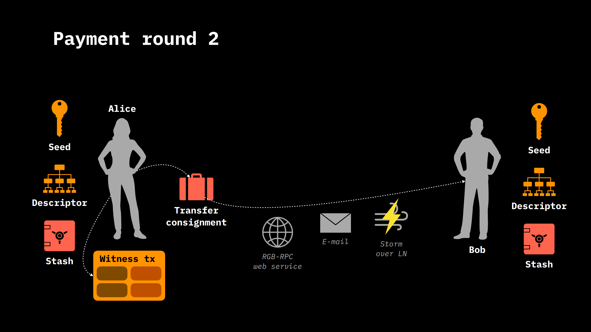

# Contract Transfers

## Asset Transfers and Smart Contract Interactions

In the realm of RGB, the process of transferring assets and interacting with smart contracts goes beyond the simple exchange of assets from one individual to another. These contract transitions can include more complex forms of interaction involving multiple parties. For example, consider the case of Bob, who owns a Bitcoin wallet but has not yet started using RGB technology. To begin interacting with the contract, Bob must install an RGB wallet and add contracts to it, assuming the contract is not present by default on the wallet to facilitate interaction with some services. This startup process involves installing the RGB wallet software, which, by default, contains no contracts. Bob then has the task of acquiring the contracts, which can be sourced through various channels, such as specific websites, e-mails, or Telegram messages, facilitated by their small size that makes them easy to share. Recall that consignment is given by the combination of Genesis, Schema, Interface, Implementation and any state transitions for a possible second reissue. Each of these parts consists of as little as 200 bytes of data, meaning a consignment is typically on the order of a few KiBs. It can also be encoded in Base 58 format and sent in a format similar to that of a PGP key or as a QR code. There are also plans in the future to use censorship-resistant transmission media such as Nostr, through the use of relay servers, or Storm over Lightning Network. The RGB ecosystem fosters innovation and competition among various wallets by allowing the freedom to propose new methods of contract interaction and transfer. This openness to experimentation and the adoption of new technologies, such as decentralized, censorship-resistant networks, promises to further enrich the capabilities offered by RGB. The ability for wallets to compete on a technological basis without compromising the underlying RGB infrastructure demonstrates the platform's potential to support a wide range of financial and contractual applications in the future.

<figure>
    
    <figcaption>
        

            <strong>
                All the various possible channels for acquiring an RGB contract in the form of consignment in a wallet.
            </strong>
        

    </figcaption>
</figure>

## Invoices Issuance

Once a contract is obtained in the consignment format, Bob is able to interact with it by issuing invoices for specific method calls within the contract, while not possessing any state within that contract. If Bob does not own the state on which the method call is to be executed, then he can invoice an authorized third party to create the transition. This invoicing process does not necessarily involve a transfer of goods, but rather a request to perform a particular action within the contract. Invoices are generated as simple URLs and can be transmitted by any means in a manner similar to what we said for consignment. The mechanism for discovering stakeholders who have status in the contract, such as Alice, remains unspecified, just as the process for discovering who can pay in Bitcoin.

<figure>
    
    <figcaption>
        

            <strong>
                Several channels for transmitting invoices in RGB.
            </strong>
        

    </figcaption>
</figure>

## State Management and Transfer

Alice, who has both a Bitcoin wallet and an RGB stash, is able to prepare a witness transaction, not necessarly signed, and a consignment that encapsulates the final state transition and the history of state transitions since Genesis. This transfer consignment, obviously larger than a contract consignment because of the inclusion of the entire history, is then forwarded to Bob, who validates and integrates it into his stash, even though the final state transition has not yet been confirmed on the Bitcoin blockchain. This procedure exemplifies how RGB facilitates the flexible and decentralized management of assets and smart contracts, regardless of the match transfer method.

<figure>
    
    <figcaption>
        

            <strong>
                Alice prepares the transfer consignment and witness transaction.
            </strong>
        

    </figcaption>
</figure>

## Transaction Security and Privacy

The approach adopted by RGB in transferring consignments between parties, as illustrated in the Alice and Bob example, underscores the significance of privacy and security. In the ideal case no one other than Bob and Alice are in possession of the consignment and witness transaction, but Bob has all the elements to verify the validity of the consignment by comparing it with the various anchors on the blockchain. Bob's stash status is consequently updated through this consignment decomposition and validation procedure. Although witness transactions are not immediately published and consignments can be encrypted for enhanced security. The stash in this case is called a _payslip_ and can remain in this state indefinitely. Alice will publish the witness transaction to be included in the blockchain only when events have occurred, such as, for example, the transfer of some object from Bob.

<figure>
    
    <figcaption>
        

            <strong>
                Optional payslip phase.
            </strong>
        

    </figcaption>
</figure>

The RGB system offers a significant advantage over other digital exchange methods, especially when it comes to complex operations such as atomic swaps. Atomic swaps, commonly used in various cryptocurrency networks, such as the Lightning network, can present complications. Typically, they require two separate transactions and the use of a hash code to ensure that both parties complete the swap simultaneously, known as the ***reverse American call option problem***. This process can create a situation where one party has the power to influence the timing of the exchange by revealing or withholding the hash code.

RGB simplifies this process considerably. Instead of requiring two separate transactions, RGB allows the direct exchange of one asset against another (e.g., Bitcoin against an RGB asset or an RGB asset against another RGB asset) within a single transaction. This eliminates the need for a hash code, as both assets can be exchanged directly. If an exchange involves Bitcoin and RGB assets, both can be included in the same transaction output, making the process more direct and secure.

In addition, RGB introduces a mechanism that allows both parties to have complete control over the execution of the transaction. If the transaction is not published, both parties have the option to do so, ensuring that neither can take advantage at the expense of the other. If both parties fail to publish, the original inputs can be spent again, rendering the transaction invalid. This approach offers a higher level of security and flexibility than traditional methods, while simplifying the exchange process.