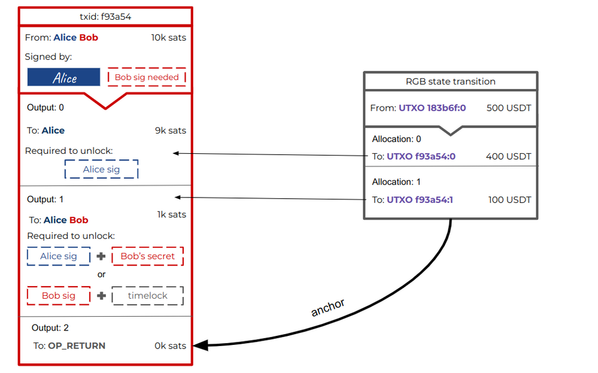

# Contract Transfers

In this section we will be guided through a RGB Contract Transfer operation step by steps, again with the cooperation of our cryptographic couple:  Alice and Bob.

Let consider the case of Bob, who owns a Bitcoin wallet but has not yet started using RGB technology.&#x20;

1. To begin operating with RGB protocol, **Bob must install an RGB wallet** and add contracts to it, assuming the contract is not present by default on the wallets. This startup process involves installing the RGB wallet software, which, by default, contains no contracts. The RGB wallet software, in addition, require the ability to interact with Bitcoin UTXO through a Bitcoin wallet and a Bitcoin Blockchain node tool full or a light node). These tools are required, because, as we learned [previously](../rgb-state-and-operations/state-transitions.md#state-transitions-and-their-mechanics), [owned states ](glossary.md#owned-state)are defined over Bitcoin UTXO and are a necessary item for state transition regarding transfer of contract in RGB.
2.  Then Bob has the task of acquiring the **necessary information about the contracts.** These data, in RGB ecosystem,  can be sourced through various channels, such as specific websites, e-mails, or Telegram messages etc, following the [contract issuer](glossary.md#contract-participant)'s choice. These data are distributed using a [contract consignment ](glossary.md#consignment)which is data package containing [Genesis](glossary.md#genesis), [Schema](glossary.md#schema), [Interface](glossary.md#interface) and [Interface Implementation](glossary.md#interface-implementation).&#x20;

    Each of these parts, usually, consists of as little as 200 bytes of data, meaning **a consignment is typically on the order of a few KiBs**. The contract consignment can also be encoded in Base58 format and sent in a format similar to that of a PGP key or as a QR code.  These kind of formats In the future will also easily adaptable to censorship-resistant transmission media such as **Nostr**, through the use of relay servers, or over the Lightning Network.&#x20;

    At this regards, it's useful to point out that the RGB ecosystem fosters innovation and competition among various wallets by allowing the freedom to propose new methods of contract interaction and transfer. This openness to experimentation and the adoption of new technologies, such as decentralized, censorship-resistant networks, promises to further enrich the capabilities offered by RGB.&#x20;

<figure><figcaption>
<strong>All the various possible channels for acquiring an RGB contract in the form of consignment in a wallet.</strong>
</figcaption></figure>

3. Once a contract is obtained in the consignment format, Bob is able to import it in his RGB wallet and validate the data contained herein. The first, and basically only thing he can do is to find someone possessing the contract / asset  he is interested to receive in his wallet. In our example, Alice has the asset in hes wallet! So, similarly to Bitcoin Transaction **they can do an RGB Transfer**, which by the way is nothing else than a RGB  [State Transition](glossary.md#state-transition). The mechanism for discovering stakeholders who have owned state in the contract, such as Alice, remains unspecified, just as the process for discovering who can pay in Bitcoin.
4. I**n order to initiate a transition**, Bob must act first. It does so by **issuing an** [invoice](glossary.md#invoice) which call the specific **transfer method** encoded in the [Schema](glossary.md#schema) of the contract and which he will hand over to Alice . **This invoice generation**, which precede the effective asset transfer, guarantee that the invoice contains **all the relevant instruction needed by Alice to make the transfer**,  containing in particular Bob's UTXO derived from the his Bitcoin wallet. Invoices are generated as simple URLs and can be transmitted by any means in a manner similar to what we said for consignment.&#x20;

<figure><figcaption>
The transfer process begins with an invoice prepared by Bob which contains all the 
</figcaption></figure>

5. Alice, who has both a Bitcoin wallet and an RGB wallet with a [stash](glossary.md#stash) of client-side validated data, receive the Invoice from Bob. With the information contained in the invoice, Alice is able to prepare: &#x20;
   * A [witness transaction](glossary.md#witness-transaction), not necessarily signed, which closes the previously defined [single-use seal](glossary.md#single-use-seal) on her UTXO and committing to the state transition transferring the asset to Bob.
   * &#x20;A [transfer consignment](glossary.md#consignment) that encapsulates the final state transition and the history of state transitions since Genesis contained, in validated form, in her stash.&#x20;
6. This **transfer consignment**, obviously larger than a contract consignment because of the inclusion of the entire history of the asset, **is then forwarded to Bob**, who validates and integrates it into his stash, even though the final state transition has not yet been confirmed on the Bitcoin Blockchain.&#x20;

<figure><figcaption>
<strong>Alice prepares a witness transaction including the information provided both by Bob's invoice and those coming from her RGB and Bitcoin wallet. In addition, through a transfer consignment allows Bob to verify all the asset history as well as the last state transition addressed to him.</strong>
</figcaption></figure>

7. Bob, after verifying the data contained in the transfer consignment handed over by Alice, may optionally sign a so called _payslip_ which confirm to Alice that:

* Bob agrees on the validity  of the client-side validated data included in the consignment.&#x20;
* Bob agrees that the witness transaction shall be published.&#x20;

Once published, the witness transaction represent the conclusion of the transfer between Alice and Bob. &#x20;

<figure><figcaption>
<strong>Optionally Bob can sign a payslip which authorizes Alice to broadcast the witness transaction which marks the conclusion of the transfer between Alice and Bob.</strong>
</figcaption></figure>

## Features of RGB Transfers

The approach adopted by RGB in transferring consignments between parties, as illustrated in the Alice and Bob example, underscores the significance of privacy and security. In the ideal case no one other than Bob and Alice is in possession of the consignment and witness transaction. Nonetheless, Bob has all the elements to verify the validity of the consignment by comparing it with the various anchors on the blockchain. Bob's stash status is consequently updated through this consignment decomposition and validation procedure. In practical transfer cases, Alice may publish the witness transaction to be included in the blockchain only when some events have occurred, such as, for example, the transfer of some object from Bob.

At this regard, it's useful to point out that the RGB system offers a significant advantage over other digital exchange methods, especially when it comes to complex operations such as atomic swaps. Atomic swaps, commonly used in various cryptocurrency networks, such as the Lightning network, can present complications. Typically, they require two separate transactions and the use of a hash code to ensure that both parties complete the swap almost simultaneously. This process can create a situation where one party has the power to influence the timing of the exchange by revealing or withholding the hash code, which is known as the _**reverse American call option problem.**_

RGB simplifies this issue considerably. Instead of requiring two separate transactions, RGB allows the direct exchange of one asset against another (e.g., Bitcoin against an RGB asset or an RGB asset against another RGB asset) within a single transaction. This eliminates the need for a hash code, as both assets can be exchanged directly. If an exchange involves Bitcoin and RGB assets, both can be included in the same witness transaction output, making the process more direct and secure.

In addition, RGB introduces a mechanism that allows both parties to have complete control over the execution of the transaction. If the transaction is not published, both parties have the option to do so, ensuring that neither can take advantage at the expense of the other. If both parties fail to publish, the original inputs can be spent again, rendering the transaction invalid. This approach offers a higher level of security and flexibility than traditional methods, while simplifying the exchange process.

