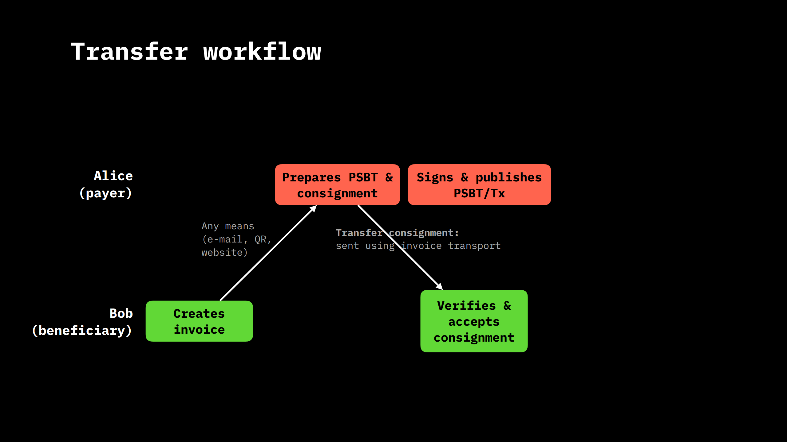
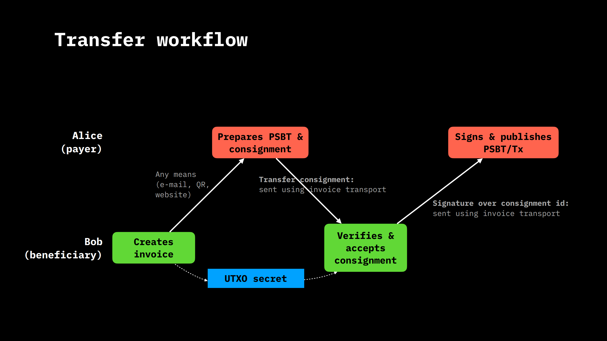

# RGB invoices

This section explores how invoices are structured and function within a particular contract. The initial focus is on RGB identifiers, which are integral to the operation of the system and have likely been encountered by users in various forms. These identifiers are unique to each component of the system, including contracts, assets, and interfaces, ensuring a standardized method of identification throughout the system.

## Identifiers and Their Encoding

Each element within the system, be it a contract, schema, interface, interface or asset is assigned a unique identifier. These identifiers are not arbitrary strings but are carefully encoded using base 58, a method chosen for its efficiency and readability. Furthermore, these identifiers are prefixed with a descriptor (in the form of a URL or URN) indicating their type, such as `rgb:` for contracts or `rgb:` plus other things for interfaces. This prefixing strategy ensures clarity regarding the nature of each identifier, preventing confusion and misuse.

## Enhancing Human Readability through Chunking

The concept of chunking is introduced as a means to enhance the readability and verifiability of these identifiers. This technique, commonly used in phone and credit card numbers, breaks down long strings into smaller, more manageable segments. This not only aids in human parsing but also in verification processes, where checking the integrity of an identifier involves examining specific segments, such as the checksum at the end. Chunking thereby offers a balance between security and usability, with each chunk providing a certain level of security assurance. For example, having 256-bit strings divided into six blocks means that each chunk adds about 256/6 (~42) bits of security.

An identifier for an RGB contract could be, for example, the following string:
$${\text{\color{orange}2WBcas9-yjzEvGufY-9GEgnyMj7-beMNMWA8r-sPHtV1nPU-TMsGMQX}}$$
which, as we said, is a string in Base 58 divided into the various chunks to make it easier to read.

Initially, bech 32 coding was considered for use in the system. Despite the potential for shorter QR codes and error correction capabilities, bech 32 proved to be more time-consuming and less practical than Base 58, especially in terms of readability and QR code size: it is not recommended for use for strings longer than 90 characters. Similar discourse for bech32m. The decision to return to Base 58, the format originally used by Bitcoin, was dictated by these results and the realization that error correction was not as crucial as previously thought, given the system's verification mechanisms.

## Utilizing URLs for Enhanced Interaction

A significant advantage of the chosen identifier system is its compatibility with URLs, allowing for direct interaction with wallets through simple clicks. This contrasts sharply with the cumbersome process required by other systems, where multiple steps are needed to copy and paste identifiers into wallets. An example of a URL for fungible tokens might be:
$${\text{\color{red}rgb\color{black}:\color{orange}2WBcas9-yjzEvGufY-9GEgnyMj7-beMNMWA8r-sPHtV1nPU-TMsGMQX\color{black}/\color{blue}RGB20\color{black}/\color{magenta}100\color{black}+utxob:\color{green}egXsFnw-5Eud7WKYn-7DVQvcPbc-rR69YmgmG-veacwmUFo-uMFKFb}}$$

where `rgb:` defines the URL pattern, the contract ID is the same as in the previous example, `RGB20` defines the interface used, i.e., the default methods available to interact with the contract, the number `100` is part of the assignment and represents the amount of tokens associated with the blinded UTXO introduced by the string `utxob`. The blinded UTXO is itself in the Base 58 format divided into chunks, but it is neither a Bitcoin address nor a transaction ID, but is the hash of: transaction ID, output number, blinding factor, and commitment method. This prevents Alice from knowing the UTXO actually held by Bob, so it falls into the type of state associated with a secret seal that we introduced in the chapter (put reference).

The URL format's simplicity and efficiency in opening wallets and facilitating transactions underscore its superiority over alternatives.
Alternatives to the direct use of contract IDs, such as using asset tickers or mnemonic checksums, were considered but ultimately rejected due to security concerns and the potential for confusion. The chosen format prioritizes clarity and security, ensuring that users can easily understand and verify the details of their transactions.

The power of URLs is also expressed in the ease with which parameters such as an invoice signature can be introduced:
$${\text{\color{red}rgb\color{black}:\color{orange}2WBcas9-yjzEvGufY-9GEgnyMj7-beMNMWA8r-sPHtV1nPU-TMsGMQX\color{black}/\color{blue}RGB20\color{black}/\color{magenta}100\color{black}+utxob:\color{green}egXsFnw-5Eud7WKYn-7DVQvcPbc-rR69YmgmG-veacwmUFo-uMFKFb\color{cyan}?sig=6kzbKKffP6xftkxn9UP8gWqiC41W16wYKE5CYaVhmEve}}$$

in which additional parameters beyond `sig` can be added if there is a need and it is not necessary for all software to be able to support them since it is inherent in the operation of URLs that the path of the request that is not understood can be ignored.

We can see how easily an NFT can be defined, for example:
$${\text{\color{red}rgb\color{black}:\color{orange}2WBcas9-yjzEvGufY-9GEgnyMj7-beMNMWA8r-sPHtV1nPU-TMsGMQX\color{black}/\color{blue}RGB21\color{black}/\color{magenta}DbwzvSu-4BZU81jEp-E9FVZ3xj-cyuTKWWy-2gmdnaxt-ACrS\color{black}+utxob:\color{green}egXsFnw-5Eud7WKYn-7DVQvcPbc-rR69YmgmG-veacwmUFo-uMFKFb}}$$
Or the issuance of new RGB20 tokens:
$${\text{\color{red}rgb\color{black}:\color{orange}2WBcas9-yjzEvGufY-9GEgnyMj7-beMNMWA8r-sPHtV1nPU-TMsGMQX\color{black}/\color{blue}RGB20\color{black}/\color{cyan}issue\color{black}/\color{magenta}100000\color{black}+utxob:\color{green}egXsFnw-5Eud7WKYn-7DVQvcPbc-rR69YmgmG-veacwmUFo-uMFKFb}}$$
this URL can be sent to whoever is authorized to issue the token, which could be, for example, a company that controls the UTXO with a multisig.

## The Command Line Interface and Workflow

RGB includes an all-in-one tool that allows you to work with these URLs through the command-line interface, for example, to verify and process invoices. Including invoice generation, transaction construction and verification, and seamless integration of RGB assets into the transaction process. The workflow demonstrates the efficiency and security of the system, highlighting its potential to simplify and secure transactions in a variety of contexts.

So, for example, Alice could use the command line to create an invoice by specifying the interface, `RGB20`, quantity and ticker of the token, which will be automatically resolved in the contract/genesis ID, and information regarding where she will receive payment, i.e., an outpoint that is prefixed with a specific code (in this case `tapret1st`):
```shell
alice$ rgb invoice RGB20 100 USDT tapret1st:456e3..dfe1:0
```
She will receive as output an URL of the type
```shell
rgb:2WBcas9-yjzEvGufY-9GEgnyMj7-beMNMWA8r-sPHtV1nPU-TMsGMQX
/RGB20/100+utxob:egXsFnw-5Eud7WKYn-7DVQvcPbc-rR69YmgmG-veacwmUFo-uMFKFb
```
in which the blinding factor generated to hide Alice's UTXO is saved in Alice's stash for future use.

The invoice is then sent by Alice to Bob. Now Bob can in turn use Bitcoin wallet commands from the shell to construct the transaction in PSBT format (this feature will be integrated inside RGB itself starting with version 0.11) and later use the newly constructed PSBT to expend one of the outputs that you want to use for RGB assets:
```shell
bob$ wallet construct tx.psbt
bob$ rgb transfer tx.psbt <invoice> consignment.rgb
```
therefore RGB constructs the state transition based on the information just provided by Bob respecting the requirements of the invoice generated by Alice. To do this it takes the whole story from Bob's stash, places the state transition on top, and generates as output the consignment file in binary form that can be sent to Alice to be accepted to produce the signature to be sent to Bob:
```shell
alice$ rgb accept consignment.rgb
```
```shell
sig:DbwzvSu4BZU81jEpE9FVZ3xjcyuTKWWy2gmdnaxtACrS # <— signature
```

Lastly Bob checks the signature and in turn signs the PSBT transaction which already contains the information about RGB since in the command used by alice not only the consignment is produced, but also the contents of the PSBT file are changed:
```shell
bob$ rgb check <sig>
bob$ wallet sign —publish tx.psbt
```
note that Bob publishes the PSBT transaction at the same time as the signature in this case.

<figure>
    
    <figcaption>
        <p>
            <strong>
                Invoice workflow in case Alice trusts Bob, i.e. Alice signs and publishes the PSBT at the same time.
            </strong>
        </p>
    </figcaption>
</figure>

<figure>
    
    <figcaption>
        <p>
            <strong>
                Invoice workflow in case Alice does not trust Bob, i.e. Alice waits for confirmation from Bob.
            </strong>
        </p>
    </figcaption>
</figure>

The latest versions of RGB also introduced the ability to associate a transition with a Bitcoin address. This can be useful in case you want to receive RGB assets without owning bitcoins so that you do not have to be forced to mix RGB assets with bitcoins for each interaction. So, the idea is to have a second format for invoices where there is not a blinded UTXO but a Bitcoin address and the payer will have to create a PSBT transaction that contains the output with which to associate RGB assets.

In conclusion, the system's approach to invoices, identifiers, and transactions is meticulously designed to balance security, usability, and efficiency. Through the use of unique identifiers, chunking, and strategic choice of encoding methods, it provides a robust framework for managing and verifying transactions with ease and accuracy.
