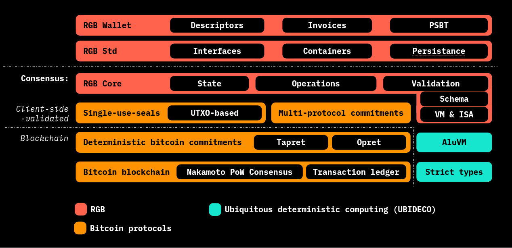

# RGB Library Map

<figure><figcaption>
T<strong>he different code parts making up RGB Protocol and dependent libraries</strong>
</figcaption></figure>

## Client-side Validation

**Repository:**

* [https://github.com/LNP-BP/client\_side\_validation](https://github.com/LNP-BP/client\_side\_validation)

**Rust Crates:**

* [https://crates.io/crates/client\_side\_validation](https://crates.io/crates/client\_side\_validation)
* [https://crates.io/crates/single\_use\_seals](https://crates.io/crates/single\_use\_seals)

## Deterministic Bitcoin Commitments

**Repository:**

* [https://github.com/BP-WG/bp-core](https://github.com/BP-WG/bp-core)

**Rust Crates:**

* [https://crates.io/crates/bp-dbc](https://crates.io/crates/bp-dbc)

## Multi Protocol Commitment - MPC

**Repository:**

* [https://github.com/LNP-BP/client\_side\_validation/tree/master/commit\_verify](https://github.com/LNP-BP/client\_side\_validation/tree/master/commit\_verify)

**Rust Crates:**

* [https://crates.io/crates/commit\_verify](https://crates.io/crates/commit\_verify)
