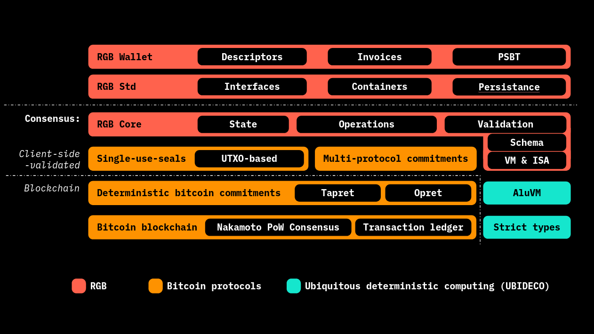

# RGB Library Map

<figure><figcaption>
<strong>The different code parts making up RGB Protocol and dependent libraries.</strong>
</figcaption></figure>

## Client-side Validation

**Repository:**

* [https://github.com/LNP-BP/client\_side\_validation](https://github.com/LNP-BP/client\_side\_validation)

**Rust Crates:**

* [https://crates.io/crates/client\_side\_validation](https://crates.io/crates/client\_side\_validation)
* [https://crates.io/crates/single\_use\_seals](https://crates.io/crates/single\_use\_seals)

## Deterministic Bitcoin Commitments - DBC

**Repository:**

* [https://github.com/BP-WG/bp-core](https://github.com/BP-WG/bp-core)

**Rust Crate:**

* [https://crates.io/crates/bp-dbc](https://crates.io/crates/bp-dbc)

## Multi Protocol Commitment - MPC

**Repository:**

* [https://github.com/LNP-BP/client\_side\_validation](https://github.com/LNP-BP/client\_side\_validation)

**Rust Crate:**

* [https://crates.io/crates/commit\_verify](https://crates.io/crates/commit\_verify)

## Strict Types & Strict Encoding

**Specifications:**

* [https://www.strict-types.org/](https://www.strict-types.org/)

**Repositories:**

* [https://github.com/strict-types/strict-types](https://github.com/strict-types/strict-types)
* [https://github.com/strict-types/strict-encoding](https://github.com/strict-types/strict-encoding)

**Rust Crates:**

* [https://crates.io/crates/strict\_types](https://crates.io/crates/strict\_types)
* [https://crates.io/crates/strict\_encoding](https://crates.io/crates/strict\_encoding)

## RGB Core

**Repository:**

* [https://github.com/RGB-WG/rgb-core](https://github.com/RGB-WG/rgb-core)

**Rust Crate:**

* [https://crates.io/crates/rgb-core](https://crates.io/crates/rgb-core)

## RGB Standard Library & Wallet

**Repository:**

* [https://github.com/RGB-WG/rgb-std](https://github.com/RGB-WG/rgb-std)

**Rust Crate:**

* [https://crates.io/crates/rgb-std](https://crates.io/crates/rgb-std)

## RGB CLI

**Repository:**

* [https://github.com/RGB-WG/rgb](https://github.com/RGB-WG/rgb)

**Rust Crates:**

* [https://crates.io/crates/rgb-cli](https://crates.io/crates/rgb-cli)
* [https://crates.io/crates/rgb-wallet](https://crates.io/crates/rgb-wallet)

## RGB Schemata

**Repository:**

* [https://github.com/RGB-WG/rgb-schemata/](https://github.com/RGB-WG/rgb-schemata/)

## ALuVM

**Info:**

* [https://www.aluvm.org/](https://www.aluvm.org/)

**Repositories:**

* [https://github.com/AluVM/aluvm-spec](https://github.com/AluVM/aluvm-spec)
* [https://github.com/AluVM/alure](https://github.com/AluVM/alure)

**Rust Crates:**

* [https://crates.io/crates/aluvm](https://crates.io/crates/aluvm)
* [https://crates.io/crates/aluasm](https://crates.io/crates/aluasm)

## Bitcoin Protocol - BP

**Repositories:**

* [https://github.com/BP-WG](https://github.com/BP-WG)
  * [https://github.com/BP-WG/bp-core](https://github.com/BP-WG/bp-core)
  * [https://github.com/BP-WG/bp-std](https://github.com/BP-WG/bp-std)
  * [https://github.com/BP-WG/bp-wallet](https://github.com/BP-WG/bp-wallet)

## Ubiquitous Deterministic Computing - UBIDECO

**Repository:**

* [https://github.com/UBIDECO](https://github.com/UBIDECO)

