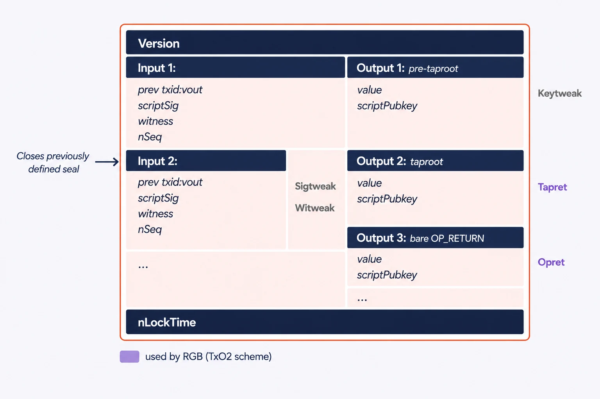

# Commitment Schemes within Bitcoin

This section briefly describes the possible Single-use Seal structures that can be implemented using bitcoin as a publication medium and outlines the set of choices taken by the RGB protocol in particular.

There are 2 main ways in which a Single-use Seal can be **defined** in Bitcoin transactions:

* **Public keys or addresses** - the seal is defined by selecting an address or public key that has not yet been used (i.e. it has not been used by any locking script, so it is not locking any bitcoin).
* **Bitcoin transaction outputs** – the seal is defined by the selection of a specific UTxO available to some wallet.

The defined methods can be used in a combination of **closing methods** that differ according to how a **spending transaction**:

1. uses the seal definition: use of the address in the locking script or spending of the UTXO;
2. hosts the message on which the seal is closed according to a **commitment scheme** (i.e. in which part of the transaction the message is committed and stored).

The following table shows the 4 possible combinations of defining and closing a seal:

<table><thead><tr><th width="92">Seal type</th><th width="130">Seal Definition</th><th width="129">Seal Closing</th><th width="185">Additional Requirements</th><th width="117">Main application</th><th>Commitment schemes</th></tr></thead><tbody><tr><td><strong>PkO</strong></td><td>Public key value</td><td>Transaction output</td><td>P2(W)PKH</td><td>none yet</td><td>keytweak, tapret, opret</td></tr><tr><td><strong>TxO2</strong></td><td><strong>Transaction output</strong></td><td><strong>Transaction output</strong></td><td><strong>Requires Deterministic Bitcoin Commitments</strong></td><td><strong>RGB</strong></td><td><strong>keytweak, tapret, opret</strong></td></tr><tr><td><strong>PkI</strong></td><td>Public key value</td><td>Transaction input</td><td>Taproot-only - Not working with legacy wallets</td><td>Bitcoin-based identities</td><td>sigtweak, witweak</td></tr><tr><td><strong>TxOI</strong></td><td>Transaction output</td><td>Transaction input</td><td>Taproot-only - Not working with legacy wallets</td><td>none yet</td><td>sigtweak, witweak</td></tr></tbody></table>

**RGB protocol uses the TxO2** scheme in which both the Seal Definition and the Seal Closing use transaction outputs.

As shown in the table above, several **commitment schemes** can be used for each **seal type**. Each method differs in the location used by related transactions to host the commitment and, in particular, whether the message is committed to a location belonging to the input or output of the transaction:

* **Transaction Input**:
  * Sigtweak - the commitment is placed within the 32-byte random $$r$$ component that forms the ECDSA signature pair $$<r,s>$$ of an input. It makes use of [Sign-to-contract (S2C)](https://blog.eternitywall.com/2018/04/13/sign-to-contract/#sign-to-contract).
  * Witweak - commitment is placed within the segregated witness data of the transaction.
* **Transaction Output** (scriptPubKey):
  * Keytweak - It uses the [Pay-to-contract](https://blog.eternitywall.com/2018/04/13/sign-to-contract/#pay-to-contract) construction by which the public key of the output of the output is "tweaked" (i.e. modified) to contain a deterministic reference to the message.
  * [Opret](deterministic-bitcoin-commitments-dbc/opret.md) - **used in RGB**, the committed message is placed in an unspendable output after the opcode `OP_RETURN`.
  * [Tapret](deterministic-bitcoin-commitments-dbc/tapret.md) (Taptweak) - This scheme, **used in RGB**, represents a form of tweak in which the commitment is an `OP_RETURN` leaf in the `Script path` of a [taproot output](../annexes/glossary.md#taproot) which then modifies the value of the PubKey.

<figure><figcaption>
<strong>The different seal closing methods in Bitcoin transaction.</strong>
</figcaption></figure>

After reading this overview, it should now be easier to dive into details of [RGB Single-use Seals](../commitment-layer/commitment-schemes.md#single-use-seals-in-rgb) construction.
