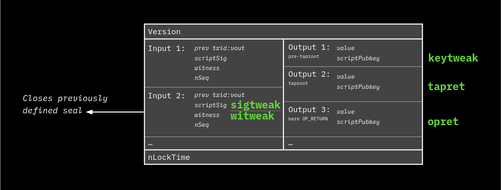
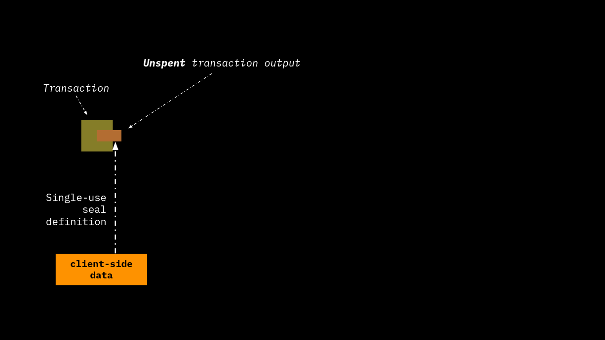
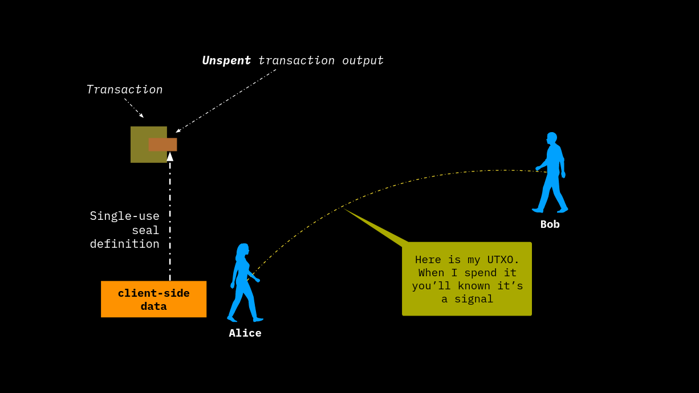
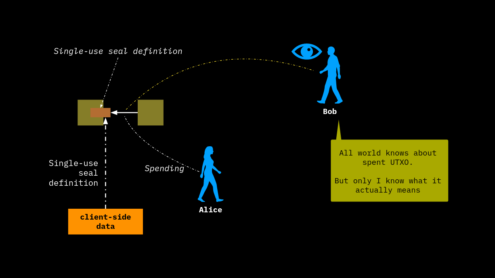
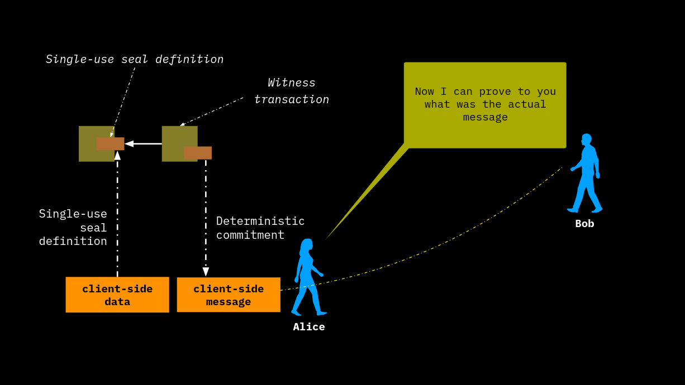
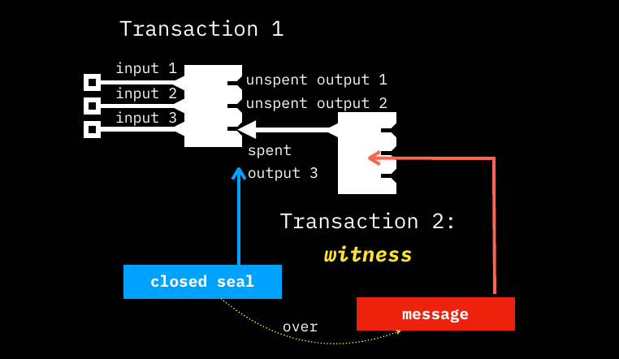

# Commitment Schemes within Bitcoin and RGB

In this chapter we will explore the application of Client-side Validation and [Single-use Seal](../annexes/glossary.md#single-use-seal) to Bitcoin Blockchain, introducing the main architectural features behind **RGB protocol related to the commitment layer (layer 1)**.&#x20;

As mentioned in the [previous chapter](../distributed-computing-concepts/paradigms-of-distributed-computing.md), these cryptographic operations can be applied in general to different blockchains and also to different publication media. However, the outstanding properties of Bitcoin consensus algorithm, particularly those related to decentralization, censorship resistance and permissionlessness, make it the ideal technology stack for the development of advanced programmability features, such as those required by digital bearer rights and smart contracts.

### Single-use Seals in Bitcoin Transactions and RGB

From previously, we recall that the creation of Single-use Seals is subject to two basic operations: [Seal Definition](../distributed-computing-concepts/single-use-seals.md#seal-definition) and [Seal Closing](../distributed-computing-concepts/single-use-seals.md#seal-closing). We will now explore how these two operations can be implemented **using Bitcoin as a publication medium**, and in particular making use of some elements of **Bitcoin Transactions**.

There are 2 main ways in which a Single-use Seal can be **defined** in Bitcoin transactions:

* **Public keys or addresses** - the seal is defined by selecting an address or public key that has not yet been used (i.e. it has not been used by any locking script, so it is not locking any bitcoin).
* **Bitcoin transaction outputs** – the seal is defined by the selection a specific UTxO available to some wallet.

The defined methods can be used in a combination of **closing methods** that differ according to how a **spending transaction**:

1. uses the seal definition: use of the address in the locking script or spending of the UTXO;
2. hosts the message on which the seal is closed according to a **commitment scheme** (i.e. in which part of the transaction the message is committed and stored).

The following table shows the 4 possible combinations of defining and closing a seal:

<table><thead><tr><th width="92">Method</th><th width="130">Seal Definition</th><th width="129">Seal Closing</th><th width="185">Additional Requirements</th><th width="117">Main application</th><th>Possible commitment schemes</th></tr></thead><tbody><tr><td><strong>PkO</strong></td><td>Public key value</td><td>Transaction output</td><td>P2(W)PKH</td><td>none yet</td><td>keytweak, tapret, opret</td></tr><tr><td><strong>TxO2</strong></td><td><strong>Transaction output</strong></td><td><strong>Transaction output</strong></td><td><strong>Requires Deterministic Bitcoin Commitments</strong></td><td><strong>RGBv1 (universal)</strong></td><td><strong>keytweak, tapret, opret</strong></td></tr><tr><td><strong>PkI</strong></td><td>Public key value</td><td>Transaction input</td><td>Taproot-only - Not working with legacy wallets</td><td>Bitcoin-based identities</td><td>sigtweak, witweak</td></tr><tr><td><strong>TxOI</strong></td><td>Transaction output</td><td>Transaction input</td><td>Taproot-only - Not working with legacy wallets</td><td>none yet</td><td>sigtweak, witweak</td></tr></tbody></table>

**RGB protocol uses the TxO2** scheme in which both seal definition and the seal closure use transaction outputs (the term "**O2**" in **TxO2** acronym stands for **2 Outputs**).

As shown in the table, several **commitment schemes** can be used for each **seal closing method**. Each method differs in the location used by related transactions to host the commitment and, in particular, whether the message is committed to a location belonging to the input or output of the transaction:

* **Transaction Input**:
  * Sigtweak - the commitment is placed within the 32-byte random **r** component that forms the ECDSA signature pair **\<r,s>** of an input. It make uses of [Sign-to-contract (S2C)](https://blog.eternitywall.com/2018/04/13/sign-to-contract/#sign-to-contract).
  * Witweak - commitment is placed within the segregated witness data of the transaction.
* **Transaction Output** (scriptPubKey):
  * Keytweak - It uses the [Pay-to-contract](https://blog.eternitywall.com/2018/04/13/sign-to-contract/#pay-to-contract) construction by which the public key of the output of the output is "tweaked" (i.e., modified) to contain a deterministic reference to the message.
  * [Opret](deterministic-bitcoin-commitments-dbc/opret.md) - used in RGB, the committed message is placed as an unspendable output after the opcode `OP_RETURN`.
  * [Tapret](deterministic-bitcoin-commitments-dbc/tapret.md) (taptweak) - This scheme, **used in RGB**, represents a form of tweak in which the commitment is an `OP_RETURN` string placed in a leaf of the `Script path` of a [taproot transaction](../annexes/glossary.md#taproot) which then modifies the value of the PubKey.

<figure><figcaption>
<strong>The different seal closing methods in Bitcoin transaction.</strong>
</figcaption></figure>

### TxO2 Client-side Validation

In the next paragraphs we will focus on client-side validation combined with the definition of a single-use seal and a **TxO2** scheme closing operation, showing them step by step below and using the two usual cryptographic characters: Alice, dealing with a seal operation, and Bob as an observer.

1. First of all, Alice has some [UTXO](../annexes/glossary.md#utxo)s **that refer to some data client-side validated and known only by her**.

<figure><figcaption>
<strong>A seal definition is applied to a specific Bitcoin UTXO.</strong>
</figcaption></figure>

2. Alice informs Bob that the spending of these UTXO represents a sign that something has happened.

<figure><figcaption>
<strong>The UTXO is associated to some meaning agreed between Alice and Bob.</strong>
</figcaption></figure>

3. Once Alice spends her UTXO, only Bob knows that this expenditure has some additional meaning and consequences, even though everyone (i.e. the Bitcoin Blockchain audience) can see this event.

<figure><figcaption>
<strong>The spending event of the UTXO triggers some meaningful consequences for the parties involved.</strong>
</figcaption></figure>

4. In fact, the UTXO spent by Alice through the [witness transaction](../annexes/glossary.md#witness-transaction) contains a commitment to a change in the validated client-side data. By passing the original data to Bob, she is able to prove to Bob that these data are properly referenced by the commitment made by Alice in the witness transaction. The verification operation is performed by Bob independently, using the appropriate methods that are part of the client-side validation protocol (e.g. the RGB protocol). Additionally, as we shall see later, **the message may contain an additional seal definition thus extending the ordered sequence of messages through a chain of seal definitions - seal closing.**

<figure><figcaption>
<strong>Alice can prove to Bob deterministically the uniqueness of the message committed. In addition the message may contain another seal definition extending the chain of commitments.</strong>
</figcaption></figure>

The key point of using the single-use seal in combination with client-side validation is the uniqueness of the spending event and the data committed (i.e., the message) in it, which cannot be changed in the future. The whole operation can be summarized in the following terms.

<figure><figcaption>
<strong>The UTXO being spent contains the seal definition. A precise kind of transaction output contains the message.</strong>
</figcaption></figure>

The next important step is to illustrate precisely how the two commitment schemes adopted in RGB protocol, **opret** and **tapret**, work and which are the features they must meet, particularly with regard to commitment determinism.

***
