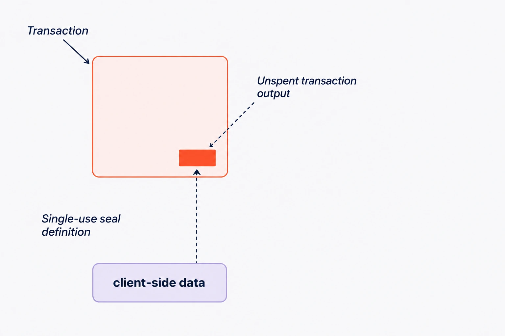
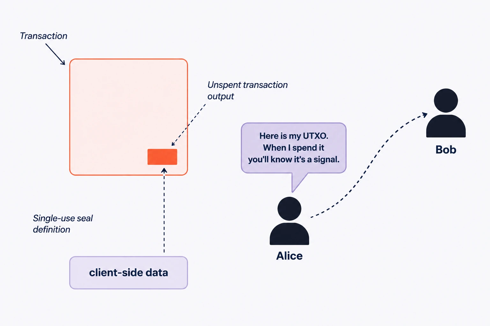
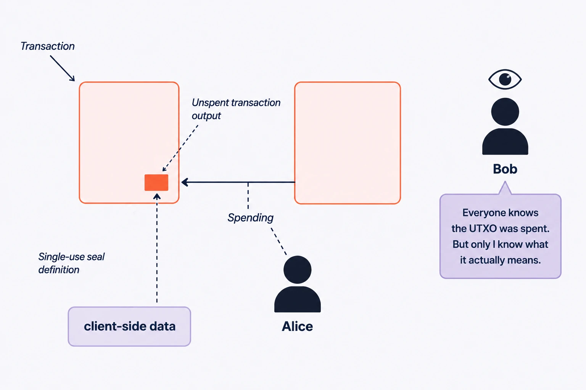
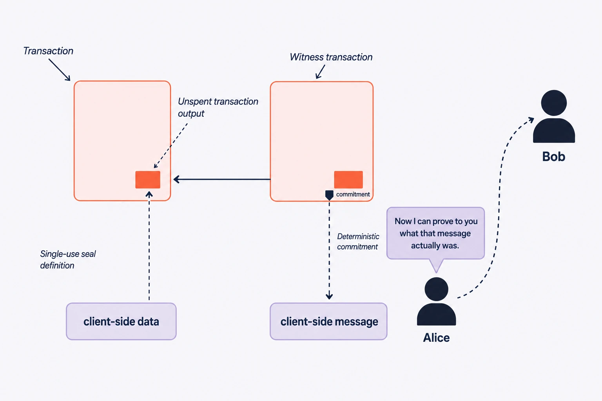
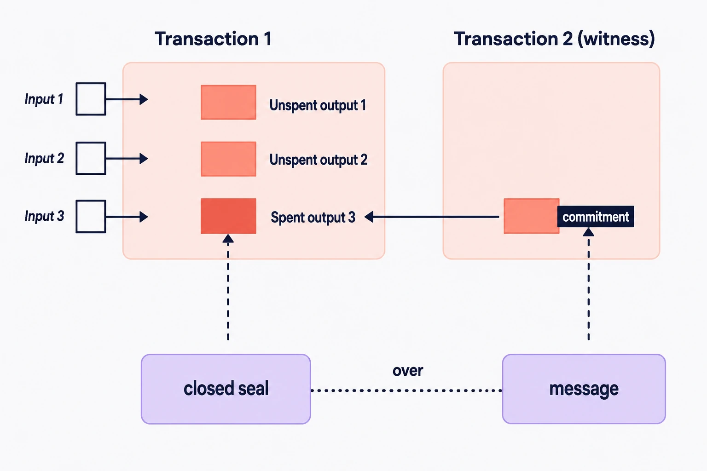

# Commitment Schemes within Bitcoin and RGB

In this chapter we will explore the application of Client-side Validation and [Single-use Seal](../annexes/glossary.md#single-use-seal) to Bitcoin Blockchain, introducing the main architectural features behind **RGB protocol related to the commitment layer (layer 1)**.

These cryptographic operations can be applied in general to different blockchains and also to different publication media. However, the outstanding properties of Bitcoin consensus algorithm, particularly those related to decentralization, censorship resistance, and permissionlessness, make it the ideal technology stack for the development of advanced programmability features, such as those required by digital bearer rights and smart contracts.

From the previous section, we recall that the creation of Single-use Seals is subject to two basic operations: [Seal Definition](../distributed-computing-concepts/single-use-seals.md#seal-definition) and [Seal Closing](../distributed-computing-concepts/single-use-seals.md#seal-closing). We will now explore how these two operations are implemented **using Bitcoin Transactions as a publication medium** for the RGB protocol. A a more generic overview on single-use seals constructions on the bitcoin blockchain can be found [here](../annexes/single-use-seals-bitcoin.md).

### Single-use Seals in RGB

RGB seals are represented by bitcoin unspent transaction outputs (UTXO), so that:
- A seal is **defined** by some **state** that points to a UTXO that identifies its owner
- A seal is **closed** around a **message** when a transaction spends the UTXO and commits to a message

These two operations are then chained together by including a seal definition in the message around which the previous seal is closed, so that the [witness transaction](../annexes/glossary.md#witness-transaction):
- spends the UTXO on which a seal was defined, thus closing the seal
- has an output that contains a commitment to a new seal definition

### RGB Client-side Validation

In the next paragraphs, we will focus on client-side validation combined with the above construction of a single-use seal, showing them step by step trough the usual cryptographic characters: Alice, who deals with a seal operation, and Bob as an observer.

1. First of all, Alice has a [UTXO](../annexes/glossary.md#utxo) **that is linked to some client-side validated data** known only by her.

<figure><figcaption>
<strong>A seal definition is applied to a specific Bitcoin UTXO.</strong>
</figcaption></figure>

2. Alice informs Bob that the spending of these UTXO represents a sign that some seal was closed.

<figure><figcaption>
<strong>The UTXO is associated to some meaning agreed between Alice and Bob.</strong>
</figcaption></figure>

3. Once Alice spends her UTXO, only Bob knows that this event has some additional meaning and consequences, even though everyone (i.e. the Bitcoin Blockchain audience) can see it.

<figure><figcaption>
<strong>The spending event of the UTXO triggers some meaningful consequences for the parties involved.</strong>
</figcaption></figure>

4. In fact, the UTXO spent by Alice through the [witness transaction](../annexes/glossary.md#witness-transaction) contains a commitment to a change in the client-side validated data. By passing the original data to Bob, she is able to prove him that it is properly referenced by the commitment that Alice included in the witness transaction. Bob can independently verify that the new seal definition is unequivocally bound to the seal closing, so that no other players can be convinced to accept a different one as valid, effectively **preventing double spend**.

<figure><figcaption>
<strong>Alice can prove to Bob deterministically the uniqueness of the message committed. In addition the message may contain another seal definition extending the chain of commitments.</strong>
</figcaption></figure>

The key point of using the single-use seal in combination with client-side validation is the uniqueness of the spending event and the data committed (i.e., the message) in it, which cannot be changed in the future. The whole operation can be summarized in the following terms.

<figure><figcaption>
<strong>The UTXO being spent represents the seal closing. A precise kind of transaction output contains the message, which represents a new seal definition.</strong>
</figcaption></figure>

The next important step is to illustrate precisely how the two commitment schemes adopted in RGB protocol, **Opret** and **Tapret**, work and which features they must meet, particularly concerning commitment determinism.

***
