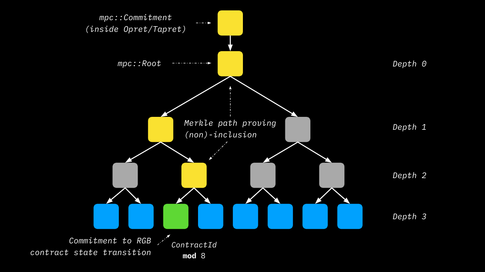

# Multi Protocol Commitments - MPC

Multi Protocol Commitments address the following important requirements:

1. How the tagged `mpc::Commitment` hash, committed in Bitcoin Blockchain according to `Opret` or `Tapret` schemes, is constructed.
2. How state changes associated with more than one contract can be stored in a single commitment.

In practice, the preceding points are addressed through an **ordered merkelization** of the multiple contracts/[state transitions](../annexes/glossary.md#state-transition) associated with the single UTXO that is spent by the **witness transaction** where such multiple transitions are eventually committed by means of the [DBC](deterministic-bitcoin-commitments-dbc/).

<figure><figcaption><p><strong>Each RGB contract has a unique position in the MPC Tree determined by a modular division applied to its ContractId according to the width of the tree. In this case the tree has width 8.</strong></p></figcaption></figure>

## MPC Root Hash

The commitment of the MPC tree - which goes either into [Opret](deterministic-bitcoin-commitments-dbc/opret.md) or into [Tapret](deterministic-bitcoin-commitments-dbc/tapret.md) commitments - is the `mpc::Commitment` constructed in BIP-341 fashion as follows:

`mpc::Commitment = SHA-256(SHA-256(mpc_tag) || SHA-256(mpc_tag) || mpc::Root )`

Where:

* `mpc::Root` is the root of the MPC tree whose construction is explained in the following paragraphs.
* `mpc_tag = urn:ubideco:mpc:commitment#2024-01-31`  follows[ RGB tagging conventions](https://github.com/RGB-WG/rgb-core/blob/vesper/doc/Commitments.md).

## MPC Tree Construction

In order to construct the MPC tree we must **deterministically provide a position to the leaf belonging to each contract**, thus:

> By setting `C` the number of contracts and `i = {0,1,..,C-1}` and by having a `ContractId(i) = c_i` to be included in the MPC, we can construct a tree with `w` leaves with `w > C` (corresponding to a depth `d` such that `2^d = w`), so that each contract identifier `c_i` representing a different contract is placed in unique position `pos(c_i) = c_i mod w`

In essence, the construction of a suitable tree of width `w` that hosts each contract `c_i` in a unique position represents a kind of mining process. The greater the number of contract `C`, the greater should be the number of leaves `w`. Assuming a random distribution of `pos(c_i)`, as per [Birthday Paradox](https://en.wikipedia.org/wiki/Birthday\_problem), we have \~50% probability of a collision occurring in a tree with `w ~ C^2`.

In order to avoid too large MPC trees and knowing that the occurrence of collisions is a random process, an additional optimization has been introduced. The modulus operation was modified according to the following formula: `pos(c_i) = c_i + cofactor mod w` where `cofactor` is a random number of 16 bytes that can be chosen as a "nonce" to obtain distinct values of `pos(c_i)` with `w` fixed. The tree construction process starts from the smallest tree such that `w > C`, then tries a certain number of `cofactor` attempts, if none of them can produce `C` distinct positions, `w` is increased and a new series of `cofactor` trials is attempted.

### **Contract Leaves (Inhabited)**

Once `C` distinct positions `pos(c_i)` with `i = 0,...,C-1` are found, the corresponding leaves are populated through a tagged hash constructed in the following way:

`tH_MPC_LEAF(c_i) = SHA-256(SHA-256(merkle_tag) || SHA-256(merkle_tag) || b || d || w || 0x10 || c_i || BundleId(c_i))`

Where:

* `merkle_tag = urn:ubideco:merkle:node#2024-01-31` is chosen according to [RGB conventions on Merkle Tree tagging  commitments](https://github.com/RGB-WG/rgb-core/blob/vesper/doc/Commitments.md#merklization-procedure). &#x20;
* `b = 1`  refers to the branching of the leaf which refers to a single leaf node.
* `d` is the depth of the MPC tree at the base layer.
* `w`  is the width of the MPC tree.
* `0x10` is the integer identifier of contract leaves.
* `c_i` is the 32-byte contract\_id which is derived from the hash of the [Genesis](../rgb-state-and-operations/state-transitions.md#genesis) of the contract itself.
* `BundleId(c_i)` is the 32-byte hash that is calculated from the data of the  [Transition Bundle](../rgb-state-and-operations/state-transitions.md#transition-bundle) which groups all the [State Transitions](../annexes/glossary.md#state-transition) of the contract `c_i`.

### **Entropy leaves (Uninhabited)**

For the remaining `w - C` uninhabited leaves, a dummy value must be committed. In order to do that, each leaf in position `j != pos(c_i)` is populated in the following way:

`tH_MPC_LEAF(j) = SHA-256(SHA-256(merkle_tag) || SHA-256(merkle_tag) || b || d || w || 0x11 || entropy || j )`

Where:

* `merkle_tag = urn:ubideco:merkle:node#2024-01-31` is chosen according to [RGB conventions on Merkle Tree tagging  commitments](https://github.com/RGB-WG/rgb-core/blob/vesper/doc/Commitments.md#merklization-procedure). &#x20;
* `b = 1`  refers to the branching of the leaf which refers to a single leaf node.
* `d` is the depth of the MPC tree at the base layer.
* `w`  is the width of the MPC tree.
* `0x11` is the integer identifier of entropy leaves.
* `entropy` is a 64-byte random value chosen by the user constructing the tree.

### MPC nodes

After generating the base of the MPC tree having `w` leaves, merkelization is performed following the rule of `commit_verify` crate detailed [here](https://github.com/RGB-WG/rgb-core/blob/vesper/doc/Commitments.md#merklization-procedure).

The following diagram shows the construction of an example MPC tree where:

* `C = 3` number of contract to place.
* As an example: `pos(c_0) = 7, pos(c_1) = 4, pos(c_2) = 2`.
* `BUNDLE_i = BundleId(c_i)`.
* `tH_MPC_BRANCH(tH1 || tH2) = SHA-256(SHA-256(merkle_tag) || SHA-256(merkle_tag) || b || d || w || tH1 || tH2)`.
* `merkle_tag = urn:ubideco:merkle:node#2024-01-31` is chosen according to [RGB conventions on Merkle Tree tagging  commitments](https://github.com/RGB-WG/rgb-core/blob/vesper/doc/Commitments.md#merklization-procedure). &#x20;
* `b` is the branching of the tree merkelization scheme. For this case it is `b = 2` meaning that the merkelization happens with 2 input nodes: `tH1` and `tH2`, both having 32-byte length .
* `d` is the tree depth which is updated at each level of the tree encoded a an 8-bit Little Endian unsigned integer. The depth at the base of the MPC tree in the example is `d = 3`
* `w` is a 256-bit Little Endian unsigned integer representing the width of the tree which remain fixed in each merkelization. In the example we have: `w=8`.


```
                                                                                   +--------------------------+
                                                                   mpc:Root        | th_MPC(tHABCD || tHEFGH) |
                                                                                   +-----------^---------^----+
                                                                                               |         |
                                              +------------------------------------------------+         +--------------------------------------------+
                                              |                                                                                                       |
                                +-------------+---------------+                                                                         +-------------+---------------+
                                | tH_MPC_BRANCH(tHAB || tHCD) |                                                                         | tH_MPC_BRANCH(tHEF || tHGH) |
                                +----------------^--------^---+                                                                         +-----------------+--------+--+
                                                 |        |                                                                                               |        |
                     +---------------------------+        +--------------+                                                   +------------------<---------+        +------------+
                     |                                                   |                                                   |                                                  |
       +-------------+-------------+                       +-------------+-------------+                       +-------------+-------------+                      +-------------+-------------+
       | tH_MPC_BRANCH(tHA || tHB) |                       | tH_MPC_BRANCH(tHC || tHD) |                       | tH_MPC_BRANCH(tHE || tHF) |                      | tH_MPC_BRANCH(tHG || tHH) |
       +----------------^------^---+                       +----------------^------^---+                       +----------------^------^---+                      +----------------^------^---+
                        |      |                                            |      |                                            |      |                                           |      |
         +--------------+      +-----+                       +--------------+      +- ---+                       +--------------+      + ----+                      +--------------+      +-----+
         |                           |                       |                           |                       |                           |                      |                           |
 +-------+--------+        +---------+------+        +-------+--------+        +---------+------+        +-------+--------+        +---------+------+        +------+---------+        +--------+-------+
 | tH_MPC_LEAF(A) |        | tH_MPC_LEAF(B) |        | tH_MPC_LEAF(C) |        | tH_MPC_LEAF(D) |        | tH_MPC_LEAF(E) |        | tH_MPC_LEAF(F) |        | tH_MPC_LEAF(G) |        | tH_MPC_LEAF(H) |
 +-------------^--+        +-------------^--+        +-------------^--+        +-------------^--+        +-------------^--+        +-------------^--+        +-------------^--+        +-------------^--+
               |                         |                         |                         |                         |                         |                         |                         | 
+--------------+-------+  +--------------+-------+  +--------------+----------+  +-----------+---------+  +------------+------------+  +---------+------------+  +---------+------------+  +---------+---------------+ 
| 0x11 || entropy || 0 |  | 0x11 || entropy || 1 |  | 0x10 || c_2 || BUNDLE_2 |  | 0x11 | entropy || 3 |  | 0x10 || c_1 || BUNDLE_1 |  | 0x11 || entropy || 5 |  | 0x11 || entropy || 6 |  | 0x10 || c_0 || BUNDLE_0 | 
+----------------------+  +----------------------+  +-------------------------+  +---------------------+  +-------------------------+  +----------------------+  +----------------------+  +-------------------------+
```


### MPC Tree Verification

From a verifier's perspective, in order to prove the presence of client-side validate related to some contract `c_i` collected in `BUNDLE_i`, **only a Merkle Proof pointing at it inside the tree is needed**. Because of this, different verifiers of different contracts do not have the full view of the Merkle Tree as the builder does, and this guarantee, together with the dummy entropy, leaves a high degree of privacy. Using the example tree in the diagram above, a verifier of, say, the contract `c_2` will receive the following _Merkle Proof_ from the tree builder:


```
                                                                            +-------------------------------+
                                                                            | tH_MPC_ROOT(tHABCD || tHEFGH) |
                                                                            +----------------^---------^----+
                                                                                             |         |
                                       +-----------------------------------------------------+         +---------------------------------------+
                                       |                                                                                                       |
                         +-------------+---------------+                                                                         +-------------+---------------+
                         | tH_MPC_BRANCH(tHAB || tHCD) |                                                                         | tH_MPC_BRANCH(tHEF || tHGH) |
                         +----------------^--------^---+                                                                         +-----------------------------+
                                          |        |
              +---------------------------+        +--------------+
              |                                                   |
+-------------+-------------+                       +-------------+-------------+
| tH_MPC_BRANCH(tHA || tHB) |                       | tH_MPC_BRANCH(tHC || tHD) |
+---------------------------+                       +----------------^------^---+
                                                                     |      |
                                                      +--------------+      +- ---+
                                                      |                           |
                                              +-------+--------+        +---------+------+
                                              | tH_MPC_LEAF(C) |        | tH_MPC_LEAF(D) |
                                              +-------------^--+        +-------------^--+
                                                            |                         |
                                             +-------------------------+  +------+----+---------+                                                                                                           
                                             | 0x10 || c_3 || BUNDLE_2 |  | 0x11 | entropy || 3 |                                                                                                           
                                             +-------------------------+  +------+--------------+                                                                                                           
```


So the Merkle Proof provided to verify the existence and uniqueness of contract commitment in the tree is: `0x11 | entropy || 3` `tH_MPC_BRANCH(tHA || tHB)` `tH_MPC_BRANCH(tHEF || tHGH`.
