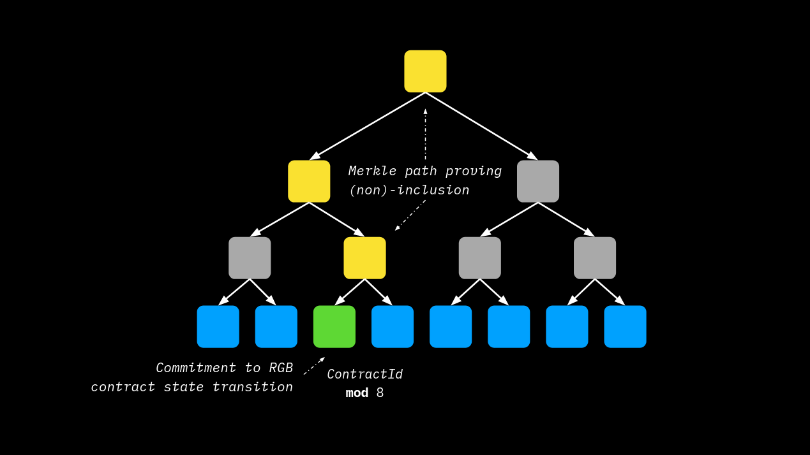

# Multi Protocol Commitments - MPC

Multi Protocol commitments address the following important requirements:

1. How the tagged  `mpc::Commitment` hash,  committed in Bitcoin Blockchain according to `Opret` or `Tapret` schemes, is constructed.
2. How state changes associated with more than one contract can be stored in a single commitment.

In practice, the preceding points are addressed through an **ordered merkelization** of the multiple contracts/state transitions associated with the UTXO that are expended by the **witness closing transaction** where such multiple transitions are eventually committed by means of [DBC](deterministic-bitcoin-commitments-dbc/).

<figure><figcaption><p>E<strong>ach RGB contract has a unique position in the MPC Tree determined by a modular division applied to its ContractId according to the width</strong></p></figcaption></figure>

## MPC Tagged Hash

The commitment of the MPC tree - which goes either into Opret or into Tapret commitments - is the `mpc::Commitment` constructed in BIP-341 fashion as follows:

`mpc::Commitment = SHA-256(SHA-256(urn:ubideco:mpc:commitment#2024-01-31) || SHA-256(urn:ubideco:mpc:commitment#2024-01-31) || x)`

`x` is the root of the MPC tree whose construction is explained in the following paragraphs.

## MPC Tree Construction

In order to construct the MPC tree we must **deterministically provide a position of the leaf belonging to each contract**, thus:

> By setting `C` the number of contracts `c_i` to be included in the MPC we can construct a tree with `w` leaves with `w > C` (corresponding to a depth `d` such that `2^d = w`), such that each contract identifier `c_i` representing a different contract is placed in unique position `pos_i = c_i mod w`

In essence, the construction a suitable tree of width `w` that hosts each contract `c_i` in a unique position represents a kind of mining process. The greater the number of contract `C`, the greater should be the number of leaves `w`. Assuming a random distribution of `pos_i`, as per [Birthday Paradox](https://en.wikipedia.org/wiki/Birthday\_problem), we have \~50% probability of a collision occurring at the position in a tree with `w ~ C^2`.

To avoid too large MPC trees and the occurrence of collisions being a random process, an additional optimization was introduced. The modulus operation was modified according to the following formula: `pos_i = c_i + cofactor mod w` where `cofactor` is a random number of 16 bytes that can be chosen as a "nonce" to obtain distinct values of `pos_i` with `w` fixed. The tree construction process starts from the smallest tree such that `w > C`, then tries a certain number of `cofactor` attempts, if none of them can produce `C` distinct positions, `w` is increased and a new series of `cofactor` trials is attempted.

### **Contract Leaves (Inhabited)**

Once `C` distinct positions `pos_i` with `i = 0,...,C-1` are found, the corresponding leaves are populated in the following way:

`tH_MPC_LEAF(c_i) = SHA-256(SHA-256(urn:lnpbp:lnpbp4) || SHA-256(urn:lnpbp:lnpbp4) || 0x10 || c_i || BUNDLE_i )`

Where:

* `0x10` is the integer identifier of contract leaves;
* `c_i` is the 32-byte contract\_id which is the hash of the [genesis](commitment-schemes.md) of the contract itself;
* `BUNDLE_i` is the 32-byte hash that is calculated from the data of the bundle of state transition.

### **Entropy leaves (Uninhabited)**

For the remaining `w - C` uninhabited leaves, a dummy value must be committed. In order to do that, each leaf in position `j != pos_i` is populated in the following way:

`tH_MPC_LEAF(j) = SHA-256(SHA-256(urn:lnpbp:lnpbp4) || SHA-256(urn:lnpbp:lnpbp4) || 0x11 || entropy || j )`

Where:

* `0x11` is the integer identifier of entropy leaves;
* `entropy` is a 64-byte random value chosen by the user constructing the tree.

The following diagram shows the construction of an example MPC tree where:

* `C = 3`
* `d = 3 (w = 8)`
* `tH_MPC_BRANCH(tH1 || tH2) = SHA-256(SHA-256(urn:lnpbp:lnpbp4) || SHA-256(urn:lnpbp:lnpbp4) || d || w || tH1 || tH2)`
* `d` and `w` is the tree depth and width respectively
* `pos_1 = 7, pos_2 = 4, pos_3 = 2`

```
                                                                                   +-------------------------------+
                                                                                   | tH_MPC_ROOT(tHABCD || tHEFGH) |
                                                                                   +----------------^---------^----+
                                                                                                    |         |
                                              +-----------------------------------------------------+         +---------------------------------------+
                                              |                                                                                                       |
                                +-------------+---------------+                                                                         +-------------+---------------+
                                | tH_MPC_BRANCH(tHAB || tHCD) |                                                                         | tH_MPC_BRANCH(tHEF || tHGH) |
                                +----------------^--------^---+                                                                         +-----------------+--------+--+
                                                 |        |                                                                                               |        |
                     +---------------------------+        +--------------+                                                   +------------------<---------+        +------------+
                     |                                                   |                                                   |                                                  |
       +-------------+-------------+                       +-------------+-------------+                       +-------------+-------------+                      +-------------+-------------+
       | tH_MPC_BRANCH(tHA || tHB) |                       | tH_MPC_BRANCH(tHC || tHD) |                       | tH_MPC_BRANCH(tHE || tHF) |                      | tH_MPC_BRANCH(tHG || tHH) |
       +----------------^------^---+                       +----------------^------^---+                       +----------------^------^---+                      +----------------^------^---+
                        |      |                                            |      |                                            |      |                                           |      |
         +--------------+      +-----+                       +--------------+      +- ---+                       +--------------+      + ----+                      +--------------+      +-----+
         |                           |                       |                           |                       |                           |                      |                           |
 +-------+--------+        +---------+------+        +-------+--------+        +---------+------+        +-------+--------+        +---------+------+        +------+---------+        +--------+-------+
 | tH_MPC_LEAF(A) |        | tH_MPC_LEAF(B) |        | tH_MPC_LEAF(C) |        | tH_MPC_LEAF(D) |        | tH_MPC_LEAF(E) |        | tH_MPC_LEAF(F) |        | tH_MPC_LEAF(G) |        | tH_MPC_LEAF(H) |
 +-------------^--+        +-------------^--+        +-------------^--+        +-------------^--+        +-------------^--+        +-------------^--+        +-------------^--+        +-------------^--+
               |                         |                         |                         |                         |                         |                         |                         | 
+--------------+-------+  +--------------+-------+  +--------------+----------+  +-----------+---------+  +------------+------------+  +---------+------------+  +---------+------------+  +---------+---------------+ 
| 0x11 || entropy || 0 |  | 0x11 || entropy || 1 |  | 0x10 || c_3 || BUNDLE_3 |  | 0x11 | entropy || 3 |  | 0x10 || c_2 || BUNDLE_2 |  | 0x11 || entropy || 5 |  | 0x11 || entropy || 6 |  | 0x10 || c_1 || BUNDLE_1 | 
+----------------------+  +----------------------+  +-------------------------+  +---------------------+  +-------------------------+  +----------------------+  +----------------------+  +-------------------------+
```

### MPC Tree Verification

From a verifier's perspective, in order to prove the presence of client-side validate related to some contract `c_i` collected in BUNDLE\_i, **only a **_**Merkle Proof**_** pointing at it inside the tree is needed**. Because of this, different verifiers of different contracts do not have the full view of the Merkle Tree as the builder does, and this guarantee, together with the dummy entropy, leaves a high degree of privacy. Using the example tree in the diagram above, a verifier of, say, the contract `c_3` will receive the following _Merkle Proof_ from the tree builder:

```
                                                                            +-------------------------------+
                                                                            | tH_MPC_ROOT(tHABCD || tHEFGH) |
                                                                            +----------------^---------^----+
                                                                                             |         |
                                       +-----------------------------------------------------+         +---------------------------------------+
                                       |                                                                                                       |
                         +-------------+---------------+                                                                         +-------------+---------------+
                         | tH_MPC_BRANCH(tHAB || tHCD) |                                                                         | tH_MPC_BRANCH(tHEF || tHGH) |
                         +----------------^--------^---+                                                                         +-----------------------------+
                                          |        |
              +---------------------------+        +--------------+
              |                                                   |
+-------------+-------------+                       +-------------+-------------+
| tH_MPC_BRANCH(tHA || tHB) |                       | tH_MPC_BRANCH(tHC || tHD) |
+---------------------------+                       +----------------^------^---+
                                                                     |      |
                                                      +--------------+      +- ---+
                                                      |                           |
                                              +-------+--------+        +---------+------+
                                              | tH_MPC_LEAF(C) |        | tH_MPC_LEAF(D) |
                                              +-------------^--+        +-------------^--+
                                                            |                         |
                                             +-------------------------+  +------+----+---------+                                                                                                           
                                             | 0x10 || c_3 || BUNDLE_3 |  | 0x11 | entropy || 3 |                                                                                                           
                                             +-------------------------+  +------+--------------+                                                                                                           
```

So the Merkle Proof provided to verify the existence and uniqueness of contract commitment in the tree is: `0x11 | entropy || 3` `tH_MPC_BRANCH(tHA || tHB)` `tH_MPC_BRANCH(tHEF || tHGH`
