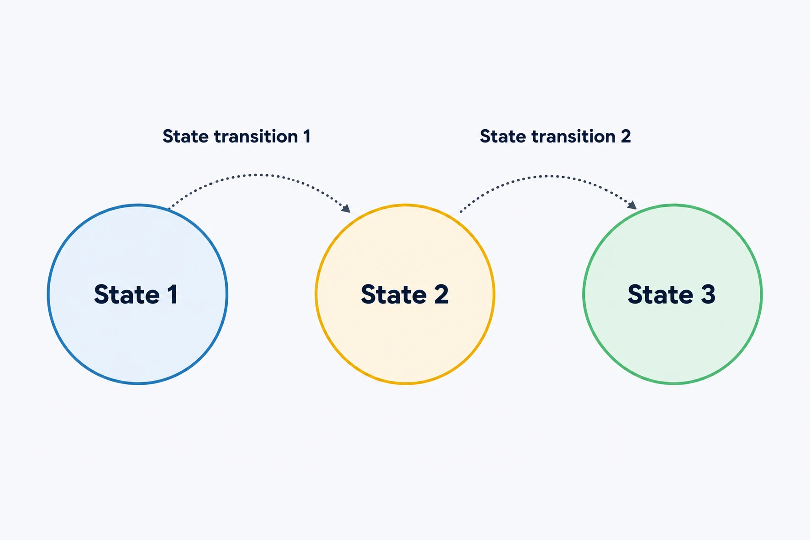
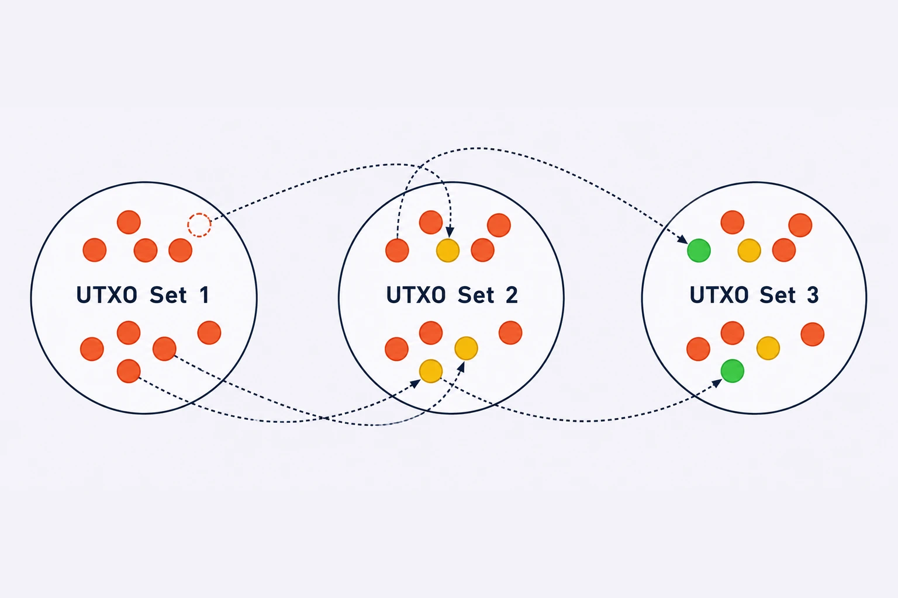
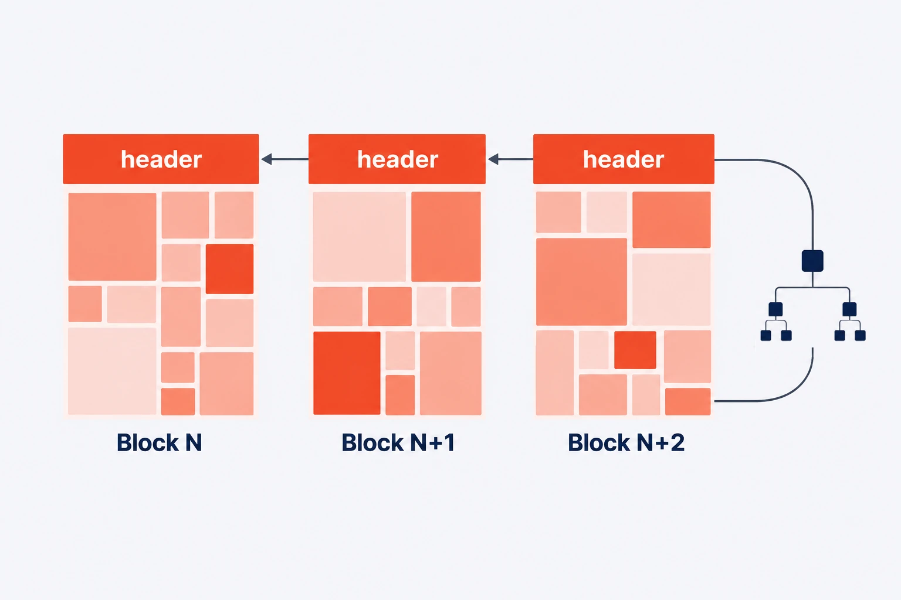
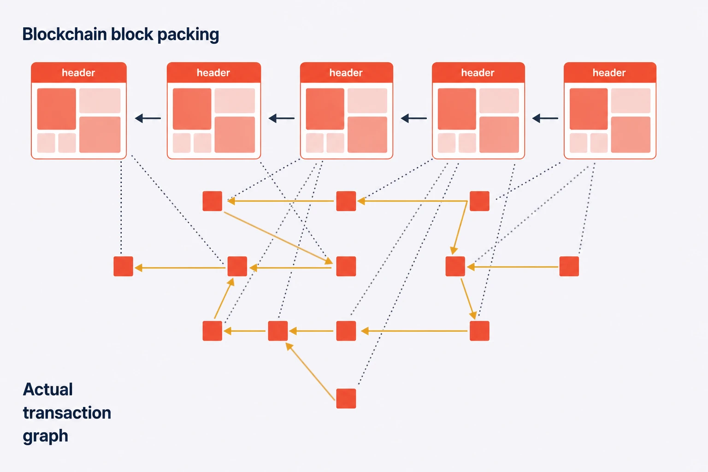
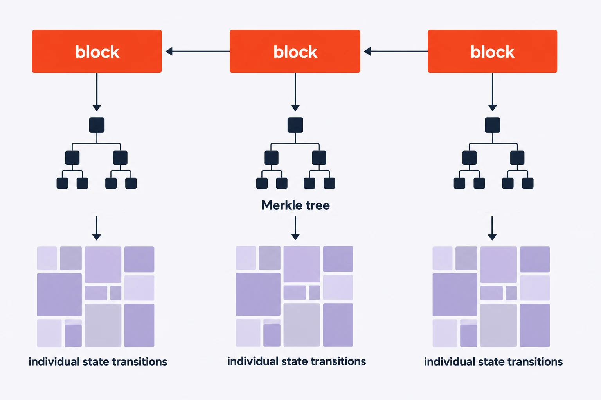
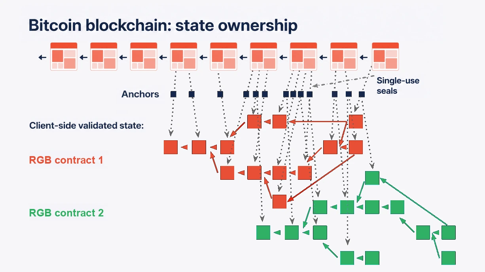

# Client-side Validation

In a distributed system, every validation process aims to **assess the validity and the chronological ordering of states**, hence to verify that state transitions correctly follow the protocol rules.

<figure><figcaption>
<strong>A consensus-based system allows the operator to track the changes of certain properties over time.</strong>
</figcaption></figure>

Taking the Bitcoin blockchain as an example, this tracking process is meant to verify that the changes to the [UTXO set](https://en.wikipedia.org/wiki/Unspent\_transaction\_output) are valid. In fact, with every new block added to the chain (i.e. the ordered sequence), the UTXO set gets modified. Thus, every block represents a **state update**.

<figure><figcaption>
<strong>In Bitcoin, the system state is represented by the UTXO Set, which represents the ownership of bitcoins.</strong>
</figcaption></figure>

The main drawback of Layer 1's validation process is that **each node must validate all transactions (even those coming from other nodes) and store the related data** long after the block is added on top of the chain. This architecture leads to two main issues:

* **Scalability**: the size limit of the blocks, versus the demand for blockspace per unit of time among participants, limits the transaction throughput (i.e. a maximum of 1 MB on \~10 minutes on average on bitcoin, taking into account [witness discount](https://en.bitcoin.it/wiki/Segregated\_Witness)).
* **Privacy**: the details of each transaction are broadcast and stored publicly (in particular, the amounts transacted and the receiving addresses are visible to everyone, albeit pseudonymous).

<figure><figcaption>
<strong>In public blockchains, every node must validate and store every transaction, which generates scalability and privacy issues.</strong>
</figcaption></figure>

However, from the recipient's perspective, only two aspects matter:

* The most recent state transition, represented by a transaction addressed to the recipient themselves.
* The chronological sequence of transactions (and thus state transitions) leading up to the last one.

What is relevant to the recipient is the chain of ownership transfers from the asset's Genesis to the last transaction addressed to them, i.e. their Directed Acyclic Graph, which is only a subset of the complete dataset.

<figure><figcaption>
<strong>The transaction graph of public blockchains cannot be sharded: since any transaction may reference an output created anywhere in prior history, all nodes must maintain a consistent view of the entire history, in order to validate new blocks.</strong>
</figcaption></figure>

For this reason, the **conventional validation logic can be reversed** as follows:

* Each party validates its **own portion of the history**, and thus the digital properties that matter to them.
* A compact reference to the **validated state transition is committed in Layer 1** to be timestamped. This construction constitutes a [Proof-of-Publication](https://petertodd.org/2017/scalable-single-use-seal-asset-transfer) and acts as an **anti-double-spending measure**.

<figure><figcaption>
 <strong>Layer 1 blocks remain public, while client-side validated state transitions are aggregated and committed through suitable Merkelization within Layer 1 transactions.</strong>
</figcaption></figure>

**Client-side Validation** ensures that the following properties are met:

* **Scalability**: since the commitment of the verified state, which must be stored by all, has, at least, a small footprint (order of tens of bytes), or, in [some commitment scheme](../commitment-layer/deterministic-bitcoin-commitments-dbc/tapret.md), no additional footprint in respect to an ordinary transaction.
* **Privacy**: using a [one-way cryptographic hash function](https://en.wikipedia.org/wiki/Cryptographic\_hash\_function) (such as [SHA-256](https://en.wikipedia.org/wiki/SHA-2)), the original data (the pre-image) that generated the commitment cannot be reconstructed, thus keeping it private to the parties involved.

<figure><figcaption>
<strong>Multiple data packages can be aggregated in a single Layer 1 transaction. The Anchor structure establishes a deterministic link between the client-side data of the contract and the single-use seal.</strong>
</figcaption></figure>

The commitment structure used in client-side validation (as implemented in the RGB protocol, which we will cover in detail [later](../commitment-layer/commitment-schemes.md)) allows for important additional scalability features:

* The aggregation of state transitions from different contracts (e.g., two different contracts related to 2 different digital assets committed in a single Bitcoin transaction).
* The bundling of multiple state transitions of the same asset in a single client-side operation.

[Anchor](../commitment-layer/anchors.md) structures provide the deterministic link between the [single-use seal](single-use-seals.md) and the client-side data representing the message over which the [single-use seal is closed](single-use-seals.md#seal-closing).

To guarantee the efficacy of the commitment scheme and the precise chronological ordering derived from Layer 1, a new cryptographic primitive needs to be introduced: the **Single-use Seal**.

***
