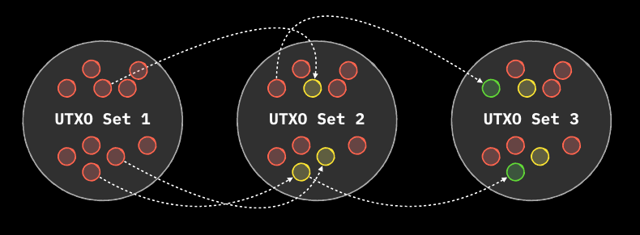
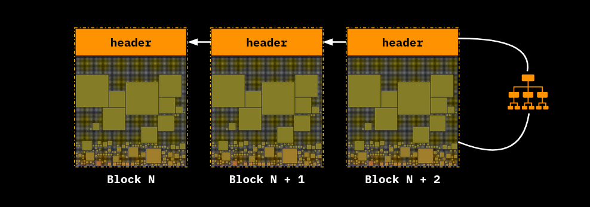
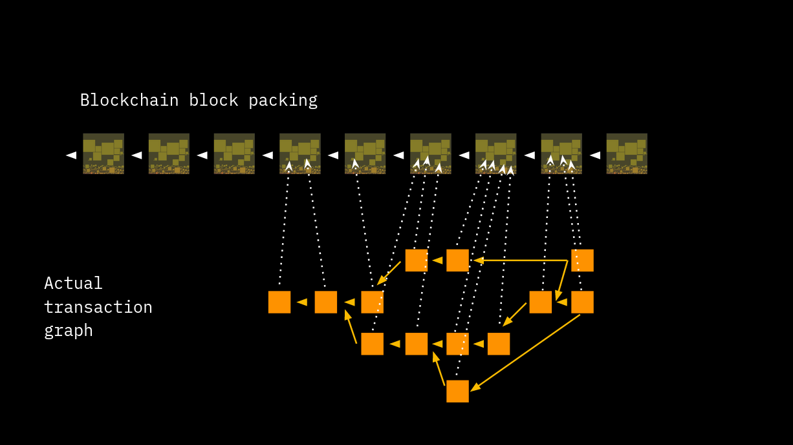
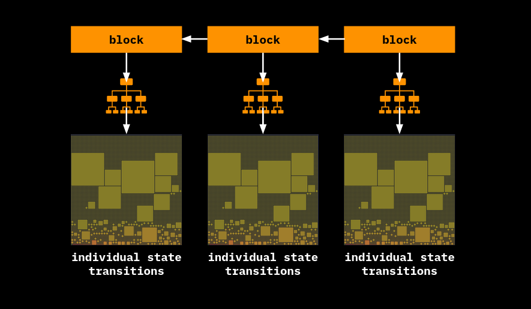
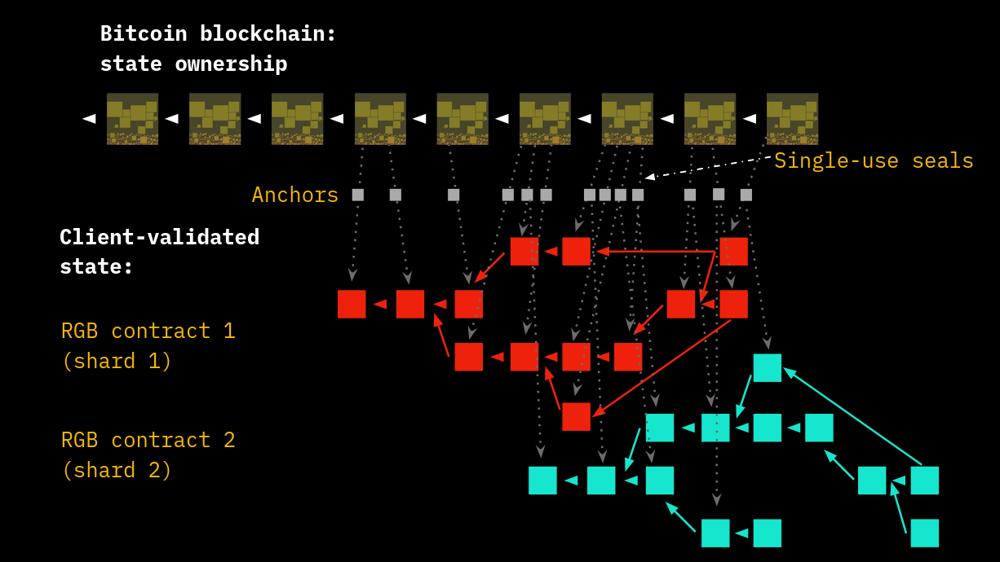

# Client-side Validation

The goal of every validation process in a distributed system is the **ability to assess the validity and chronological ordering of states**, hence to verify the correctness with respect to the protocol rules of the state transitions that have occurred.

<figure><figcaption>
<strong>Consensus system allows for the tracking of the state evolution of some properties</strong>
</figcaption></figure>

In Bitcoin Blockchain, for instance, such process verify the correctness of the changes in the [UTXO set](https://en.wikipedia.org/wiki/Unspent\_transaction\_output) determined by the transactions collected into the sequence of ordered blocks. Thus, every block represents a **state update**.

<figure><figcaption>
<strong>In Bitcoin the System State is represented by the UTXO Set, reflecting the ownership of bitcoins.</strong>
</figcaption></figure>

The main drawback of Layer 1 validation process is that **each node has to validate each transaction from everybody and store the related data** once block inclusion takes place. This architecture leads to two main issues:

* **Scalability**: the size limit of the blocks vs. the demand of blockspace per unit time shared by all willing participants limits the transaction throughput (i.e. \~4 MB on \~10 minutes on average on bitcoin)
* **Privacy**: details of each transaction are broadcasted and stored in public form (in particular: the amounts transacted and the receiving addresses, although pseudonyms).

<figure><figcaption>
<strong>In Public Blockchains everyone needs to validate all the information leading to privacy and scalability issues.</strong>
</figcaption></figure>

However, from the point of view of the recipient of a transaction, the only aspects that matter are:

* the last state transition motivated by a transaction addressed to him;
* the chronological sequence of transactions (and thus state transitions) leading up to the last state transition.

Basically what is important to him is the [Directed Acyclic Graph](client-side-validation.md) which connects the history of the state transitions from the [genesis](client-side-validation.md) to the last state addressed to him (a **Shard** of the whole data).

<figure><figcaption>
<strong>The transaction graph of Public Blockchains cannot be sharded due to internal consistency</strong>
</figcaption></figure>

For this reason, the **logic of validation can be reversed** in the following terms:

* Each part validates its **own part of the history** and thus the digital properties that matters to him.
* A compact reference of the **validated state transition is committed in the first layer** to be time-stamped. This construction constitutes a **Proof-of-Publication** and acts as an **anti double-spending measure**.

<figure><figcaption>
 <strong>The Layer 1's blocks is kept public, but Client-side validated state transition are aggregated and committed through suitable merkelization in Layer 1's transactions</strong>
</figcaption></figure>

**Client-side Validation** ensures that the following properties are met:

* Scalability: since the commitment of the verified state, which must be stored by all, has a small footprint (order of tens of bytes).
* Privacy: using a one-way cryptographic hash function (such as SHA-256), the original data (the pre-image) that produced the commitment cannot be reconstructed and, moreover, is kept private by the parties.

<figure><figcaption>
<strong>Several shards can be aggregated in a single Layer 1 transaction allowing for g</strong>
</figcaption></figure>

The commitment structure used in Client-Side Validation (as in the RGB protocol, which we will cover in detail later) allows for important additional scalability features:

* aggregate state transitions of different properties (e.g., two different contracts related to 2 different digital assets).
* bundle more than one state transition of the same asset in the same commitment.

In order to guarantee the efficacy of the commitment scheme and precise chronological ordering derived from the blockchain layer, the use of a new cryptographic primitive needs to be introduced: the **Single-use Seal**.
