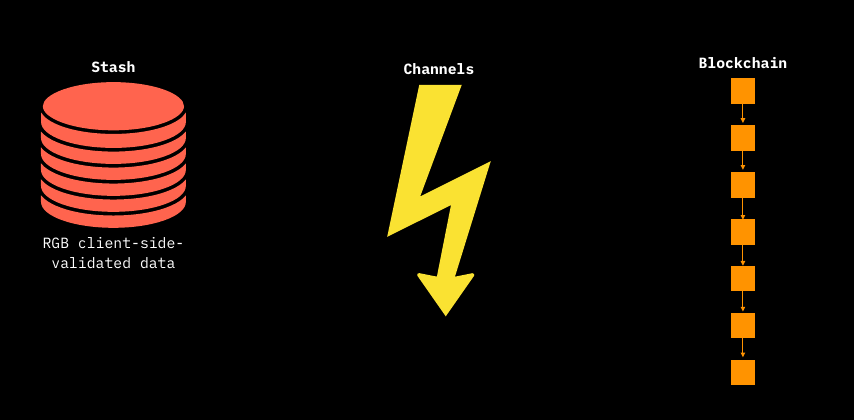
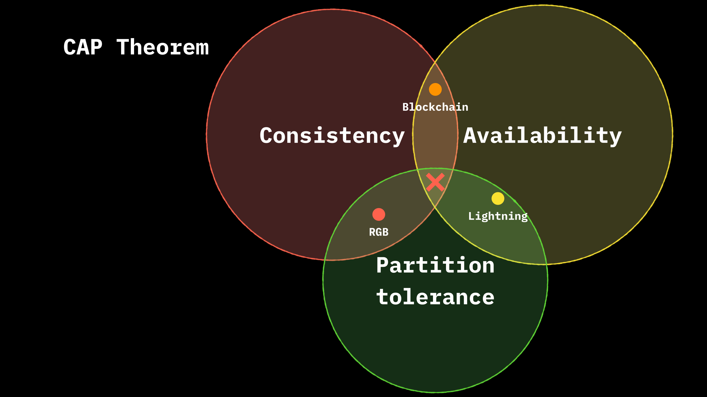
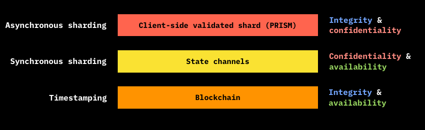
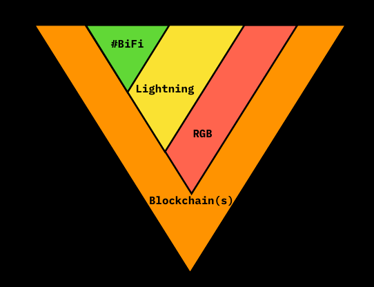

# Paradigms of Distributed Computing

RGB locate itself as a new additional piece of the vast word of _Distributed Computing_.

Distributed computing, is a branch of Computer Science which study the protocol systems able to exchange and compute data information between a network of computer nodes: the set of computer nodes and the underlying protocol rules which allows the computation of these data are the constituents of a **Distributed System**.

The nodes, composing the network are able to independently verify and validate some set of data and they can construct, depending on the protocol, complete or partial snapshots of the set of information elaborated by the network: these are called the **states** of the distributed system and essentially represent the expression of properties and the underlying agreement over those properties that are established during network operations.

The most important properties of a distributed system is represented by the **Chronological Ordering** of the operations and the data and thus the **ordered sequence of state changes** that take place inside the system. In fact when we talk about **Consensus**, we are talking about:

1. **recognizing the validity of the state transitions** by the nodes according to the protocol rules.
2. **establishing consensus on the order of the state transitions** so that every node knows which operation precedes the other and the state cannot be reversed once it has changed: the so called **anti double-spend property**.

The achievement of a _resilient and reliable_ chronological ordering for distributed system, which embeds important properties such as permissionlessness and censorship resistance, was reached by Satoshi Nakamoto with the invention of Bitcoin, using the blockchain data structure and a **Proof-of-Work** consensus which is able to entrust different participants to the system according to their computational power. Indeed Bitcoin can be considered the first working example of a permissionless **Distributed Consensus System**.

We will discuss various kind of **Distributed Consensus Systems** which have some degree of hierarchy and interrelated properties between them. They are differentiated on how they determine and enforce the most updated state of the system:

* **Blockchain + PoW Mechanism**. The sequence of **state transitions** is public and auditable and is organized in **transactions** included in ordered blocks which are added one upon the other. The security of the system lies on the amount of work required to produce an alternative chain which revert the actual greater-work chain which is considered as the valid chain. For instance **Bitcoin** is based on this technological stack.
* **State Channels**. Is a system constructed between 2 (or more) parties and which depend hierarchically on the blockchain layer. The final state is represented by the last transaction out of sequence of ordered invalidating transactions, signed and agreed by the parties _off-chain_. The final state can be enforced by each parties by publishing that last valid transaction on the layer 1. The most known application of payment channels, a simplified form of state channels, is the **Lightning Network**.
* **Client Side Validated Data - Stash**. Is a system that can be implemented both on top of blockchain and state channels and it is based on a certain _circumscribed_ amount of data whose validity, computation tasks and update is entrusted to a _limited number_ nodes. Unlike layer 1, the data to be validated by each client node represent a **defined subset of the entirety of all state transitions of the network, and NOT every transition happened within it**. This validated subset of data in possession of a client node is what is called **Stash**. Basically, the client needs to validate the whole history of the state transitions occurred from the start to the last transition and which relate to the exchange and to the validation of some digital properties among the counterparties involved. Seen as a whole, the validation mechanism of the shard which produce the stash is called **Client-side Validation** and underpin all **RGB** operations.&#x20;

<figure><figcaption>
<strong>The 3 set of Distributed System - Blockchain (Layer 1) is self-sustaining while the other 2 rely on Layer 1 for operating. In turn, Stashes can operate on top of both Blockchain and State Channels.</strong>
</figcaption></figure>

In order to precisely frame the applications of each Distributed Consensus System and their underlying data structure it's important to understand the limitations that affect each one of these technology. This condition is expressed in form of a **Trilemma** which is connected to an important theoretical result of Distributed Computing, known as [**CAP Theorem**](https://en.wikipedia.org/wiki/CAP\_theorem). which states that:

> Any distributed system can provide simultaneously only two of the following three guarantees:
>
> * Consistency - Every node in the system agree on the current global state.&#x20;
> * Availability - Every request to the system receives a response.
> * Partition Tolerance - The system continues to operate correctly despite a network partition, e.g. failures or delays between nodes.

<figure><figcaption>
<strong>Application of CAP Theorem to Distributed Consensus System - Each Distributed Consensus System can fit 2 - and only 2 - out of the 3 properties</strong>
</figcaption></figure>

Seen from a more consensus-focused point of view, the properties of the theorem can be reformulated in the following way:

* Consistency > Integrity
* Availability > Decentralization
* Partition Tolerance > Scalability and Confidentiality

<figure><figcaption>
<strong>A more in-depth view of the inherent degree of application of the Trilemma to Distributed Consensus System</strong>
</figcaption></figure>

In synthesis:

* **Blockchain** preserve Integrity and Decentralization but **lacks Scalability** and Confidentiality as each node need to replicate _publicly and in full_ every state transition.
* **State Channels** preserve Decentralization and Scalability but **doesn't preserve Integrity** as the state can be changed or updated asynchronously by the counterparties.
* **Stashes of Client Side validated data** are Scalable and maintain Integrity, however they **are not replicated** by the vast majority of nodes of the network **lacking Availability**. For this reason these data are not decentralized as a single point of centralization which backup them is required to recover them in case of loss.

An important feature to take into account is the different way through which State Channel and Client-Side validation architectures update the state of the data:

* Channel state must be **synchronous** between the counterparts.
* Client side validated state update can be **asynchronous**.

Naturally, if the client-side validated data are embedded in the state channels, the state update will be ultimately based on an asynchronous process.

<figure><figcaption>
<strong>Blockchain is the base layer over which multiple-interacting layers can be constructed</strong>
</figcaption></figure>

In addition to the three layers just described, a fourth layer of Bitcoin Finance (#BiFi) which leverages both state channels and blockchain can complete the whole ecosystem. The general picture and the deep interconnections of all the layers, with the blockchain layer at the base, allows to achieve all the properties of the CAP theorem in a composite way.

In the next section we will delve into Client-side Validation and its features.
