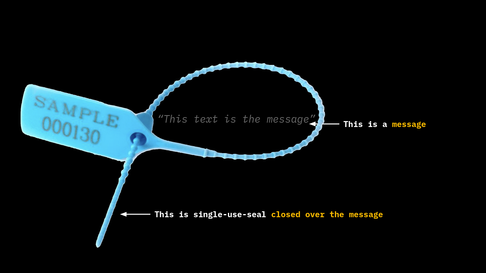

# Single-use Seals and Proof of Publication

Single-use Seals are cryptographic primitives [proposed](https://petertodd.org/2016/commitments-and-single-use-seals) by Peter Todd in \~2016. They are a kind of **cryptographic commitment** that resembles the application of a physical seal to a container. They can be used to prove a sequence of events to a party, thereby limiting the risk that such a sequence may be altered after it has been established. This implies that such commitment schemes are a more sophisticated form of both `simple commitments` (i.e. digest/hash) and `timestamping`.

<figure><figcaption><p><strong>Physical single-use seals: once closed their protected content cannot be altered</strong></p></figcaption></figure>

To work properly, Single-use Seals require a **Proof-of-Publication Medium**: it may be a medium with global consensus (such as blockchains), not necessarily decentralized, which has the ability to be difficult to forge or replicate once issued and made public. A **newspaper** represents a widespread example of this concept.

The **Proof-of-Publication Medium** will be used:

* To prove that _every_ member `p` in an audience `P` has received a certain message `m`.
* To prove that the message `m` has not been published.
* To prove that some member `q` is in the audience `P`.

With these properties, we can give a more formal definition:

> _Single-Use-Seal is a formal promise to commit to a (yet) unknown message in the future, once and only once, such that the fact of commitment is demonstrably known to all members of a certain audience._

With this definition and the general properties above, we can compare the properties of the various cryptographic primitives along with Single-use Seals:

| Property                                                             | Simple commitment (digest/hash) | Timestamp    | Single-Use-Seals |
| -------------------------------------------------------------------- | ------------------------------- | ------------ | ---------------- |
| Commitment publication does not reveal the message                   | Yes                             | Yes          | Yes              |
| Proof of the commitment time / message existence before certain date | Not Possible                    | Possible     | Possible         |
| Prove that no alternative commitment can exist                       | Not Possible                    | Not Possible | Possible         |

So how can we practically construct a disposable seal and what operations have to be used? In general, the principles of operation include 3 steps:

* **Seal Definition**.
* **Seal Closing**.
* **Seal Verification**.

For the following operation examples, we will use the well-known computer science characters, Alice and Bob.

### **Seal Definition**

In Seal Definition, Alice promises to Bob (either in private or in public) to create some **message** (in practice a hash of some data):

* At a well-defined point in time and space.
* Using an agreed publication medium.

### **Seal Closing**

When Alice publishes the **message** following all the rules stated in the Seal definition, in addition, she produces also a **witness**, which is the proof that the seal has indeed been closed.

<figure><figcaption><p><strong>By closing a message with a single-use seal, such message cannot be altered. In it's digital form, inscribed in Layer 1, the seal cannot be opened any more.</strong></p></figcaption></figure>

### **Seal Verification**

**Once closed the seal, being "single-use", cannot be opened nor closed again.** The only thing Bob can do is to check whether the seal has actually been closed around the message commitment, using as inputs: the seal, the witness, and the message (which is a commitment to some data).

In Computer Science Language the whole procedure can be summed up as follows:

```
seal <- Define()                         # Done by Alice, accepted by Bob.

witness <- Close(seal, message)          # Close a seal over a message, done by Alice.

bool <- Verify(seal, witness, message)   # Verify that the seal was closed, done by Bob.
```

The combination of Single-Use-Seals and Client-Side-Validation enables a distributed system that does not require global consensus (i.e. a blockchain) to store all the data that matters to some counterparts, providing a high level of scalability and privacy. However, this is not enough to make the system work. Because the definition of a single-use seal is done on the client side and does not need to be included in the global consensus medium, **a party can’t prove that the definition of the seal ever took place** even if one is a member of the audience observing the publication medium.

We therefore need a **“chain” of Single-Use-Seals**, where **the closure of the previous seal incorporates the definition of subsequent seal(s): this is what RGB does together with Bitcoin**:

* Messages represent the commitment to client-side validated data.
* Seal definitions are bitcoin UTXO.
* The commitment is a hash entered within a Bitcoin transaction.
* The seal closure can be a UTXO that is spent or an address to which a transaction credits some bitcoins.
* The chain of connected transaction spends represents the Proof-of-Publication.

In the next chapters, we will explore in detail how RGB implements the concept of Single-Use-Seal by storing the commitments of its operation in the Bitcoin blockchain.

***
