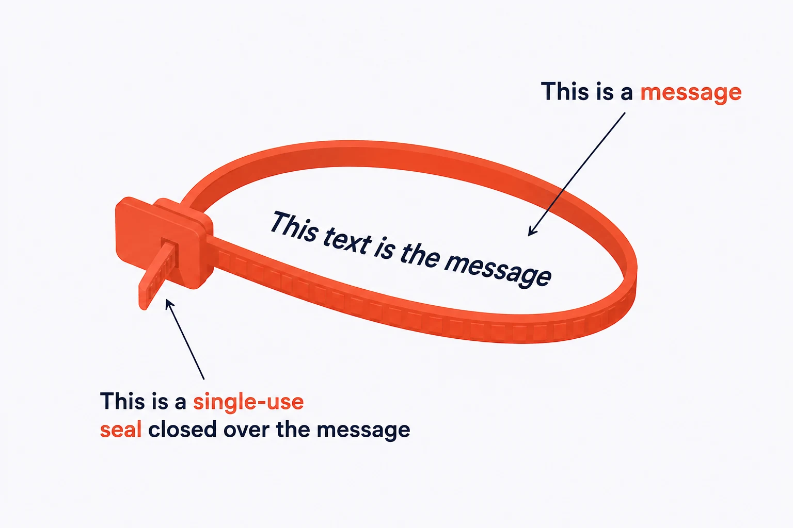

# Single-use Seals and Proof of Publication

Single-use Seals are cryptographic primitives [proposed](https://petertodd.org/2016/commitments-and-single-use-seals) by Peter Todd in \~2016. They are a type of **cryptographic commitment** that resembles a physical seal applied to a container. Such primitives let a party prove to another that a sequence of events took place, which reduces the risk that the sequence could be altered once established.

This property renders such commitment schemes a more sophisticated form of both `simple commitments` (i.e. digest/hash) and `timestamping`.

To be more precise, a simple hash proves that a party possesses certain data without revealing it, but it doesn't prove when the data was created. Meanwhile, timestamping establishes that something existed before a certain date, but it doesn't prevent the same party from creating alternative commitments. Single-use Seals combine the properties of both these primitives.

<figure><figcaption><p><strong>A physical single-use seal: once closed, its protected content cannot be altered</strong></p></figcaption></figure>

To work properly, single-use seals require a **proof-of-publication medium**: a mechanism based on global consensus (such as blockchains) that is not necessarily decentralized, but protects against forgery or replication once the commitment is issued and made public. A **newspaper** is a familiar example of this concept.

The **proof-of-publication medium** will be used:

* To prove that _every_ member `p` in an audience `P` has received a certain message `m`.
* To prove that the message `m` has not been revealed.
* To prove that some member `q` is in the audience `P`.

Considering these properties, we can write a more formal definition:

> _A single-use seal is a formal promise to commit once (and only once) to a yet-unknown message in the future, such that the fact of commitment is demonstrably known to all members of a certain audience._

Taking this definition and the general properties above into account, we can compare the properties of single-use seals with those of various cryptographic primitives:

| Property                                                   | Simple Commitment | Timestamp    | Single-use Seals |
| ----------------------------------------------------------- | ------------------ | ------------ | ----------------- |
| Never reveal the message when the commitment is published   | Yes                 | Yes          | Yes                |
| Prove message existence before a certain date                | Not Possible        | Possible     | Possible           |
| Prove no alternative commitment can exist                    | Not Possible        | Not Possible | Possible           |

How can we construct a single-use seal and which operations are involved? In general, this process includes three steps:

* **Seal Definition**.
* **Seal Closing**.
* **Seal Verification**.

For the following examples, we will use the well-known computer science characters, Alice and Bob.

### **Seal Definition**

Alice promises Bob (either in private or in public) to create some **message** (technically a hash of some data):

* At a well-defined point in time and space.
* Using an agreed publication medium.

### **Seal Closing**

When Alice publishes the **message** following all the rules stated in the seal definition, she also produces a **witness**, which proves that the seal has indeed been closed.

<figure><figcaption><p><strong>By closing a single-use seal containing a message, a user renders such a message unalterable. In its digital form, inscribed in Layer 1, the seal cannot be opened anymore.</strong></p></figcaption></figure>

### **Seal Verification**

**Once the seal is closed, it cannot be opened or closed again, precisely because it's single-use.** The only thing Bob can do is check whether the seal has actually been closed over the message commitment: to do it, he will use the seal, the witness, and the message (which is a commitment to some data) as inputs.

In Computer Science terms, the whole procedure can be summed up as follows:

```
seal <- Define()                         # Done by Alice, accepted by Bob.

witness <- Close(seal, message)          # Close a seal over a message, done by Alice.

bool <- Verify(seal, witness, message)   # Verify that the seal was closed, done by Bob.
```

Thanks to the combination of single-use seals and client-side validation, a distributed system does not need global consensus (that is, a blockchain) in order to reliably store all the data that matters to some counterparties. A distributed system will use global consensus only to commit that data. This design provides a high level of scalability and privacy. However, it is not enough to make the system work. Because the definition of a single-use seal occurs on the client side and does not need to be recorded on the global consensus medium, **a party cannot prove that the seal's definition ever took place** even if that party is a member of the audience observing the publication medium.

We therefore need a **"chain" of single-use seals**, where **the closure of the previous seal incorporates the definition of the subsequent seal. RGB Protocol on Bitcoin implements such a mechanism** as follows:

* Messages represent the commitment to client-side validated data.
* Seal definitions are bitcoin UTXOs.
* The commitment is a hash embedded in a Bitcoin transaction.
* The seal closure can take the form of a UTXO that is spent or an address that receives Bitcoin.
* This resulting chain of connected transactions represents the Proof-of-Publication.

In the next chapters, we will explore in detail how RGB Protocol implements the concept of single-use seals by storing the commitments of its operations in the Bitcoin blockchain.

***
