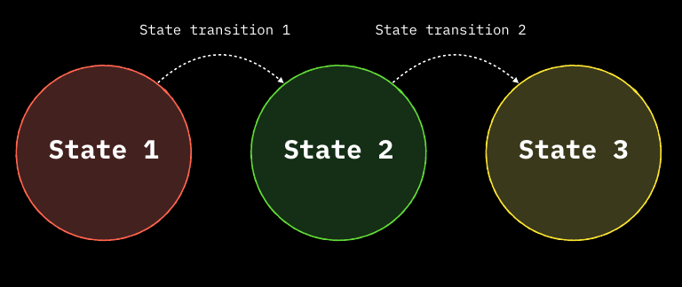
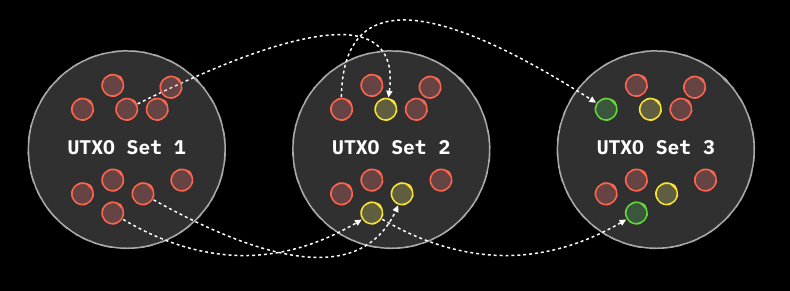
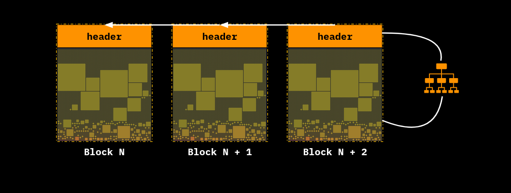
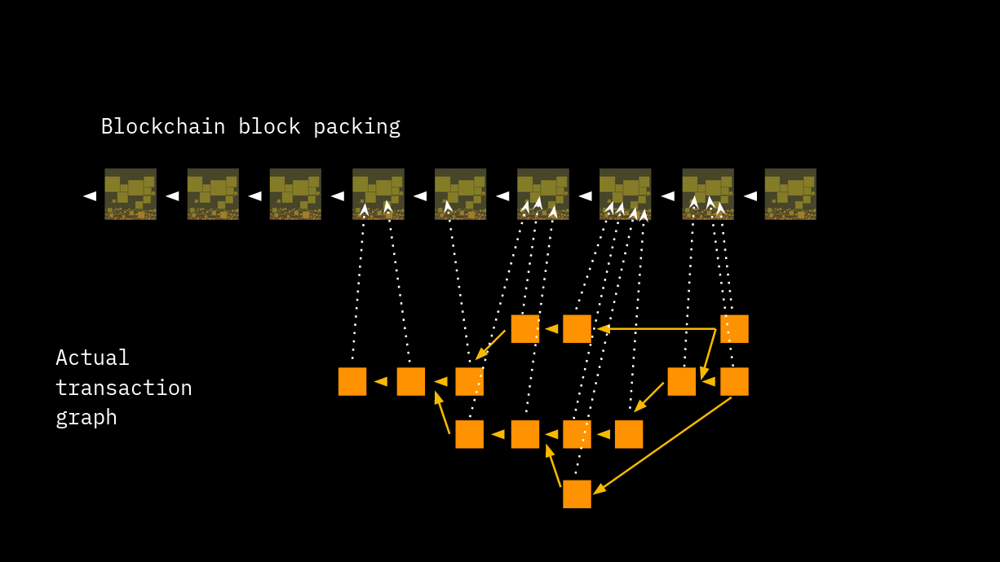
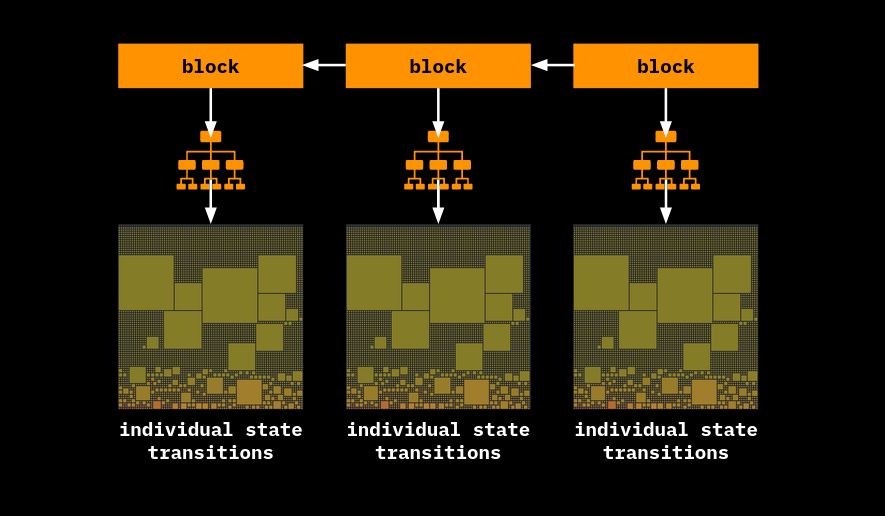
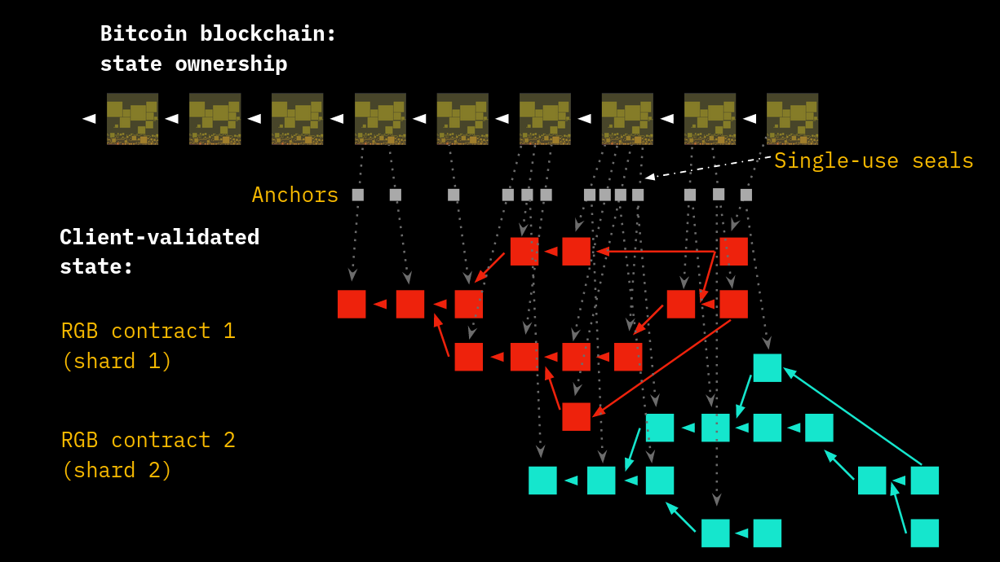
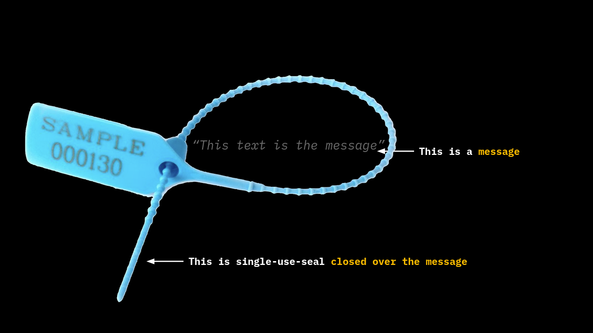

# Technical Introduction and Base Concepts

Before divining into the technical details of the RGB, the introduction to the fundamental concepts of the technology, as well as the study of the base terminology represent the essential step towards a thorough understanding of the subject.

## Paradigm of Distributed Computing

* RGB locate itself as a new additional piece of the vast word of *Distributed Computing*.
* Distributed computing, is a branch of Computer Science which study the protocol systems able to exchange and compute data information between a network of computer nodes: the set of computer nodes and the underlying protocol rules which allows the computation of these data are the constituents of a **Distributed System**.
  * The nodes, composing the network are able to independently verify and validate some set of data and they can construct, depending on the protocol, complete or partial snapshots of the set of information elaborated by the network: these are called the **states** of the distributed system and essentially represent the expression of properties and the underlying agreement over those properties that are established during network operations.
  * The most important properties of a distributed system is represented by the **Chronological Ordering** of the operations and the data and thus the **ordered sequence of state changes** that take place inside the system. In fact when we talk about **Consensus**, we are talking about:
    1.  **recognizing the validity of the state transitions** by the nodes according to the protocol rules.
    2.  **establishing consensus on the order of the state transitions** so that every node knows which operation precedes the other and the state cannot be reversed once it has changed: the so called **anti double-spend property**. 
  * The achievement of a *resilient and reliable* chronological ordering for distributed system, which embeds important properties such as permissionlessness and censorship resistance, was reached by Satoshi Nakamoto with the invention of Bitcoin, using the blockchain data structure and a **Proof-of-Work** consensus which is able to entrust different participants to the system according to their computational power. Indeed Bitcoin can be considered the first working example of a permissionless **Distributed Consensus System**.     

We will discuss various kind of **Distributed Consensus Systems** which have some degree of hierarchy and interrelated properties between them. They are differentiated on how they determine and enforce the most updated state of the system:
* **Blockchain + PoW Mechanism**. The sequence of **state transitions** is public and auditable and is organized in **transactions** included in ordered blocks which are added one upon the other. The security of the system lies on the amount of work required to produce an alternative chain which revert the actual greater-work chain which is considered as the valid chain. For instance **Bitcoin** is based on this technological stack.
* **State Channels**. Is a system constructed between 2 (or more) parties and which depend hierarchically on the blockchain layer. The final state is represented by the last transaction out of sequence of ordered invalidating transactions, signed and agreed by the parties *off-chain*. The final state can be enforced by each parties by publishing that last valid transaction on the layer 1. The most known application of payment channels, a simplified form of state channels, is the **Lightning Network**.
* **Client Side Validated Data - Stash**. Is a system that can be implemented both on top of blockchain and state channels and it is based on a certain *circumscribed* amount of data whose validity, computation tasks and update is entrusted to a *limited number* nodes. Unlike layer 1, the data to be validated by each client node represent a **defined subset of the entirety of all state transitions of the network, and NOT every transition happened within it**. This validated subset of data in possession of a client node is what is called **Stash**. Basically, the client needs to validate the whole history of the state transitions occurred from the start to the last transition and which relate to the exchange and to the validation of some digital properties among the counterparties involved. Seen as a whole, the validation mechanism of the shard which produce the stash is called **Client-side Validation** and underpin all **RGB** operations. <br>  <br> <p align="center">
  <br>
 <i> The 3 set of Distributed System - Blockchain (Layer 1) is self-sustaining while the other 2 rely on Layer 1 for operating. In turn, Stashes can operate on top of both Blockchain and State Channels.
 </i>
</p>

In order to precisely frame the applications of each Distributed Consensus System and their underlying data structure it's important to understand the limitations that affect each one of these technology. This condition is expressed in form of a **Trilemma** which is connected to an important theoretical result of Distributed Computing, known as **[CAP Theorem](https://en.wikipedia.org/wiki/CAP_theorem)**. which states that:

> Any distributed system can provide simultaneously only two of the following three guarantees:
> * Consistency - Every node in the system agree on the current global state.
> * Availability - Every request to the system receives a response.
> * Partition Tolerance - The system continues to operate correctly despite a network partition, e.g. failures or delays between nodes.

<p align="center">
	 <br>
	<i> Application of CAP Theorem to Distributed Consensus System - Each Distributed Consensus System can fit 2 - and only 2 - out of the 3 properties </i>
</p>

Seen from a more consensus-focused point of view, the properties of the theorem can be reformulated in the following way: 

* Consistency > Integrity
* Availability > Decentralization
* Partition Tolerance > Scalability and Confidentiality

<p align="center">
    <br>
   <i>A more in-depth view of the inherent degree of application of the Trilemma to Distributed Consensus System</i>
</p>

In synthesis:
* **Blockchain** preserve Integrity and Decentralization but **lacks Scalability** and Confidentiality as each node need to replicate *publicly and in full* every state transition.
* **State Channels** preserve Decentralization and Scalability but **doesn't preserve Integrity** as the state can be changed or updated asynchronously by the counterparties.
* **Stashes of Client Side validated data** are Scalable and maintain Integrity, however they **are not replicated** by the vast majority of nodes of the network **lacking Availability**. For this reason these data are not decentralized as a single point of centralization which backup them is required to recover them in case of loss.  

An important feature to take into account is the different way through which State Channel and Client-Side validation architectures update the state of the data:

* Channel state must be **synchronous** between the counterparts.
* Client side validated state update can be **asynchronous**.

Naturally, if the client-side validated data are embedded in the state channels, the state update will be ultimately based on an asynchronous process. 


<p align="center">
    <br>
   <i>Blockchain is the base layer over which multiple-interacting layers can be constructed </i>
</p>

In addition to the three layers just described, a fourth layer of Bitcoin Finance (#BiFi) which leverages both state channels and blockchain can complete the whole ecosystem. The general picture and the deep interconnections of all the layers, with the blockchain layer at the base, allows to achieve all the properties of the CAP theorem in a composite way.

In the next paragraph we will delve into Client-side Validation and its features.  

## Client-side Validation

The goal of every validation process in a distributed system is the **ability to assess the validity and chronological ordering of states**, hence to verify the correctness with respect to the protocol rules of the state transitions that have occurred.

<p align="center">
    <br>
   <i> Consensus system allows for the tracking of state evolution of some properties.</i>
</p>


In Bitcoin Blockchain, for instance, such process verify the correctness of the changes in the [UTXO set](https://en.wikipedia.org/wiki/Unspent_transaction_output) determined by the transactions collected into the sequence of ordered blocks. Thus, every block represents a **state update**.

<p align="center">
    <br>
   <i> In Bitcoin the System State is represented by the UTXO Set, reflecting the ownership of bitcoins.</i>
</p>

The main drawback of Layer 1 validation process is that **each node has to validate each transaction from everybody and store the related data** once block inclusion takes place. This architecture leads to two main issues:
* **Scalability**: the size limit of the blocks vs. the demand of blockspace per unit time shared by all willing participants limits the transaction throughput (i.e. ~4 MB on ~10 minutes on average on bitcoin)   
* **Privacy**: details of each transaction are broadcasted and stored in public form (in particular: the amounts transacted and the receiving addresses, although pseudonyms).
  
<p align="center">
    <br>
   <i>In Public Blockchains everyone needs to validate all the information leading to privacy and scalability issues.</i>
</p>

However, from the point of view of the recipient of a transaction, the only aspects that matter are:
* the last state transition motivated by a transaction addressed to him;
* the chronological sequence of transactions (and thus state transitions) leading up to the last state transition.

Basically what is important to him is the [Directed Acyclic Graph](#) which connects the history of the state transitions from the [genesis]() to the last state addressed to him (a **Shard** of the whole data).

<p align="center">
    <br>
   <i>The transaction graph of Public Blockchains cannot be sharded due to internal consistency</i>
</p>

For this reason, the **logic of validation can be reversed** in the following terms:
* Each part validates its **own part of the history** and thus the digital properties that matters to him.
* A compact reference of the **validated state transition is committed in the first layer** to be time-stamped. This construction constitutes a **Proof-of-Publication** and acts as an **anti double-spending measure**. 


<p align="center">
    <br>
   <i>The Layer 1's blocks is kept public, but Client-side validated state transition are aggregated and committed through suitable merkelization in Layer 1's transactions</i>
</p>

**Client-side Validation** ensures the following properties are met:
* Scalability: since the commitment of the verified state, which must be stored by all, has a small footprint (order of tens of bytes).
* Privacy: using a one-way cryptographic hash function (such as SHA-256), the original data (the pre-image) that produced the commitment cannot be reconstructed and, moreover, is kept private by the parties.

<p align="center">
    <br>
   <i>Several shards can be aggregated in a single Layer 1 transaction allowing for g</i>
</p>


The commitment structure used in Client-Side Validation (as in the RGB protocol, which we will cover in detail later) allows for important additional scalability features:
* aggregate state transitions of different properties (e.g., two different contracts related to 2 different digital assets).
* bundle more than one state transition of the same asset in the same commitment.   

In order to guarantee the efficacy of the commitment scheme and precise chronological ordering derived from the blockchain layer, the use of a new cryptographic primitive needs to be introduced: the **Single-use Seal**.

## Single-Use-Seals

Single-Use-Seals are cryptographic primitives [proposed](https://petertodd.org/2016/commitments-and-single-use-seals) by Peter Todd in ~2016. They are a kind of **cryptographic commitment** that resembles the application of a physical seal to a container. They can be used to prove a sequence of events to a party, thereby limiting the risk that this sequence of events may be altered after it has been established. This implies that such commitment schemes are a more sophisticated form of both `simple commitments` (i.e. digest/hash) and `timestamping`.

<p align="center">
    <br>
   <i>Physical single-use seals: once closed their protected content cannot be altered</i>
</p>

In order to work properly, Single-Use-Seals require a **Proof-of-Publication Medium**: it may be a medium with global consensus (such as blockchain) but not necessarily decentralized which has the ability to be difficult to forge or replicate once issued and made public, such as a newspaper.

The **Proof-of-Publication Medium** will be used:
* to prove that *every* member `p` in a audience `P` has received message `m`;
* to prove that message `m` has not been published;
* to prove that some member `q` is in the audience `P`.

With these properties we can give a more formal definition:

> _Single-Use-Seal is a formal promise to commit to a (yet) unknown message in the future, once and only once, such that the fact of commitment is demonstrably known to all members of a certain audience._

With this definition and the general properties above, we can compare the properties of the various cryptographic primitives mentioned with Single-Use-Seals:

|                                                                      | Simple commitment (digest/hash) | Timestamps   | Single-Use-Seals |
|----------------------------------------------------------------------|---------------------------------|--------------|------------------|
| Commitment publication does not reveal the message                   | Yes                             | Yes          | Yes              |
| Proof of the commitment time / message existence before certain date | Not Possible                    | Possible     | Possible         |
| Prove that no alternative commitment can exist                       | Not Possible                    | Not Possible | Possible         |

So how can we practically construct a disposable seal and what can be used? In general, the principles of operation include 3 steps:

* Seal Definition;
* Seal Closing;
* Seal Verification.

For the examples we will use the well-known computer science characters, Alice and Bob.

**Seal Definition** 
 
In Seal definition, Alice promise to Bob (either in private or in public) to create some **message** (in practice an hash of some data):
* at a well-defined point in time and space;
* using an agreed publication medium.

**Seal Closing**

When Alice publishes the **message** following all the rules stated in the **seal definition**, in addition, she produces also a **witness**, which is the proof that the seal has indeed been closed.

<p align="center">
    <br>
   <i>By closing a message with a single-use seal, such message cannot be altered. In it's digital form inscribed in Layer 1, the seal cannot be opened any more</i>
</p>

**Seal Verification**
      
Once closed the seal, being "single-use", cannot be opened nor closed again. The only thing Bob can do is to check whether the seal has actually been closed around the message commitment, using as inputs: the seal, the witness and the commitment (to the message).

In Computer Science Language the whole procedure can be summed-up as follows:
```
seal <- Define()                         # Done by Alice, accepted by Bob.

witness <- Close(seal, message)          # Close a seal over a message, done by Alice.

bool <- Verify(seal, witness, message)   # Verify that the seal was closed, done by Bob.
```

The combination of Single-Use-Seals and Client-Side-Validation enables a distributed system that does not require global consensus (i.e. a blockchain) to store all the data that matters to some counterparts, providing a high level of scalability and privacy. However, this is not enough to make the system work. Because the definition of a Single-Use-Seal is done on the client side and does not need to be included in the global consensus medium, **a party can’t prove that the definition of the seal ever took place** even if one is a member of the audience observing the publication medium.

We therefore need a **“chain” of Single-Use-Seals**, where **the closure of the previous seal incorporates the definition of subsequent seal(s): this is what RGB does together with Bitcoin**:
 * messages are committed to client-side validated data;
 * seal definitions are bitcoin UTxO;
 * the commitment is a hash entered within a Bitcoin transaction;
 * the seal closure can be a UTxO that is spent or an address to which a transaction credits some bitcoin.

### Library for Client-side Validation
Repository:
* https://github.com/LNP-BP/client_side_validation

Rust Crates:
* https://crates.io/crates/client_side_validation
* https://crates.io/crates/single_use_seals
 
In the next chapter we will explore in detail how RGB implements the concept of Single-Use-Seal by storing the commitments of its operation in the Bitcoin blockchain.