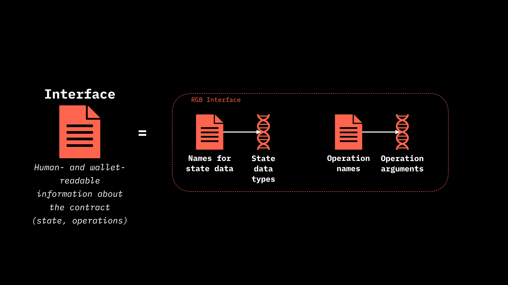

# Interface

## Interfaces

We anticipated that an interface is both human-readable and wallet-readable information about the contract, the state it is in, and the transactions it can make. The wallet can interact with different contracts using interfaces. So the only thing the wallet has to learn is not the billions of pattern shapes, which can happen, but a small amount of interfaces, which are commonly used. And the interfaces can have a little bit of functionality. They don't necessarily have to cover everything. For example, you can have an interface for a named contract, which just returns the name of the contract or something like that. So it is a fairly composite thing, and the contract can have multiple interfaces to the outside world, which makes things much simpler.

<figure><figcaption>
<strong>Example of a wallet that interacts with multiple contracts through various interfaces</strong>
</figcaption></figure>

They, therefore, make sense of the different contracts for the user, telling the wallet, first of all, what state the contract has. In addition to the semantic meaning of the state they also provide information on how to parse that state. The only thing the wallet gets through the interface, if you are working with RGB from outside Rust, is a JSON (or YAML) structure, which is self-explanatory, with field names and everything, so that it is easy to make sense of the internal structured data, even if it is complex structures. In addition, the interface tells the wallet what operations can be performed with the contract, what arguments it accepts. Because each argument is structured data, a wallet can also have a way to expose any interface because from the structured data you can generate a form. This means that RGB basically support any smart contract with any interface because of this explanatory layer.

So, a contract can implement many interfaces to provide advanced functionality, and you can update the functionality of the contract and have users be able to use it without asking the wallet developers to update their software. So, for example, suppose you exposed some of it through the standard interface such as RGB20. Unlike Ethereum's ERC20 standard, the contract is created without a single transaction on the blockchain. In fact, you just fill out the form and create a binary object that you then send to other people. So, you can do that and people will see, you will see 20 interfaces in their wallets when they import your contract, but the day after tomorrow you could create a new interface that exposes some other part of the functionality, send it to your users and they will immediately see more of your contract in their wallet without the wallet developers updating or making a new release. What the interface does is it takes the name, then it defines the set of states, like it knows the sum of the states of the contract, and it says these contract-specific state types have these names, and these data types are also bound to the strict type definition. So you basically add semantics to what is already in the contract, and the same thing happens with operations and arguments. So, the interface is a very, very small thing. It's just two mappings.

<figure><figcaption>
<strong>Components of an RGB interface</strong>
</figcaption></figure>
