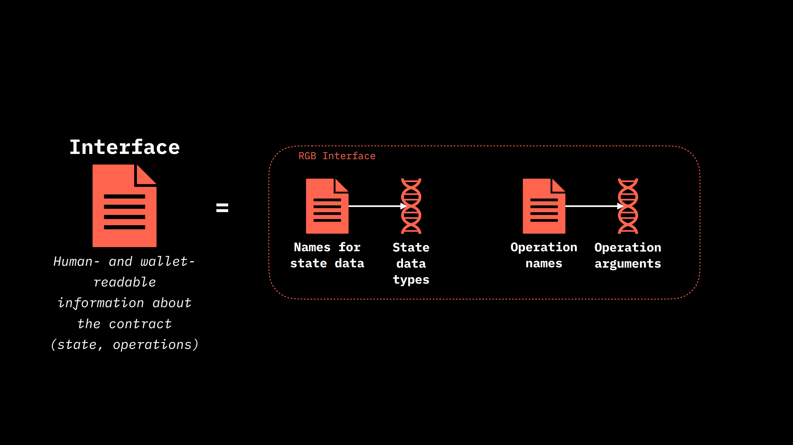
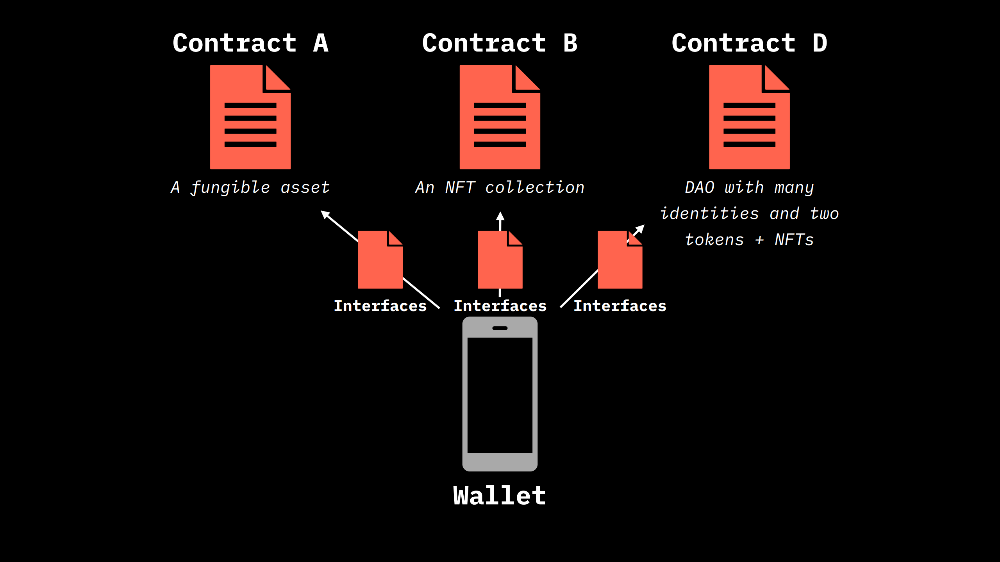

# Interface

An **Interface represents a standardized way to translate all the information pertaining to a compiled contract, as well as its states and operation, in a human-readable and wallet-readable format.**

A RGB Interface can be compared to the very same word of various Object Oriented Programming (OOP) Languages such as Java's _Interfaces_. In Rust, the equivalent concept is expressed by the _trait_ statement.&#x20;

Their use in RGB is made necessary by the design choice of the contract construction. Indeed, as  described in the previous chapters,  [Schema](../schema/) is expressed a purely declarative form which is then eventually compiled in a `.rgb` binary file or in a `.rgba` armored binary file. Through Schema the definition of the [states](../../annexes/glossary.md#contract-state), the related variable and [contract operation](../../annexes/glossary.md#contract-operation) is basically **not accessible without additional pieces of code which actually are able to parse these information once those are compiled.** &#x20;

<figure><figcaption>
<strong>Definition and purposes of an RGB Interface.</strong>
</figcaption></figure>

With Interface we can have a **semantic connection** which can connect to suitable predefined names all the relevant types encoded in the strict type system, in particular:

* Allows to interface the available states, read the names state and state data and **access their value**, for example the ticker name, the maximum amount token&#x20;
* Access the operation name and access the data contained in a specific contract operation, for example the amount of token been transferred.
* Allows for the construction of contract operation permitted in the schema, by using the name data mapping&#x20;

In general we can state that **contracts which have different purposes possess different interfaces which are built to parse them.** For instance an Interface for a non inflatable fungible token would be different from that parsing a DAO with identities. However, **a single interface may provide a standard way to parse a large number of contracts of the same kind**. This approach provides several benefit:

* **Standardization of contract interface**, fostering code re-usability for common wallet tasks. In particular this is the purpose of the Interfaces provided by the LNP/BP association described in the next section.&#x20;
* A clear **separation between the development of schema and the development of interfaces** which can happen in different development streams. For instance the Schema developers can focus on the contract features paying attention only to the connections of those features an already coded interface (task which is accomplished by [interface implementation](./#interface-implementation) we will be discussing just after).
* A **contract may even be parsable by more than one interface** in order to provide separated functionality for different class of wallet and users. For example the features of an issuer would be more advanced to those of a normal user, which can lack all the complex part related to the contract issuance.

<figure><figcaption>
W<strong>allet that interacts with multiple contracts through various interfaces</strong>
</figcaption></figure>

From this important points, it's helpful to stress, once more, the major **difference of RGB in respect to Ethereum smart contract system.** In the case of Ethereum, as well as other blockchain-based smart contract systems, all the interface related part is encoded directly inside the contract and committed into the blockchain at issuance time. This approach leads, inevitably, to an high degree of rigidity in the possible evolution of the contract, since it results hard to make modification to some specific part of the interface without modify the contract altogether. With RGB the clear separation of contract Schema and Interface allows to **easily modify the interface (and also the Interface Implementation)  even after assets issuance.**  This way the contract can contain some advance functionality whose Interface code with the wallet can be written later and independently from the development of the contract.

In the next section we will be going through a description of some Interface which are shipped by default with [RGB Standard Library](https://github.com/RGB-WG/rgb-std)  and which were provided by LNP/BP association. As a final remark it is important to point out that **any person can write his own custom interface**.
