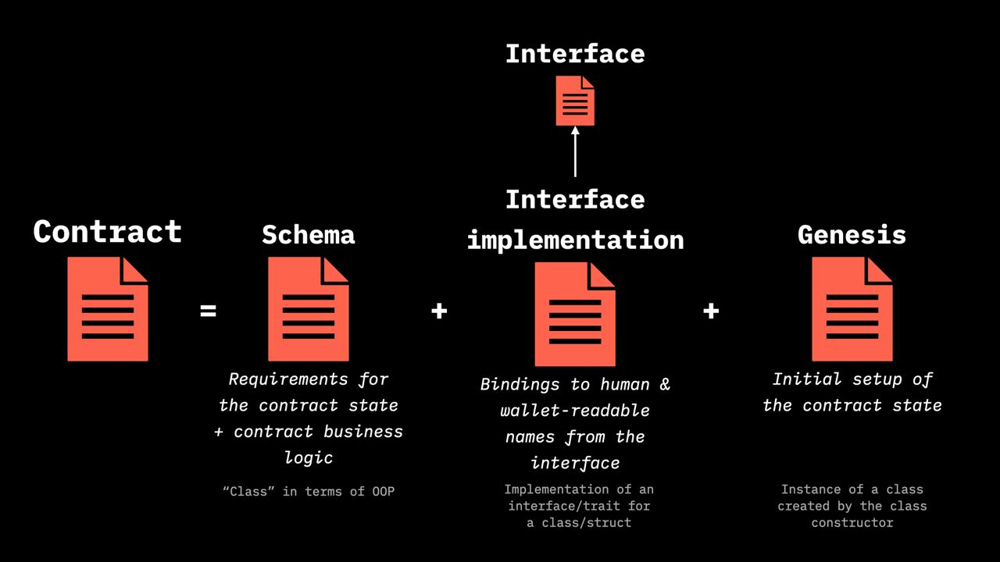

# Contract Implementation in RGB

We have come now to this final  section in which we will be **describing how an RGB contract is actually defined and implemented**. In addition to [Genesis](../annexes/glossary.md#genesis),  which we have discussed [earlier](../rgb-state-and-operations/state-transitions.md#genesis), the definition of  [contract](../annexes/glossary.md#contract) in RGB ecosystem it is realized by  2  independent and complementary components &#x20;

* [Schema](schema/)&#x20;
* [Interface](interface-and-interface-implementations/)&#x20;
* In addition to these components a third one called [Interface Implementation](../annexes/glossary.md#interface-implementation) is responsible to bridge  the latter two together. &#x20;

At this regard, it is important to point out that **each one of this component can be freely** and independently developed by different developers, provided that they respect the RGB consensus regarding the validation of client-side data and strict types formats. This represent a notable feature of RGB ecosystem which allows an even higher degree of competition among different components of the contract itself.

In the image below a general scheme of all the components together with a summary explanation is reported.

<figure><figcaption>
<strong>The list of components which defines a contract in RGB and their analogies with construct of OOP programming languages.</strong>
</figcaption></figure>

In order to give a better general view, the following table summarizes the main characteristics of each one and the  equivalent terminology  adopted both in Object Oriented Programming (OOP) languages and in Ethereum contract system.

<table><thead><tr><th width="220">Contract component</th><th width="129">Meaning</th><th width="162">OOP terms</th><th>Ethereum terms</th></tr></thead><tbody><tr><td>Genesis </td><td>Initial Contract State</td><td>Class constructor</td><td>Contract constructor</td></tr><tr><td>Schema </td><td>Contract business logic</td><td>Class</td><td>Contract</td></tr><tr><td>Interface</td><td>Contract semantics</td><td>
Interface (Java), 

trait (Rust), protocol (Swift)
</td><td>ERC* Standard</td></tr><tr><td>Interface Implementation</td><td>Mapping semantics to business logic</td><td>Impl (Rust), Implements (Java)</td><td>Application Binary Interface (ABI)</td></tr></tbody></table>

In the next sections we shall explore in more depth the role and the technicalities of each one of these constructs.
