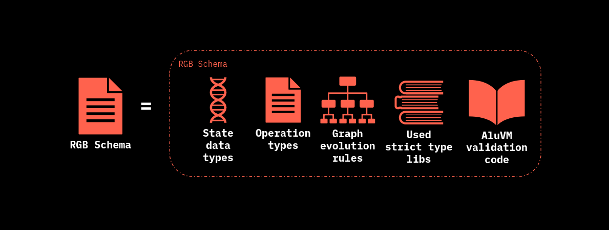

# Schema

An RGB Schema defines, through coding, the necessary template for Genesis and embeds all the rules of available [contract operation](../../annexes/glossary.md#contract-operation) representing the [business logic](../../annexes/glossary.md#business-logic) of the contract and which allows for the [state](../../annexes/glossary.md#contract-state) of the contract to be updated.

&#x20;As [mentioned earlier](../schema-interface.md) an RGB Schema is the analogue of a class for an OOP language. Hence such a construction is used to define the various standards for RGB contract and assets, for example: fungible assets, collectibles, digital identities, etc.&#x20;

The [issuer](../../annexes/glossary.md#contract-participant) of a token on RGB uses (and make available to the public)  a Schema in order to define the issuance properties encoded in the Genesis such as that the contract can be supported by wallets and exchanges. Thus, **when wallets and exchanges receive some information about an asset on RGB (data and contract) they must validate them against the Schema used by the issuer of that asset.**&#x20;

In fact the Schema validation is the very first operation step which an user need to undergo before interacting in any way with the contract (e.g. to perform the desired contract operations).

From a contract functional point of view, the **Schema construct addresses the following questions**:

* What kinds of owned states and [Assignments](../../annexes/glossary.md#assignment) exist?
* What kinds of [Valences](../../annexes/glossary.md#valency) exist?
* What [Global State](../../rgb-state-and-operations/components-of-a-contract-operation.md#global-state) does the contract have?
* How is the [Genesis](../../annexes/glossary.md#genesis) contract structured?
* What kind of [State Transitions](../../annexes/glossary.md#state-transition) and [State Extensions](../../annexes/glossary.md#state-extension) are possible?
* What [Metadata](../../rgb-state-and-operations/components-of-a-contract-operation.md#metadata) can contract operations have?
* How state data are allowed to change with state transitions?
* What sequences of transitions are allowed?

<figure><figcaption>
<strong>Elements of Contained in an RGB Schema</strong>
</figcaption></figure>

**From a technical point of view an RGB Schema is a functional declarative document which need to be compiled for effective usage inside RGB applications and wallets.**

Among the most important properties: Schema:

* References an optional Root `SchemaId` from which a basic and customizable structure layout is derived. &#x20;
* Defines all the variable used in contract state and transition using a specific [strict type system](https://www.strict-types.org/) encoding.  Of particular importance inside the Schema are specified the `Types` related to:
  * Metadata.
  * Owned state.
  * Global state.
  * Valences.
  * Contract Operation.
* Defines all the data structure required for Genesis operation, which marks the first instantiation of the contract. &#x20;
* Defines the requirements needed to validate state transitions outside the Layer 1 (state owned) provided by Bitcoin Script-managed commitments.&#x20;
* Allows for simple updates to the contract without having to modify the software, so that wallets, explorers, and LN nodes can accept new asset types without making any changes to their respective code.&#x20;
* Embeds the **state validation script** and the related functions for the client-side part of RGB executed through the [AluVM](../../annexes/glossary.md#aluvm) engine and which represents most fundamental parts of it's business logic.&#x20;

**This architecture  appears to be very different from blockchain-based contracts**, for example those  implemented on Ethereum, because in that case **the contract itself is provided as an executable code** that implements the rules for changing the state and implements the state and which is directly stored into the blockchain. I**n contrast, in RGB the contract is encoded in a purely declarative way.**

In every Contract Operation performed the client-side validation phase the Contract Schema is always referenced and checked against. In particular after compilation the contract can provide all the necessary data structure to perform the issuance of the contract represented by the Genesis Operation.

As [mentioned earlier](../../rgb-state-and-operations/features-of-rgb-state.md#the-validation-ownership-paradigm-in-rgb), **Schema clearly differentiates contract developers from issuers**, who know may know nothing about coding and programming. This kind of approach make extensive use of **contracts templates** which can be used promptly by issuers which benefit from avoiding common programming mistakes in the implementation phase.

In the next subsection we will provide an example of an actual Schema used for the issuance of a **Non Inflatable Fungible Asset.** &#x20;
