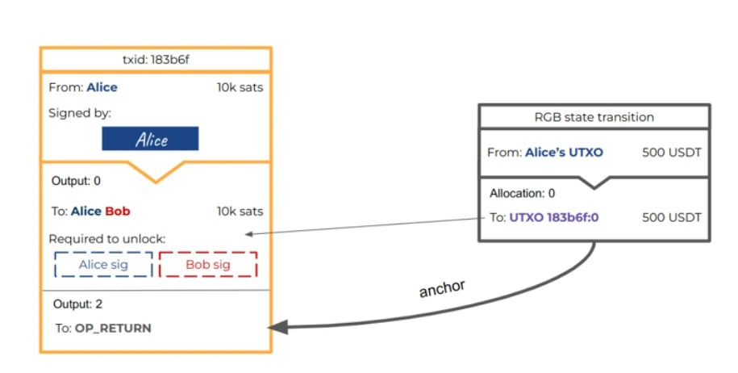
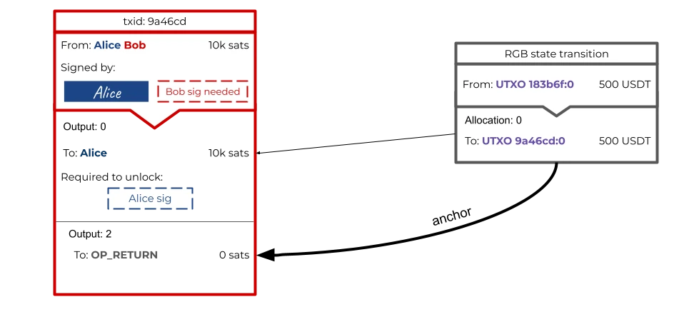
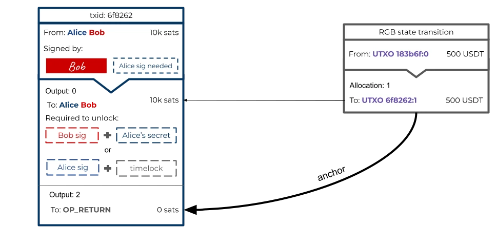
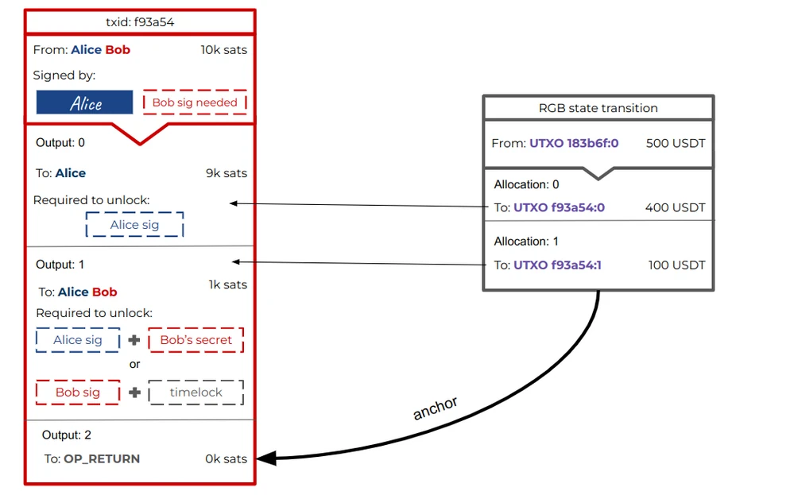
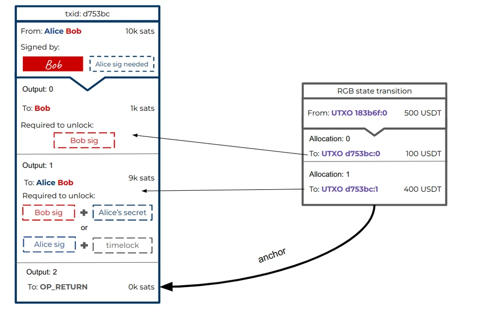
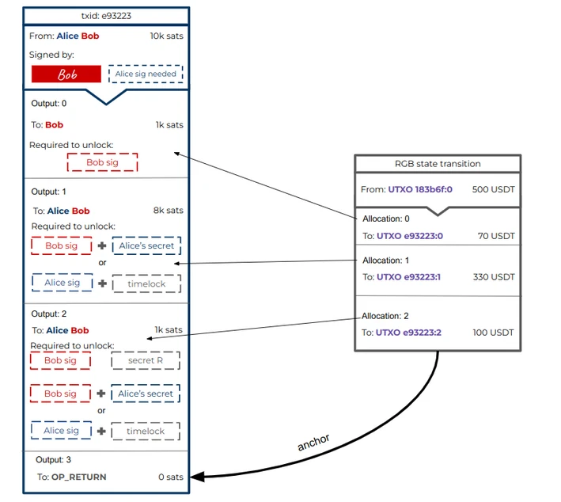

# Lightning Network compatibility

When an RGB state transition is committed into a Bitcoin transaction, such transaction does not necessarily need to be settled on the blockchain immediately, as it can derive its security by being part of a [Lightning Network](../annexes/glossary.md#lightning-network) payment channel. In this way, every time the Lightning channel is updated, a new RGB state transition can be committed inside the new channel update transaction, invalidating the previous one. It is therefore possible to have lightning channels that move RGB assets, and to route payments across channels, just like with regular lightning payments.

The first thing needed for an RGB lightning channel to work is a funding transaction. The funding operation is composed of two parts:

1. The bitcoin funding to create the multisig.
2. The RGB asset funding sending assets to the multisig [UTXO](../annexes/glossary.md#utxo).

The bitcoin funding is needed to create the channel UTXO where the assets can be allocated to, but it doesn’t necessarily need to have an economically significant amount of satoshis in it as long as it has enough balance that all the outputs of the lightning commitment transitions will be above the dust limit.

<figure><figcaption>
<strong>In this example Alice is opening a channel with Bob providing 10k satoshis and 500 USDT. Here the RGB commitment is added in a dedicated OP_RETURN output, but it could also be a Taproot output as RGB support both as a commitment scheme.</strong>
</figcaption></figure>

Once the funding transaction has been prepared, but not yet signed and broadcast, it is time to prepare the commitment transactions that will allow both parties to unilaterally close the channel at any time. The structure of the commitment transactions are almost identical to those of normal lightning channels, with the only difference being that an extra output is added to contain the RGB anchor to the RGB state transition, which in this example uses the OP\_RETURN commitment scheme, but when Taproot payment channels will be available the Taproot commitment scheme can be used as well.

<figure><figcaption>
<strong>Commitment transaction signed by Alice and ready to be broadcasted by Bob, with associated RGB state transition.</strong>
</figcaption></figure>

<figure><figcaption>
<strong>Commitment transaction signed by Bob and ready to be broadcast by Alice, with associated RGB state transition.</strong>
</figcaption></figure>

As we can see in the example, the RGB state transition is moving the assets towards the allocation that corresponds to the output created by the lightning commitment transaction.
This means that Alice, if Bob were to become irresponsive until the timelock expired, would be able to recover both satoshis and USDTs she locked in the channel.

## Updating the channel

When a payment occurs between the two parties and the state of the channel needs to be updated, a new pair of commitment transactions will be created.
The bitcoin amounts in the output of the new commitment transaction are not relevant and may or may not stay the same as they were in a previous state (depending on the implementation), as their primary scope is to enable the creation of a new UTXO, not the movement of economic value denominated in bitcoin.
However, the OP\_RETURN (or in the future Taproot) output needs to change as now it will have to contain the RGB anchor to a new RGB state transition, which, differently from the previous one, will update the asset amounts reflecting the new balances after the payment happened.

In the example below, 100 USDT have been moved from Alice to Bob, making the new state of the balances be 400 USDT to Alice and 100 USDT to Bob.

<figure><figcaption>
<strong>Update to the commitment transaction, signed by Alice and ready to be broadcasted by Bob.</strong>
</figcaption></figure>

<figure><figcaption>
<strong>Update to the commitment transaction, signed by Bob and ready to be broadcasted by Alice.</strong>
</figcaption></figure>

Notice that in the RGB state transition, while the UTXO endpoints where the assets get allocated change with every new lightning commitment transaction, the RGB input is always the original funding multisig where the assets are allocated on-chain until the channel closure.

The RGB state transition moves the assets from the multisig where the funding happened, towards the outputs that are being created by the lightning commitment transaction. In this way, the RGB state transition inherits directly from the lightning commitment transaction all the security properties in case of unilateral channel closing.
Moreover, after commitments are exchanged, Alice and Bob share the revocation secrets of the previous channel state, invalidating it in favor of the new state. 

This means that if Alice broadcasts an old state (trying to get back the 100 USDT she just sent), Bob will be able to spend the output using Alice’s revocation secret, and while spending the output he will not only move the satoshis towards an address under his exclusive control, but he will also be able to move the RGB assets towards himslf.
In this way, the economic punishment for trying to steal with an old state does not come only from the satoshis amount (which may be insignificant), but also from all the RGB assets that were locked in the channel.
On the contrary, if the commitment transaction broadcast by Bob was indeed the last state of the channel, Bob won’t be able to spend the output triggering the punishment transaction, and Alice will be able to take both the satoshis and the RGB assets after the timelock has expired.

## Introducing HTLCs

Above we just saw a simplification of payment channels that involve only two parties, but since in reality the lightning network is designed also to route payments towards more participants, all payments actually use HTLCs output. With RGB channels it works exactly the same way, for each payment that is being routed through the channels, a dedicated HTLC output will be added to the lightning commitment transaction. The HTLC output needs to have a bitcoin amount higher than the dust limit, but it can remain economically insignificant. Together with the new HTLC output, a new allocation needs to be added to the RGB state transition, which will send the amount of assets involved in the payment towards the new HTLC output. Whoever manages to spend the HTLC output, either through knowledge of a secret or by waiting for a timelock expiration, will be able to move both the satoshis that were in the output, and all the assets assigned to it.

<figure><figcaption>
<strong>HTLC transaction involving RGB state transition.</strong>
</figcaption></figure>

The above example only contains one HTLC output, but more can be added as needed for all the pending routed payments, and for each new HTLC output there will be a new corresponding RGB allocation in the state transition.

Every HTLC output needs a bitcoin amount above dust that ensures, in case the channel is
force-closed while the payment is in flight, the legitimate owner will be able to spend
it and claim the corresponding assets. This means that, in practice, every RGB payment on
lightning also needs to transfer some satoshis as well.
