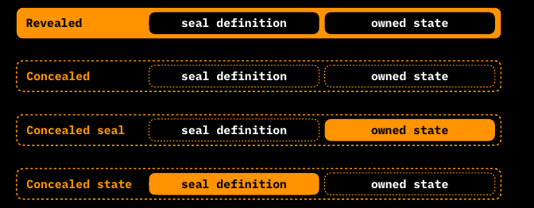
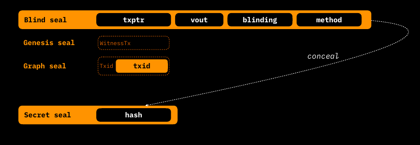

# Components of a Contract Operation

Let's now deep-dive in all the components of a contract operation, which are able to change the state of the contact and are eventually client-side verified by the rightful recipient in a deterministic way.


```
               +---------------------------------------------------------------------------------------------------------------------+
               |  Contract Operation                                                                                                 |
               |                                                                                                                     |
               |  +-----+     +-----------------------+      +--------------------------------+      +---------+     +------------+  |                             
               |  | Ffv |     | ContractId | SchemaId |      | TransitionType | ExtensionType |      | Testnet |     | AltLayers1 |  |                               
               |  +-----+     +-----------------------+      +--------------------------------+      +---------+     +------------+  |     
               |                                                                                                                     |
               |  +-----------------------------------------------+  +------------------------------------------------------------+  |
               |  | Metadata                                      |  | Global State                                               |  |
               |  |                                               |  | +----------------------------------+                       |  |
               |  | +-------------------------------------+       |  | | +-------------------+ +--------+ |                       |  |
               |  | |          Structured Data            |       |  | | |  GlobalStateType  | |  Data  | |     ...     ...       |  |
               |  | +-------------------------------------+       |  | | +-------------------+ +--------+ |                       |  |
               |  |                                               |  | +----------------------------------+                       |  |
               |  +-----------------------------------------------+  +------------------------------------------------------------+  |         +------+
               |                                                                                                                     +---------> OpId |
               |  +-----------------------------------------------+  +------------------------------------------------------------+  |         +------+
               |  | Inputs                                        |  | Assignments                                                |  |
               |  |                                               |  |                                                            |  |
               |  | +-------------------------------------------+ |  | +--------------------------------------------------------+ |  |
               |  | | Input #1                                  | |  | | Assignment #1                                          | |  |
+------+       |  | | +----------+ +----------------+ +-------+ | |  | | +----------------+ +-------------+ +-----------------+ | |  |       +-------------+
| OpId +--------------> PrevOpId | | AssignmentType | | Index | | |  | | | AssignmentType | | Owned State | | Seal Definition +--------------> Bitcoin TXO |
+------+       |  | | +----------+ + ---------------+ +-------+ | |  | | +----------------+ +-------------+ +-----------------+ | |  |       +-------------+
               |  | +-------------------------------------------+ |  | +--------------------------------------------------------+ |  |         
               |  |                                               |  |                                                            |  |         
               |  | +-------------------------------------------+ |  | +--------------------------------------------------------+ |  |         
               |  | | Input #2                                  | |  | | Assignment #2                                          | |  |         
+------+       |  | | +----------+ +----------------+ +-------+ | |  | | +----------------+ +-------------+ +-----------------+ | |  |       +-------------+
| OpId +--------------> PrevOpId | | AssignmentType | | Index | | |  | | | AssignmentType | | Owned State | | Seal Definition +--------------> Bitcoin TXO |
+------+       |  | | +----------+ +----------------+ +-------+ | |  | | +----------------+ +-------------+ +-----------------+ | |  |       +-------------+
               |  | +-------------------------------------------+ |  | +--------------------------------------------------------+ |  |
               |  |                                               |  |                                                            |  |
               |  |       ...           ...          ...          |  |     ...          ...             ...                       |  |
               |  |                                               |  |                                                            |  |
               |  +-----------------------------------------------+  +------------------------------------------------------------+  |
               |                                                                                                                     |
               |  +-----------------------------------------------+  +------------------------------------------------------------+  |
               |  | Redeems                                       |  | Valencies                                                  |  |
               |  |                                               |  |                                                            |  |            
               |  | +------------------------------+              |  |                                                            |  |   
+------+       |  | | +----------+ +-------------+ |              |  |  +-------------+  +-------------+                          |  |            
| OpId +--------------> PrevOpId | | ValencyType | |  ...   ...   |  |  | ValencyType |  | ValencyType |         ...              |  |    
+------+       |  | | +----------+ +-------------+ |              |  |  +-------------+  +-------------+                          |  |    
               |  | +------------------------------+              |  |                                                            |  |   
               |  |                                               |  |                                                            |  |      
               |  +-----------------------------------------------+  +------------------------------------------------------------+  |    
               |                                                                                                                     |    
               +---------------------------------------------------------------------------------------------------------------------+
```


With the help of the comprehensive diagram above it's important to point out that any contract operation is composed by some components related to the **New State** and some components related to the **Old State** being updated. The components of the **New state** are:

* **Assignments** in which are defined:
  * Seal Definition(s);
  * Owned State(s);
* **Global State** which can be either mutated or added
* **Valencies** which are present only in State Extensions.

The **Old State** is referenced through:

* **Inputs** connected to previous assignments of the related old states. Not present in Genesis.
* **Redeems** which are a reference to previously defined [Valencies](state-transitions.md). They are only present in State Extensions.

In addition, we also have a set of operation-specific fields:

* **Ffv** or **Fast-forward version** a 2-byte integer indicating the version of the contract, following RGB rules of [fast-forward versioning](state-transitions.md). The contract version can be updated according to some issuer choices and needs at some points in the history of the contract, for example regarding _re-issuances_
* **TransitionType or ExtensionType** a 16-bit number indicating the kind of Transition/Extension being expressed by the operation which is encoded in the Contract Schema and which represents the manifestation of the Business Logic of the contract. It is present in State Transition
* **ContractId** the 32-byte number referencing the `OpId` of the Genesis of the contract. Naturally, it is present in State Transitions and Extensions, but not in Genesis.
* **SchemaId** In Genesis, in place of the `ContractId` a `SchemaId`, which is a 32-byte hash fingerprint of the contract [Schema](state-transitions.md), is included.
* **Testnet** is a boolean variable indicating the use of Bitcoin Testnet or Mainnet. It is present only in Genesis operation.
* **Altlayers1** is a variable indicating Blockchain Layer is being used as a Commitment medium for the client-side validated data in alternative to Bitcoin (e.g. [Liquid Sidechain](https://blockstream.com/liquid/)). It is present only in Genesis Operation.
* **Metadata** allowing for the declaration of temporary variables useful for complex contract validation but which doesn't need to be registered as state properties.

Finally, through a custom hashing methodology, all the Contract Operation fields are summarized in an `OpId` commitment which goes into the Transition Bundle. We will cover each of those construct in a separate subsection. The complete memory layout of each component of a contract operation is reported [here](https://github.com/RGB-WG/rgb-core/blob/vesper/stl/Transition.vesper).

## OpId

Each Contract Operation is identified by a 32-byte hash called `OpId`, which is, indeed, the ordered SHA-256 hashing of the element contained in the State Transition. Each Contract Operation (State Transition, Genesis and State Extensions) has its own custom [commitment and hashing methodology](https://github.com/RGB-WG/rgb-core/blob/vesper/doc/Commitments.md#operation-id-and-contract-id).

As an important additional feature, the `ContractId` of a smart contract is calculated by using the `OpId` of its Genesis and applying to it a `Reverse byte order operation` plus a `Base58` encoding.

## Contract State

Before addressing each state component, it's fundamental to clarify through which elements a **Contract State** is expressed in the RGB protocol. Specifically, in RGB, the **State** of a contract is fully expressed by:

* A single **Global State**
* One or more **Owned State(s)** which can belong to either 2 different categories:
  * Private States
  * Public States


Global State are embedded in state transition as a single component block, while Owned States are defined inside the [Assignment](state-transitions.md) components together with a Seal Definition.

An important feature of RGB which **affects both Global and Owned States, is the ways in which State are modified**. Basically, State exhibit 2 different behaviors:

* **Mutable** behavior, where **each state transition discards previous state** and assigns a new one;
* **Accumulating** behavior, where each state transition adds to previous state a new state.

In any case in which the **Contract State is nor Mutated nor Accumulated, the respective components are left blank**, meaning that no repetition of the data takes place in such Contract Operation.

The choice of the Business Logic (how state can evolve) is encoded in the Schema of the Contract and cannot be changed after the Genesis, unless with some extensions specifically encoded herein. In the following table a summary of the rules regarding the permitted modification to the Global/Owned States by each Contract Operation is provided:

|                          | **Genesis** | **State Extension** | **State Transition** |
| ------------------------ | :---------: | :-----------------: | :------------------: |
| **Adds Global State**    |      +      |          \*         |           +          |
| **Mutates Global State** |     n/a     |          \*         |           +          |
| **Adds Owned State**     |      +      |          \*         |           +          |
| **Mutates Owned State**  |     n/a     |          No         |           +          |
| **Adds Valencies**       |      +      |          +          |           +          |

_+ = if allowed by Contract Schema       \* = if Confirmed by a State Transiti_

As a final consideration for this section, in the table below we provide the summary of the main properties regarding the scope which the various kind of state element exhibit in the RGB protocol.

|                    |             **Metadata**            |                   **Global state**                  |                                             **Owned state**                                            |
| ------------------ | :---------------------------------: | :-------------------------------------------------: | :----------------------------------------------------------------------------------------------------: |
| **Scope**          |    Defined per contract operation   |            Defined per contract globally            |                                Defined per single-use-seal (Assignment)                                |
| **Who can update** |            Not updatable            |                  Operation creators                 |                   Controlled by right owners (parties able to close single-use-seal)                   |
| **Time scope**     | Defined just for a single operation | State is defined after/as a result of the operation | State is defined before the operation (when the seal definition is embedded in the previous operation) |

### Global State

The purpose of Global State can be summarized by the following sentence:**"nobody owns, everyone knows"** as it defines some general characteristics of the contract which must be publicly visible. A **Global State is always a public state**, and can be written in Genesis by the contract issuer and later changed in state transition or in state extensions by a rightful party defined in the Genesis itself.

As an important feature, the Global State is usually made available by the contract issuers or by contract participants and distributed through public networks both centralized or decentralized (e.g. Websites, IPFS, Nostr, Torrent, etc.). It's important to point out that the **availability** of the Global State is incentivized only by economic means of usage and diffusion of the contract: the involved parties are interested and bears the cost of the storage solution which allows for the accessibility of such kind of data.

Every Component of a Global State is composed by a 2-field structure which include:

* A `GlobalType` which embeds a deterministic reference to the global propriety expressed in the [Schema](state-transitions.md);
* The actual Data expressing the property.

For example, a Global State of newly issued token written in Genesis, dependent on the [`Non inflatable Asset Schema`](state-transitions.md) and [Contract Interface](state-transitions.md) `RGB 20` , [contains](https://github.com/RGB-WG/rgb/blob/master/examples/rgb20-demo.yaml) generally, as common `GlobalTypes`:

* the `ticker`.
* the Full name of the token: `name`.
* the precision of decimal figures: `precision`.
* the maximum supply of the token: `issuedSupply`.
* the date of issuance: `created`.
* a text with some Legal disclaimer: `terms`.

### Assignments of an Owned State

Assignments are the fundamental constructs that are responsible for the **Seal Definition** operation and the related **Owned State** to which such Seal Definition is bounded to. They are the core parts which allows for the **rightful transfer of some digital property** described in the Owned State, to a New Owner identified by the possession of a specific Bitcoin UTXO. Assignment can be compared to Outputs of Bitcoin Transaction, but embeds eventually more capabilities and potentialities.

Each Assignment is composed by the following components:

* The `AssignmentType` which is the identifier of the digital property being stored in the Assignment (e.g. the `assetOwner` used in token transfers).
* the `Seal Definition` which is a sub-construct containing the reference to the UTXO.
* The `Owned State` which specify in which ways the properties associated to the AssignmentType are modified.

#### Revealed / Concealed form

As a peculiar feature of RGB, both Seal Definition and Owned State can be expressed in a `Revealed` or `Concealed` form. This is particularly useful for maintaining - in a selective way - high privacy and scalability in both state transition construction and subsequent validation by the different parties that may be involved in the contract. Indeed, the constructs in `Revealed` form can be used to validate the same data that were inserted in (a) previous State Transition(s) with their hash digest representing the concealed form of the construct. In the diagram below, all 4 combination of Reveal/Conceal form are shown:



###

As the concealment methodology of each constructs can vary, we will discuss the respective forms for each construct when needed. As a final remark of this paragraph, per RGB consensus rules **the `OpId` of the state transition is always** [**calculated**](https://github.com/RGB-WG/rgb-core/blob/vesper/doc/Commitments.md#commitencode-trait) **from the concealed data**

#### Seal Definition

The first main component of the Assignment construct is the [Seal Definition](https://github.com/RGB-WG/rgb-core/blob/master/src/contract/seal.rs) which, in its _revealed_ form, is itself a structure composed by 4 fields: `txptr` `vout` `blinding` `method`.

* **txptr** is a more complex object than a simple Bitcoin Transaction hash. In particular it can have two forms, either:
  * `Graph seal` which is the most straightforward case where an existing UTXO (having a specific `txid`) is referred as seal definition.
  * `Genesis seal` which is a "self-referenced" definition, meaning that the **The transaction used as a seal definition coincides with the witness transaction which include the present Assignment**. As the final `txid` of the transaction depends on all the data of the state transition, including `txptr` it would be impossible to calculate it due to the circular reference implied. In practice the `Genesis Seal` is a void field which has become necessary to handle several situation in which an external UTXO is not available: a notable example is the generation and update of Lightning Network's commitment transactions.
* **vout** is the transaction output of the transaction id inserted in `txptr` (if it's `Graph seal`). `txptr` together with `vout` form the standard _outpoint_ representation.
* **blinding** is a 8-byte random number, which allows for the effective concealment of the data of the seal once hashed, improving resistance to brute-force attacks.
* **method** is a 1-byte field which indicate the seal closing method, which will be used in the related [witness transaction](../annexes/glossary.md#--). It's either [tapret](../commitment-layer/commitment-schemes.md#tapret) or [opret](../commitment-layer/commitment-schemes.md#tapret).

The _concealed_ form of the Seal Definition is simply the ordered SHA-256 [tagged hash](https://github.com/RGB-WG/rgb-core/blob/vesper/doc/Commitments.md#specific-rgb-consensus-commitments) of the the 4 field:

`SHA-256(SHA-256(urn:lnp-bp:seals:secret#2024-02-03) || SHA-256(urn:lnp-bp:seals:secret#2024-02-03) || txptr || vout || blinding || method)`



#### Owned States

This second component of the Assignment is responsible for the definition and storage of the data assigned by the Seal Definition. Before proceeding with the characteristics of Owned States, a short digression about Conceal/Reveal feature of this construct is needed. Differently from Global State, Owned States come into two forms:

* **Public** Owned States: where the related data must always kept and transferred in revealed form by their owner recursively. For example, they can be applied to some image file which must be bounded to ownership, but are always publicly shown. This form can be described by the sentence: **"someone owns, everybody knows"**.
* **Private** Owned States: where the related data are kept concealed and revealed only if they are part of the history for validation purposes. For example the number of token transferred in a token contract is generally kept in private form. This form can be summarized by the sentence: **"someone owns, nobody knows"**.

In RGB, an Owned State can be defined with only one among 4 **StateTypes**: `Declarative`, `Fungible`, `Structured`, `Attachments`, each of which come with its concealed and Revealed form:

* **Declarative** is a StateType with **no data**, representing some form of governance rights which can be executed by a contract party. For example it can be used for voting rights. Concealed and Revealed form of it coincides.
* **Fungible** is the StateType that allows for the transfer of fungible units such those of a token contract. In Revealed form it consists of two fields: an `amount` and a `blinding` factor, while in concealed form it is transformed in a 1-field structure containing a [`Pedersen commitment`](https://link.springer.com/chapter/10.1007/3-540-46766-1\_9) which commits to the `amount` and the `blinding` factor of the revealed form. In a future upgrade it would be possible to implement ZK cryptographic proofs such as [`Bulletproof`](https://crypto.stanford.edu/bulletproofs/) which will be able to demonstrate that inside the same State Transition the sum of `Inputs` referencing a fungible state equates the sum of fungible `Owned States` without revealing the actual amounts.
* **Structured** is a state that can host collections of bounded and ordered data of arbitrary content which can be used for complex validation schemes of the contract. It's maximum storage size is bounded to 64 kB at maximum. The Revealed form is simply the byte serialized data _blob_ and the concealed form is the SHA-256 tagged hash of that data blob: `SHA-256(SHA-256(urn:lnp-bp:rgb:state-data#2024-02-12) || SHA-256(urn:lnp-bp:rgb:state-data#2024-02-12) || blob)`
* **Attachments** is used to attach an arbitrary file with a defined purpose, such as media file, audio file, text, binary, etc.). The actual file is kept separated by the Owned State construct itself, as, in revealed form the Attachment structure contains 3 fields: the SHA-256 `file_hash`, the MIME `media type` and a `salt` factor which guarantee additional privacy. In concealed form this StateType is the SHA-256 tagged hash of the 3 fields just described: `SHA-256(SHA-256(urn:lnp-bp:rgb:state-attach#2024-02-12) || SHA-256(urn:rgb:state-attach#2024-02-12) || file_hash || media_type || salt)`

In the following diagram, a summary of the 4 State Types and both their Concealed and Revealed forms is shown:

```
  State                      Concealed form                              Revealed form

+---------------------------------------------------------------------------------------------------------

                     +--------------------------------------------------------------------------------+
                     |                                                                                |
  Declarative        |                              < void >                                          |
                     |                                                                                |
                     +--------------------------------------------------------------------------------+

+---------------------------------------------------------------------------------------------------------

                     +--------------------------+             +---------------------------------------+
                     | +----------------------+ |             |         +--------+ +---------+        |
  Fungible           | | Pedersen Commitement | | <========== |         | Amount | | Blinding|        |
                     | +----------------------+ |             |         +--------+ +---------+        |
                     +--------------------------+             +---------------------------------------+

+---------------------------------------------------------------------------------------------------------

                     +--------------------------+             +---------------------------------------+
                     | +----------------------+ |             |         +--------------------+        |
  Structured         | |     Tagged Hash      | | <========== |         |     Data Blob      |        |
                     | +----------------------+ |             |         +--------------------+        |
                     +--------------------------+             +---------------------------------------+

+---------------------------------------------------------------------------------------------------------

                     +--------------------------+             +---------------------------------------+
                     | +----------------------+ |             | +-----------+ +------------+ +------+ |
  Attachments        | |     Tagged Hash      | | <========== | | File Hash | | Media Type | | Salt | |
                     | +----------------------+ |             | +-----------+ +------------+ +------+ |
                     +--------------------------+             +---------------------------------------+

```

In the table a summary of the characteristics of each StateType is provided:

<table><thead><tr><th width="160">Item</th><th width="136">Declarative</th><th width="132">Fungible</th><th>Structured</th><th>Attachments</th></tr></thead><tbody><tr><td><strong>Data</strong></td><td>None</td><td>64-bit signed/unsigned integer</td><td>Any strict data type</td><td>Any file</td></tr><tr><td><strong>Type info</strong></td><td>None</td><td>Signed/unsigned</td><td>Strict Types</td><td>MIME type</td></tr><tr><td><strong>Confidentiality</strong></td><td>Not Required</td><td>Pedersen commitment</td><td>Hashing with blinding</td><td>Hashed file id</td></tr><tr><td><strong>Size limits</strong></td><td>N/A</td><td>256 Byte</td><td>Up to 64 kByte</td><td>Up to ~500 GByte</td></tr></tbody></table>

## Inputs

In a similar fashion to Bitcoin Transactions, **Inputs represent the "other half" of the Assignment construct**. They have the fundamental role of referencing the Assignments of a previous State Transition or Genesis. Inputs are not present in Genesis and State Extension Operation and are composed of the following fields:

* `PrevOpId` containing the previous operation identifier of the Assignment being referenced.
* `AssignmentType` containing the identifier related to the contract property being modified by the present Assignment.
* `Index` the index number of the Assignment being referenced inside the list of Assignment of the `PrevOpId`. The `Index` is implicitly calculated from the lexicographical ordering hash of the **Concealed Seal** of the Assignment referenced.

The RGB validation procedure, beside checking the correct closure of the Seal, is also responsible to check the consistency between inputs and outputs especially for `Fungible` StateType. In that case, the validation procedure checks that the amount of token of each Input of a specific `AssignmentType` match the number of token of the the Assignments with the same `AssignmentType`.

As a straightforward consequence, Genesis doesn't have Inputs as well as all State Transitions which don't change some Owned States of any kind. For example a State Transition which change only the Global State, doesn't have Inputs.

## Metadata

Metadata construct is a particular field which contains all the information which are not useful to be stored as a part of the contract state history. It has a size limit of 64 KiB, and can be used, for example, to host temporary data of complex contract validation procedure by the [AluVm](state-transitions.md) engine.

## Valencies

Valencies are a unique-in-its-kind construct which can be present in all 3 forms of Contract Operation. Basically they are a set of digital rights that can be recalled and "put in effect" by a subsequent State Transition. In RGB, Valencies are encoded simply by enumerating each `ValencyType` which is a list of 16-bit field defining the particular right encoded by the Valency. As `GlobalType` and `AssignmentType` the appropriate meaning and semantic is encoded and defined in the Contract [Schema](state-transitions.md) and decode in human form by the appropriate [Interface](state-transitions.md).

## Redeems

Redeems are akin to State Transition's Inputs for Valencies. They are only included in State Extension which are responsible for "activating" the digital right embedded in the Valency itself. An example of Reedeem could be the execution of a _coinswap_ or a _distributed issuance_. Redeems are constituted by 2 field entries:

* the `PrevOpId` 32-byte field referring to the hash of the O in which the Valency being redeemed is included;
* the `ValencyType` 16-bit field which is recalled from the previous operation where the Valency is defined. Each ValencyType can be redeemed only once inside the same State Extension.
