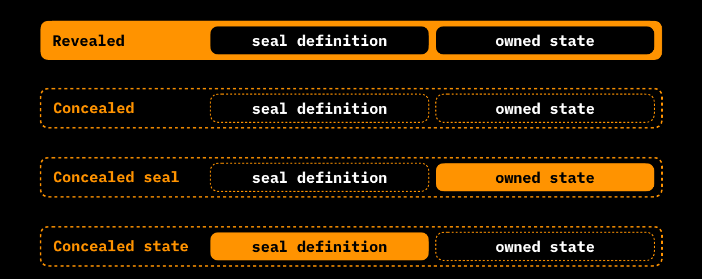
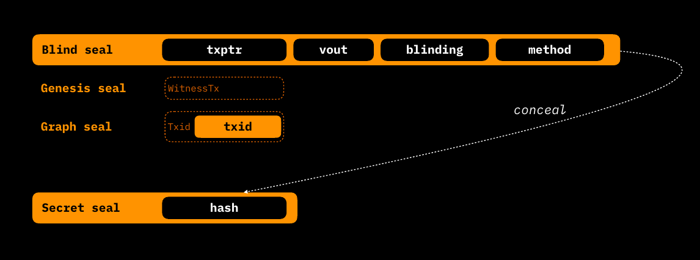

# Components of a Contract Operation

Let's now deep-dive into all the components of a contract operation, which are capable of changing the state of the contract and which are ultimately verified client-side by the legitimate recipient in a deterministic manner.


```
               +---------------------------------------------------------------------------------------------------------------------+
               |  Contract Operation                                                                                                 |
               |                                                                                                                     |
               |  +-----+     +-----------------------+      +--------------------------------+      +---------+     +------------+  |                             
               |  | Ffv |     | ContractId | SchemaId |      | TransitionType | ExtensionType |      | Testnet |     | AltLayers1 |  |                               
               |  +-----+     +-----------------------+      +--------------------------------+      +---------+     +------------+  |     
               |                                                                                                                     |
               |  +-----------------------------------------------+  +------------------------------------------------------------+  |
               |  | Metadata                                      |  | Global State                                               |  |
               |  |                                               |  | +----------------------------------+                       |  |
               |  | +-------------------------------------+       |  | | +-------------------+ +--------+ |                       |  |
               |  | |          Structured Data            |       |  | | |  GlobalStateType  | |  Data  | |     ...     ...       |  |
               |  | +-------------------------------------+       |  | | +-------------------+ +--------+ |                       |  |
               |  |                                               |  | +----------------------------------+                       |  |
               |  +-----------------------------------------------+  +------------------------------------------------------------+  |         +------+
               |                                                                                                                     +---------> OpId |
               |  +-----------------------------------------------+  +------------------------------------------------------------+  |         +------+
               |  | Inputs                                        |  | Assignments                                                |  |
               |  |                                               |  |                                                            |  |
               |  | +-------------------------------------------+ |  | +--------------------------------------------------------+ |  |
               |  | | Input #1                                  | |  | | Assignment #1                                          | |  |
+------+       |  | | +----------+ +----------------+ +-------+ | |  | | +----------------+ +-------------+ +-----------------+ | |  |       +--------------+
| OpId +--------------> PrevOpId | | AssignmentType | | Index | | |  | | | AssignmentType | | Owned State | | Seal Definition +--------------> Bitcoin UTXO |
+------+       |  | | +----------+ + ---------------+ +-------+ | |  | | +----------------+ +-------------+ +-----------------+ | |  |       +--------------+
               |  | +-------------------------------------------+ |  | +--------------------------------------------------------+ |  |         
               |  |                                               |  |                                                            |  |         
               |  | +-------------------------------------------+ |  | +--------------------------------------------------------+ |  |         
               |  | | Input #2                                  | |  | | Assignment #2                                          | |  |         
+------+       |  | | +----------+ +----------------+ +-------+ | |  | | +----------------+ +-------------+ +-----------------+ | |  |       +--------------+
| OpId +--------------> PrevOpId | | AssignmentType | | Index | | |  | | | AssignmentType | | Owned State | | Seal Definition +--------------> Bitcoin UTXO |
+------+       |  | | +----------+ +----------------+ +-------+ | |  | | +----------------+ +-------------+ +-----------------+ | |  |       +--------------+
               |  | +-------------------------------------------+ |  | +--------------------------------------------------------+ |  |
               |  |                                               |  |                                                            |  |
               |  |       ...           ...          ...          |  |     ...          ...             ...                       |  |
               |  |                                               |  |                                                            |  |
               |  +-----------------------------------------------+  +------------------------------------------------------------+  |
               |                                                                                                                     |
               |  +-----------------------------------------------+  +------------------------------------------------------------+  |
               |  | Redeems                                       |  | Valencies                                                  |  |
               |  |                                               |  |                                                            |  |            
               |  | +------------------------------+              |  |                                                            |  |   
+------+       |  | | +----------+ +-------------+ |              |  |  +-------------+  +-------------+                          |  |            
| OpId +--------------> PrevOpId | | ValencyType | |  ...   ...   |  |  | ValencyType |  | ValencyType |         ...              |  |    
+------+       |  | | +----------+ +-------------+ |              |  |  +-------------+  +-------------+                          |  |    
               |  | +------------------------------+              |  |                                                            |  |   
               |  |                                               |  |                                                            |  |      
               |  +-----------------------------------------------+  +------------------------------------------------------------+  |    
               |                                                                                                                     |    
               +---------------------------------------------------------------------------------------------------------------------+
```


With the help of the comprehensive diagram above, it's important to point out that any contract operation is composed of some components related to the **New State** and some components that reference the **Old State** being updated. The components of the **New state** are:

* The **Assignments** in which are defined:
  * [Seal Definition](components-of-a-contract-operation.md#seal-definition).
  * [Owned State](components-of-a-contract-operation.md#owned-states).
* The [Global State](components-of-a-contract-operation.md#global-state), which can be either [mutated or added](components-of-a-contract-operation.md#state-update-methods-and-rules).
* The [Valencies](components-of-a-contract-operation.md#valencies) which can be defined in State Transition and Genesis.

The **Old State** is referenced through:

* [Inputs](components-of-a-contract-operation.md#inputs) connected to previous assignments of related State Transitions. Not found in Genesis.
* [Redeems](components-of-a-contract-operation.md#redeems) which are a reference to previously defined [Valencies](state-transitions.md). They are present only in State Extensions.

In addition, we also have several operation-specific fields:

* `Ffv` or `Fast-forward version` a 2-byte integer indicating the version of the contract, following the RGB rules of [fast-forward versioning](features-of-rgb-state.md#rgb-consensus-changes). The version of the contract can be updated according to the issuer's choices and needs at certain points in the contract's history, such as concerning _re-issuances._
* `TransitionType` or `ExtensionType` a 16-bit integer indicating the type of Transition/Extension expressed by the operation encoded in the Contract [Schema](../annexes/glossary.md#schema) and representing the manifestation of the [Business Logic](../annexes/glossary.md#business-logic) of the contract. It's not present in [Genesis](../annexes/glossary.md#genesis).
* `ContractId` the 32-byte number that references the processed `OpId` of the Genesis of the contract. Naturally, it's present in State Transitions and Extensions, but not in Genesis.
* `SchemaId` is a field found only in Genesis, instead of the `ContractId`. It's a 32-byte hash of the contract [Schema](../annexes/glossary.md#schema) used in the contract.
* `Testnet` is a boolean variable indicating the use of Bitcoin Testnet or Mainnet. It is only present in Genesis.
* `Altlayers1` is a variable that indicates which layer of the Blockchain is used as the Commitment medium for the client-side validated data as an alternative to Bitcoin (e.g. [Liquid Sidechain](https://blockstream.com/liquid/)). It is only present in Genesis.
* `Metadata` that allows you to declare temporary variables that are useful for validating complex contracts, but that do not have to be recorded as [state](../annexes/glossary.md#contract-state) properties.

Finally, through a custom hashing methodology, all of the fields in the Contract Operation are summarized into an `OpId` commitment that is placed in the [Transition Bundle](state-transitions.md#transition-bundle).

We will cover each contract component in a dedicated subsection. The complete memory layout of each component of a contract operation is given [here](https://github.com/RGB-WG/rgb-core/blob/vesper/stl/Transition.vesper).

## OpId

Each Contract Operation is identified by a 32-byte hash called `OpId`, which is, precisely, the ordered SHA-256 hashing of the element contained in the State Transition. Each [Contract Operation](../annexes/glossary.md#contract-operation) has its own customized [commitment and hashing methodology](https://github.com/RGB-WG/rgb-core/blob/vesper/doc/Commitments.md#operation-id-and-contract-id).

## ContractId

As an important additional feature, the `ContractId` of a smart contract is calculated by using the `OpId` of its [Genesis](../annexes/glossary.md#genesis) and applying to it a _Reverse byte order operation_ plus a [Base58](https://en.wikipedia.org/wiki/Binary-to-text\_encoding#Base58) encoding.

## Contract State

Before addressing each state component, it's essential to clarify through which elements a [Contract State](../annexes/glossary.md#contract-state) is expressed in the RGB protocol. Specifically, in RGB, the **State** of a contract is fully expressed by:

* A single **Global State**
* One or more **Owned State(s)** that can belong to two different categories:
  * Private States
  * Public States


Global States are embedded into Contract Operation as a single component block, while [Owned States](../annexes/glossary.md#owned-state) are defined inside the [Assignment](../annexes/glossary.md#assignment) construct where they are stored alongside the pertaining [Seal Definition](../annexes/glossary.md#seal-definition).

### State update methods and rules

An important feature of RGB, which **affects both Global and Owned States, is the way the state is modified**. Basically, States may exhibit two different behaviors:

* A **Mutable** behavior, in which **each state transition discards the previous state** and assigns a new one.
* An **Accumulating** behavior, in which each state transition adds a new state to the previous state.

In all cases where the **Contract State is neither Mutated nor Accumulated, the respective components are left empty**, meaning that no repetition of data takes place in a Contract Operation.

The choice between mutable or accumulated state is set inside the [Business Logic](../annexes/glossary.md#business-logic) encoded in the [Schema](../annexes/glossary.md#schema) of the contract and cannot be changed after the Genesis, except by some [State Extension](../annexes/glossary.md#state-extension) specifically encoded herein.

The table below provides a summary of the rules regarding the permitted modification of Global/Owned States by each Contract Operation:

|                          | **Genesis** | **State Extension** | **State Transition** |
| ------------------------ | :---------: | :-----------------: | :------------------: |
| **Adds Global State**    |      +      |          \*         |           +          |
| **Mutates Global State** |     n/a     |          \*         |           +          |
| **Adds Owned State**     |      +      |          \*         |           +          |
| **Mutates Owned State**  |     n/a     |          No         |           +          |
| **Adds Valencies**       |      +      |          +          |           +          |

_+ = if allowed by Contract Schema \* = if Confirmed by a State Transition_

As a final consideration of this section, in the following table we provide a summary of the main scope-related properties that the various kind of state data elements exhibit in the RGB protocol.

|                    |             **Metadata**            |                   **Global state**                  |                                             **Owned state**                                            |
| ------------------ | :---------------------------------: | :-------------------------------------------------: | :----------------------------------------------------------------------------------------------------: |
| **Scope**          |    Defined per contract operation   |            Defined per contract globally            |                                Defined per single-use-seal (Assignment)                                |
| **Who can update** |            Not updatable            |                  Operation creators                 |                   Controlled by right owners (parties able to close single-use-seal)                   |
| **Time scope**     | Defined just for a single operation | State is defined after/as a result of the operation | State is defined before the operation (when the seal definition is embedded in the previous operation) |

### Global State

The purpose of Global State can be summarized by the following sentence:**"nobody owns, everyone knows"** in that it defines certain general features of the contract that must be publicly visible. A **Global State is always a public state**, and can be written in Genesis by the [contract issuer](../annexes/glossary.md#contract-participant) and later modified in state transition or state extensions by a legitimate party defined in the contract schema.

As an important feature, the Global State is usually made available by contract issuers or contract participants and distributed through both centralized and decentralized public networks (e.g. websites, IPFS, Nostr, Torrent, etc.) in form of a [contract consignment](../annexes/glossary.md#consignment). It's important to note that the **availability** of the Global State is incentivized only by economic means of using and sharing the contract to the wider public: the parties involved are committed to bear the cost of the necessary storage solution that enables the accessibility of this kind of contract data.

Each component of a Global State consists of a 2-field structure that includes:

* A `GlobalType` which embeds a deterministic reference to the global propriety expressed in the [Schema](../rgb-contract-implementation/schema/).
* The actual Data expressing the property.

For example, a Global State of newly issued token written in Genesis, dependent on the [Non inflatable Asset Schema](../rgb-contract-implementation/schema/non-inflatable-fungible-asset-schema.md) and Contract [Interface](../annexes/glossary.md#interface) [RGB 20](../rgb-contract-implementation/interface/rgb20-interface-example.md), [contains](https://github.com/RGB-WG/rgb/blob/master/examples/rgb20-demo.yaml) generally, as common `GlobalTypes`:

* The `ticker`.
* The full name of the token: `name`.
* The precision of decimal digits: `precision`.
* The maximum supply of the token: `issuedSupply`.
* The date of issuance: `created`.
* A text with some Legal disclaimer: `data`.

### Assignments

Assignments are the core constructs responsible for the [Seal Definition](../annexes/glossary.md#seal-definition) operation and related [Owned State](../annexes/glossary.md#owned-state) to which that Seal Definition is bound. They are the central part that enables the **rightful transfer of a digital property**, described in the Owned State, to a New Owner identified by the possession of a specific Bitcoin [UTXO](../annexes/glossary.md#utxo). An Assignment can be compared to a Bitcoin Transaction Output, but possibly embedding more expressiveness and potential.

Each Assignment consists of the following components:

* The `AssignmentType` which is the identifier of the digital property that is stored in the Assignment (e.g. the `assetOwner` declaration used to declare the transfer function in token transfers).
* The `Seal Definition` which is a sub-construct containing the reference to the UTXO.
* The `Owned State` which specifies how the properties associated with the `AssignmentType` are modified.

#### Revealed / Concealed form

As a unique feature of RGB, both the Seal Definition and the Owned State can be expressed in `Revealed` or `Concealed` form. This is particularly useful for maintaining - selectively - high privacy and scalability both in the construction of state transitions and in subsequent validation by the various parties that may be involved in the contract. The constructs in `Revealed` form can be used to validate the same data entered in the previous [State Transitions](../annexes/glossary.md#state-transition) with their hash digest representing the `Concealed` form of the construct. In the diagram below, all four Reveal/Conceal form combinations are shown:

<figure><figcaption><p><strong>All combination of Revealed/Concealed form applied to Seal Definition and Owned State.</strong></p></figcaption></figure>

Since the concealment methodology of each construct may vary, we will discuss the respective forms for each construct when necessary. As a final remark in this paragraph, according to the RGB consensus rules **the** `OpId` **of the State Transition is always** [calculated](https://github.com/RGB-WG/rgb-core/blob/vesper/doc/Commitments.md#commitencode-trait) **from the concealed data.**

#### Seal Definition

The first main component of the Assignment construct is the [Seal Definition](https://github.com/RGB-WG/rgb-core/blob/master/src/contract/seal.rs) which, in its `Revealed` form, is itself a structure consisting of four fields: `txptr` `vout` `blinding` `method`.

* `txptr` is a more complex object than a simple hash of a Bitcoin Transaction. In particular, it can have two forms:
  * `Graph seal` which is the simplest case where an existing [UTXO](../annexes/glossary.md#utxo) is used as the seal definition. Specifically, the seal is referenced by the `txid` pointing at the UTXO chosen as a seal.
  * `Genesis seal` which should be interpreted as a "self-referenced" definition. The use of this construct means that the **transaction used as the seal definition coincides with the witness transaction that includes the present Assignment**. Since the final `txid` of the transaction depends on all the state transition data, including `txptr`, it would be impossible to compute it because of the implied circular reference. In practice the `Genesis Seal` is a null field that has become necessary to handle several situations where no external UTXO is available: a notable example is the generation and update of Lightning Network's commitment transactions or when the recipient doesn't have any available UTXO.
* `vout` is the transaction output number of the Transaction Id entered in `txptr`, and it is only present if `txptr` is a `Graph seal`. The `txptr`  field together with `vout` field constitute the standard _outpoint_ representation of Bitcoin transactions.
* `blinding` is a random number of 8 bytes, which allows the seal data to be effectively hidden once they have been hashed, improving resistance to brute-force attacks.
* `method` is a 1-byte field indicating the seal closing method, which will be used in the related [witness transaction](../annexes/glossary.md#witness-transaction). It's either [Tapret](../commitment-layer/deterministic-bitcoin-commitments-dbc/tapret.md) or [Opret](../commitment-layer/deterministic-bitcoin-commitments-dbc/opret.md).

The `concealed` form of the Seal Definition is simply the SHA-256 [tagged hash](https://github.com/RGB-WG/rgb-core/blob/vesper/doc/Commitments.md#specific-rgb-consensus-commitments) of the concatenation of the four fields:

`SHA-256(SHA-256(seal_tag) || SHA-256(seal_tag) || txptr || vout || blinding || method)`

Where:

* `seal_tag = urn:lnp-bp:seals:secret#2024-02-03`

<figure><figcaption><p><strong>Components of the Seal Definition.</strong></p></figcaption></figure>

#### Owned States

This second Assignment component is responsible for defining and storing the data assigned by the Seal Definition. Before proceeding with the features of Owned States, a brief digression about `Conceal/Reveal` feature of this construct is necessary. Unlike the Global State, Owned States come in two forms:

* **Public** Owned States: in which related data must always be kept and transferred in a revealed form by their owner recursively. For example, they may apply to some image files that must be bound to ownership, but are always publicly shown. This form can be described by the phrase: **"someone owns, everybody knows"**.
* **Private** Owned States: in which related data is kept hidden and revealed only if it is part of the history for validation purposes. For example, the number of tokens transferred in a token contract is generally kept private. This form can be summarized by the sentence: **"someone owns, nobody knows"**.

In RGB, an Owned State can only be defined with one of the four **StateTypes**: `Declarative`, `Fungible`, `Structured`, `Attachments`, each of which has its concealed and Revealed form:

* `Declarative` is a StateType with **no data**, representing some form of governance [rights](../annexes/glossary.md#contract-rights) that can be performed by a contract party. For example, it can be used for _voting rights_. Concealed and Revealed forms of it coincide.
* `Fungible` is the StateType that allows for the transfer of **fungible units** such as those in a token contract. In the Revealed form it consists of two fields: an `amount` and a `blinding` factor, while in concealed form it is transformed into a 1-field structure containing a [Pedersen commitment](../annexes/glossary.md#pedersen-commitment) which commits to the `amount` and to the `blinding` factor of the revealed form. In a future update, it would be possible to implement _Zero-KnowledgeIts_ cryptographic proofs such as [`Bulletproof`](https://crypto.stanford.edu/bulletproofs/) that will be able to prove that within the same State Transition the sum of `Inputs` that refer to a fungible state equals the sum of fungible `Owned States` without revealing the actual amounts.
* `Structured` is a State Type that can accommodate ordered and limited data collections of arbitrary content, which can be used as input for complex contract validation schemes. Its maximum storage size is limited to a maximum of 64 KiB. The Revealed form is simply the _blob_ of data serialized into bytes, while the concealed form is the SHA-256 tagged hash of that data blob: `SHA-256(SHA-256(tag_data) || SHA-256(tag_data) || blob)`, where `tag_data = urn:lnp-bp:rgb:state-data#2024-02-12`.
* `Attachments` type is used to attach an arbitrary file with a defined purpose, such as a media file, audio file, text, binary, etc. The actual file is kept separated by the Owned State construct itself, as, in revealed form, the Attachment structure contains three fields: the SHA-256 `file_hash`, the MIME `media type` and a `salt` factor that provides additional privacy. In concealed form, this StateType is the SHA-256 tagged hash of the three fields just described: `SHA-256(SHA-256(tag_attachment) || SHA-256(tag_attachment) || file_hash || media_type || salt)` , where `tag_attachment = urn:rgb:state-attach#2024-02-12`.

The diagram below shows a summary of the four state types and their Concealed and Revealed forms:


```
  State                      Concealed form                              Revealed form

+---------------------------------------------------------------------------------------------------------

                     +--------------------------------------------------------------------------------+
                     |                                                                                |
  Declarative        |                              < void >                                          |
                     |                                                                                |
                     +--------------------------------------------------------------------------------+

+---------------------------------------------------------------------------------------------------------

                     +--------------------------+             +---------------------------------------+
                     | +----------------------+ |             |         +--------+ +----------+       |
  Fungible           | | Pedersen Commitement | | <========== |         | Amount | | Blinding |       |
                     | +----------------------+ |             |         +--------+ +----------+       |
                     +--------------------------+             +---------------------------------------+

+---------------------------------------------------------------------------------------------------------

                     +--------------------------+             +---------------------------------------+
                     | +----------------------+ |             |         +--------------------+        |
  Structured         | |     Tagged Hash      | | <========== |         |     Data Blob      |        |
                     | +----------------------+ |             |         +--------------------+        |
                     +--------------------------+             +---------------------------------------+

+---------------------------------------------------------------------------------------------------------

                     +--------------------------+             +---------------------------------------+
                     | +----------------------+ |             | +-----------+ +------------+ +------+ |
  Attachments        | |     Tagged Hash      | | <========== | | File Hash | | Media Type | | Salt | |
                     | +----------------------+ |             | +-----------+ +------------+ +------+ |
                     +--------------------------+             +---------------------------------------+

```


In addition, a summary of the technical characteristics of each **StateType** is provided in the table below:

<table><thead><tr><th width="164">Item</th><th width="136">Declarative</th><th width="132">Fungible</th><th>Structured</th><th>Attachments</th></tr></thead><tbody><tr><td><strong>Data</strong></td><td>None</td><td>64-bit signed/unsigned integer</td><td>Any strict data type</td><td>Any file</td></tr><tr><td><strong>Type info</strong></td><td>None</td><td>Signed/unsigned</td><td>Strict Types</td><td>MIME type</td></tr><tr><td><strong>Confidentiality</strong></td><td>Not Required</td><td>Pedersen commitment</td><td>Hashing with blinding</td><td>Hashed file id</td></tr><tr><td><strong>Size limits</strong></td><td>N/A</td><td>256 Byte</td><td>Up to 64 kByte</td><td>Up to ~500 GByte</td></tr></tbody></table>

## Inputs

Similar to Bitcoin Transactions, **Inputs represent the "other half" of the Assignment construct**. They have the basic role of referencing Assignments from a previous State Transition or Genesis. Inputs are not present in Genesis and State Extension Operation and consist of the following fields:

* `PrevOpId` containing the identifier of the previous Assignment operation being referenced.
* `AssignmentType` containing the identifier of the contract property being modified by the referenced Assignment.
* `Index` is the index number of the Assignment being referenced within the Assignment list of the `PrevOpId`. The `Index` is calculated implicitly from the lexicographic sorting of the hashes of the **Concealed Seal** of the referenced Assignments.

The validation procedure of RGB, in addition to checking the correct closure of the Seal, is also responsible for checking the consistency between the inputs and outputs, particularly for the `Fungible` StateType. In this case, the validation procedure, embedded in the [AluVM](../annexes/glossary.md#aluvm) script part of the [Schema](../annexes/glossary.md#schema), checks that the amount of tokens of each Input of a specific `AssignmentType` matches the number of tokens of the Assignments with the same `AssignmentType`.

As a natural property, Genesis has no Inputs as well as all State Transitions that don't change some Owned States of any kind. For example, a State Transition that changes only the Global State has no Inputs.

## Metadata

The metadata construct is a particular field that contains all the information that is not useful to be stored as part of the contract state history. It has a maximum size of 64 KiB and can be used, for example, to host temporary data from a complex contract validation procedure by the AluVm engine.

## Valencies

Valencies are a unique-in-its-kind construct that can be present in all three forms of Contract Operation. In essence, they are a set of digital rights that can be [redeemed](../annexes/glossary.md#redeem) in State Extensions and "put into effect" by a subsequent State Transition. In RGB, Valencies are encoded simply by enumerating each `ValencyType`, which is a list of 16-bit fields that define the particular right encoded by the Valency. As `GlobalType` and `AssignmentType`, the appropriate meaning and semantics are encoded and defined in the Contract Schema and decoded into human form by a related [Interface](../annexes/glossary.md#interface).

## Redeems

Redeems are similar to State Transition's Inputs for Valencies. They are included only in State Extensions and are responsible for "activating" the digital right embedded in the Valency itself. An example of Redeem might be the execution of a _coinswap_ or a _distributed issuance_. Redeems consist of two fields:

* The 32-byte `PrevOpId` field that refers to the hash of the Operation in which the Valency to be redeemed is defined.
* The 16-bit `ValencyType` field that is retrieved from the previous operation in which the Valency is defined. Each ValencyType can be redeemed only once within the same State Extension.

***
