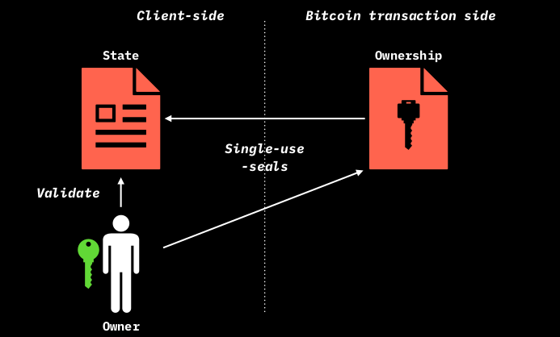

# Features of RGB State

## Strict Type System

As described in previous sections, The state represent a set of condition which undergo validation both against contract business logic and both with regards to commitment ordered history.

In RGB, this set of data is actually a **set of arbitrary rich data** which:

* are **strongly typed**, which means that **each variable possesses a clear type definition (e.g. u8) and both lower and upped bounds**.
* can be **nested**, meaning that a type can be constructed from other types.
* can be organized in `lists` `sets` or `maps`

In order to properly encode data into the state in a reproducible way a [Strict Type System](https://www.strict-types.org/) together with [Strict Encoding](https://github.com/rust-amplify/rust-amplify) has been adopted in RGB. This means that:

* The encoding of the data is done according to a precise [schema](features-of-rgb-state.md#terminilogy/glossary.md#schema) which, unlike JSON or YAML, define a precise structure and layout of the data thus allowing also for deterministic ordering of each data element herein.
* The ordering of the elements inside every collection (i.e. in lists, sets or maps) is deterministic as well.
* Boundaries (lower and higher) are defined for every variable and for the number of element in a collection (the so called **Confinement**).
* All data field are byte-aligned.
* The serialization and hashing of the data is performed in a deterministic way (Strict Encoding) allowing for creating **reproducible commitments** of the data irrespective of the system on which such operation is performed.
* The creation of the data according to the schema is **performed through a simple description language which compile in Binary form** from Rust Language. In the future extension to other languages will be supported.
* Additionally, the compiling according to the Strict Type System produces 2 types of outputs:
  * A **Memory Layout at compile time**
  * **Associated Semantic identifiers** to the memory layout (i.e. commitment to each field's name of the data)\
    For instance, this kind of construction is able to make detectable the change of a single variable name, which **doesn't change the memory layout** but which **do change the semantics**.
* Finally, Strict Type System allows for **versioning** of the compilation schema, thus enabling the tracking of consensus changes in contracts and in the compilation engine.

As a matter of fact Strict Encoding is defined in both an extremely pure functional level (thus very far away from Oriented Object Programming (OOP) philosophy) and at a very low level (nearly hardware definition, so far away from more abstract structures and languages).

### Size limitation

Regarding the **data concurring to state validation**, the RGB protocol consensus rule apply a **maximum size limit** of 2^16 bytes (64kiB):

* To the size of **any data type** participating in state validation (e.g. a maximum of 65536 x `u8`, 32768 x `u16`, etc...)
* To the **number of elements of each collection** employed in state validation. This has been designed in order to:
* Avoid unlimited growth of the client side-validate data per each state transition.
* Ensures that this size fits the size of the register of a particular virtual machine [AluVM](state-transitions.md) which is capable of complex validation purposes working alongside RGB.

## The Validation != Ownership Paradigm in RGB

One of the most important features of RGB in respect to the majority of blockchain-based smart contract systems rests on the **clear separation between the validation task and ownership property** which are defined by the protocol at the most fundamental level.

In practice:

* The **Validation** task, performed by users and observers of the protocol, guarantees **in which way(s) the properties of a smart contract may change** and thus the internal consistency and adherence of state transitions to the smart contract rule. This process belong entirely accomplished by RGB-specific libraries.
* The **Ownership** property, which, through the seal definition pointing to a Bitcoin UTXO, **defines who can change the state**. The security level of this property, depends entirely upon the security model of Bitcoin itself.

This kind of separation prevents the possibility of mix the non-Turing complete capabilities of smart contract with the public access of contract states which is embedded in nearly all blockchains with advanced programming capabilities. On the opposite, **the usage of these common "mixed" architectures, have led to frequent and notable episodes of hacks** where yet unknown vulnerabilities of smart contracts have been exploited by publicly accessing the contract state encoded in the blockchain.

Additionally, by relying on Bitcoin transaction structure, RGB can exploit the **features of the Lightning Network** in a straightforward way.

## RGB Consensus Changes

As an another important characteristics, RGB possesses, in addition to Semantic Versioning of data, a Consensus Update System, that keep track of consensus changes in Contracts and Contracts Operations. Basically there are two basic way to update consensus rule embedded in the protocol:

* A **fast-forward** update where _some previously invalid rule becomes valid_. Despite the similarities, this kind of update is **not comparable to a **~~**blockchain hardfork**~~. The chronological history of this kind of changes it's mapped in contract through the [Ffv field](features-of-rgb-state.md#components-of-a-contract-operation) of Contract Operation. In particular it is characterized by the following properties:
  * Existing owners are not affected.
  * New beneficiaries must upgrade their wallets.
* A **pushback** update where _some previously valid state becomes invalid_ .Despite the similarities, this kind of update is **not comparable to a **~~**blockchain softfork**~~, and in addition:
  * Existing owners may loose assets if they update the wallet.
  * In fact a new protocol, not the same version of RGB anymore.
  * Can happen only through issuers re-issing assets on a new protocol - and users using two wallets (for both the old and the new protocol).

## RGB Contract Operation Libraries

Repository:

* https://github.com/RGB-WG/rgb-core which contains all the engine for contract construction and validation.
