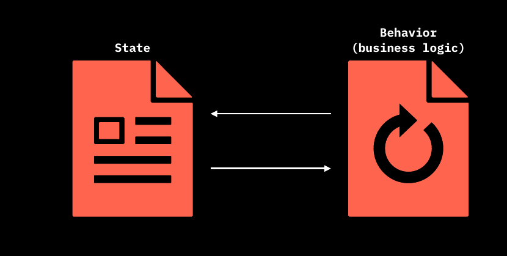
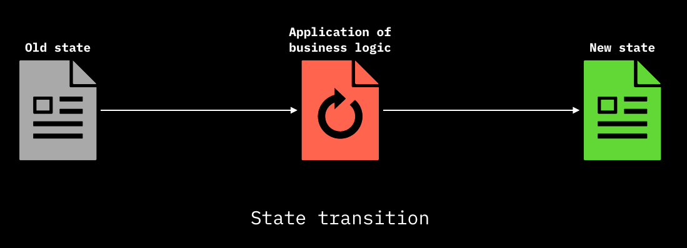

# Introduction to Smart Contracts and their States

Before addressing the technical implementation of **states** and their related data structure, it is important to recall that the **ordered sequence of seal definition and the following seal closure** is meant to provide the ability to implement properly the most important operation of the client-side validated domain: **State Transition**.\
In the following section, after a brief introduction to **smart contracts** and **states** we will devote our attention to the mechanism behind **Contract Operations** from the the Client-side perspective and the related _point of contacts_ which tether such operation with the Bitcoin Blockchain commitments discussed in the [Client-side Validation with Bitcoin](../commitment-layer/commitment-schemes.md) section.

## Smart Contracts and Digital Bearer Rights

Since RGB allows for the implementation of **smart contracts** in Bitcoin, it's the right time to give a definition of what actually a smart contract is.

> A **smart contract** is an agreement which is automatically enforced between parties

This means that the enforcement of the conditions agreed between the parties **does not require human intervention** and that such enforcement is done by mathematics and computing means.

In addition to that, a question arises. In order to achieve the highest degree of automation, decentralization and privacy it is possible to forfeit centralized registry storing contract ownership and information? The affirmative answer lie back at the origins.

Once upon a time contracts, for examples those of securities, were **bearer instruments**. Indeed, the generalized use of assets ledgers which in fact imply a custody relation with some institution controlling both the transaction ledger and/or the storage means of the contract - on behalf of the client - represents a quite recent development of economic history. **The bearer nature of contracts is in fact a centuries-old tradition.** This kind of philosophy is at the core of RGB architecture, as the bearer rights of each rightful party are contained in form of data inside the contract and they can be modified and enforced digitally, following the rules of the contract itself.

## Introduction to States

In RGB design, a wider range of issues regarding programmability of smart contract have been taken into account, in particular:

1. A contract may be associated to a _digital asset_ or a _token_, but it's **not limited to it**. A wider range of applications and extensions of the _smart contract_ concept can be implemented in RGB.
2. Differently from other public blockchain's approach to smart contracts, in **RGB there is a clear separation among the different parties related to a contract and the related rights**: e.g. the creator of the contract and the different kind of users interacting in some ways with the contract. This include in particular the differentiation between:
   * the possibility to _observe_ some properties or operations performed by other parties over the contract;
   * the possibility to _perform a set of operations_ permitted by the contract.

**No other counterpart can interact** with the operations performed on the contract, if not allowed by the authorized parties. Inside RGB this characteristics means that there is always an **owner** which is a party which possesses the right to perform some operation on the contract, which are defined by the contract itself.

These combined properties allow for the achievement of 2 among the most important properties at the core of RGB value proposition which are: **scalability** and **censorship resistance** at unprecedented levels.

In order to achieve this goals, a RGB contract is composed by 2 main components:

* **State**
* **Business Logic (Behavior)**

In fact the Business Logic of the contract represent the rules that allows the entitled party (the owner) to change the state of the contract. We will explore later that the **Business Logic** is embedded in a particular structure of the contract called the [Schema](state-transitions.md).

At this point, without going into the specific implementation details of RGB, which will be covered later, a first and basic definition of [State](state-transitions.md) is required. Simply put:

> A State can be defined as a unique configuration of information / data that represents the conditions of a contract in some precise moment in time.

Thus a Contract Operation, in general terms, represents any **first creation / update of data** from an **old state** to a **new state** following the **rules inscribed into the contract** constituting its **Business Logic**.

The chain of Contract Operation in RGB is the ordered path that make contract data evolve from the very **first contract definition**, called the [**Genesis**](state-transitions.md) up to the [**Terminal States**](state-transitions.md) representing the most updated state at the tip of the [DAG](../annexes/glossary.md#directed-acyclic-graph---dag) of Contract Operations.

The order relation among the DAG in maintained thanks to the commitments that anchors the client-side validated data to the Bitcoin Blockchain which, in turn, provides, timestamping capabilities and **source of ordering**.
