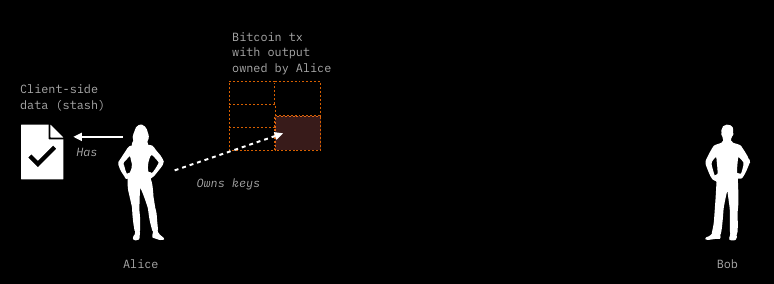
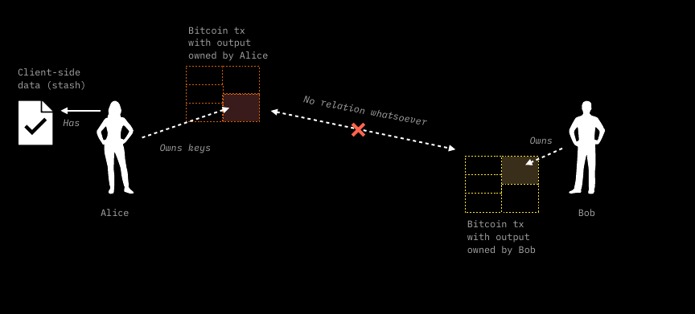
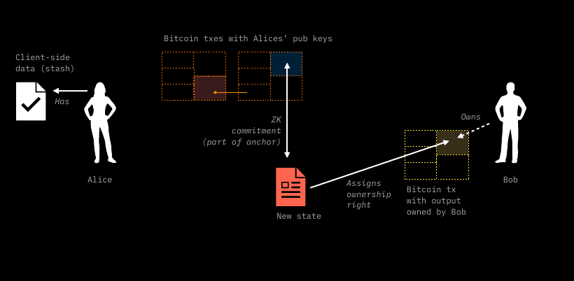
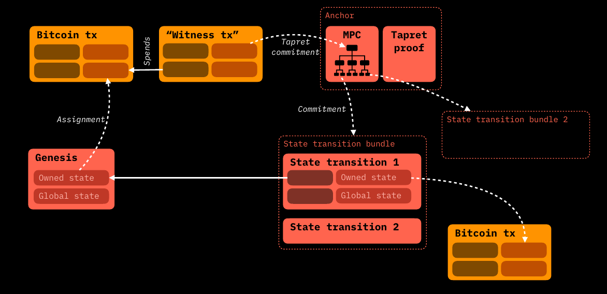
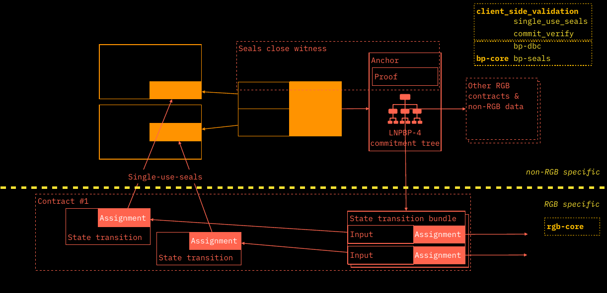

# Contract Operations

## State Transitions and their mechanics

The approach followed in this paragraph is the same as that developed in the [TxO2 Client-side Validation chapter](../commitment-layer/commitment-schemes.md#txo2-client-side-validation) using our beloved cryptographic characters Alice and Bob. This time the explanation contains an important difference: this time Bob is not simply validating the client-side validated data that Alice shows him. He is effectively asking Alice to add some additional data which **will give Bob some degree of ownership** over the contract expressed as a hidden reference to one of his bitcoin [UTXO](../annexes/glossary.md#utxo)s. Let's see how the process works in practice for a [State Transition](state-transitions.md#state-transitions-and-their-mechanics) (one among [Contract Operations](state-transitions.md)):

1. Alice has a [stash](../annexes/glossary.md#stash) of client side validated data, which themselves reference to some Bitcoin UTXO owned by her. This means that in her client-side validate data there is a [seal definition](../annexes/glossary.md#seal-definition) pointing to one of her UTXOs.&#x20;

<figure><figcaption><p>At the beginning of the State Transition, Alice possesses some stash and an UTXO. The idea behind the operation is that she will pass Bob some digital rights in her possession. </p></figcaption></figure>

2. Bob, in turn, possesses some unspent UTXO as well. This UTXO is completely unrelated to Alice's, meaning that there is no direct spending event making a connection between them.&#x20;

<figure><figcaption><p><strong>Also Bob possesses some UTXOs. In addition, they are unrelated to Alice's. This UTXO is a fundamental requirement to complete the State Transition.</strong></p></figcaption></figure>

3. Bob, through some information data, encoded in an [invoice](../annexes/glossary.md#invoice), instruct Alice to create a **New state** which follows the contract rules and which embed a **new seal definition** which points to his UTXO in a concealed form (more on that later). This way, Alice is assigning Bob **some ownership** of the new state: for example, the property of a certain amount of tokens.  &#x20;

<figure><figcaption><p><strong>Bob, co-operate with Alice in the State Transition providing the necessary data for Alice to constructing the new state.</strong>  </p></figcaption></figure>

1. After that, Alice using some [PSBT](state-transitions.md) wallet tool, prepares a transaction which spend the UTXO which were pointed by the previous seal definition (the one that has granted her the ownership of some elements of the contracts). This transaction, which is a **witness transaction**, embeds in his output a commitment to the new state data which uses [Opret](../commitment-layer/commitment-schemes.md#opret) or [Tapret](../commitment-layer/commitment-schemes.md#tapret) rules depending on the method chosen. As explained previously, the Opret or Tapret commitment derive from a [MPC](../commitment-layer/commitment-schemes.md#mpc-tree-construction) tree which can collect more than one contract's state transition.
2. Before broadcasting the transaction prepared in this way, she passes to Bob a package of data called a [Consignment](state-transitions.md) which contain the organized stash of client-side data already in possession of Alice in addition to the new state. Bob, at this point through the tools coded in [RGB-core library](https://github.com/RGB-WG), and [client-side validation library](state-transitions.md):
   * **validates the data contained in the RGB Consignment**;
   * through the [Anchors](../commitment-layer/commitment-schemes.md#anchors), **verifies the chronological ordering of the** [**witness transactions**](state-transitions.md) and the relate commitments to RGB data contained herein.
3.  After checking the correctness of the Consignment Bob can give "green light" (for example by means of GPG signing) to Alice and let her broadcast the witness transaction. When confirmed, such **witness transaction** represent the conclusion of the [State Transition](state-transitions.md) from Alice to Bob.&#x20;

    <figure><figcaption><p><strong>Indeed the new state points to Bob's UTXO assigning them the digital properties once in Alice's possession. The new state is committed in the witness transaction which spend the UTXO, that, in turn, demonstrated Alice's ownership over the digital property being passed to Bob. The spend of the UTXO by Alice, marks the completion  of the State Transition embedding the same anti-double spend security level of Bitcoin.</strong> </p></figcaption></figure>

It's helpful to see the full details of a DAG of two RGB contract operations - ([Genesis](../annexes/glossary.md#genesis) + a State Transition) - both from the RGB client-side components, which will be covered in the next paragraphs, and the _connection points_ to the Bitcoin Blockchain which embed the seal definition and the witness transaction.



Just to give some context introduction from the above diagram, we introduce some terminology which will be covered later in details:

* the [Assignment construct](components-of-a-contract-operation.md#assignments-of-an-owned-state), which is used as an Input from a different RGB State Operation directed to Alice (in this example the Genesis) is responsible for 2 things:
  * the [Seal Definition](components-of-a-contract-operation.md#seal-definition) pointing at a specific UTXO (in this example Bob's).
  * the association of the _Seal Definition_ to specific sets of data called [Owned States](components-of-a-contract-operation.md#owned-states) which, depending on the contract properties, can be chosen among several properties. Just to give a simple example, the amount of token transferred is a common kind of Owned State.
* [Global States](components-of-a-contract-operation.md#global-state) on the contrary reflects general and **public properties** of a contract that maintain consistency in the evolution and state changes of the contract.

As stated previously, a **State Transition** represent the core form among **Contract Operations** (in addition to [Genesis](state-transitions.md#genesis) and [State Extension](state-transitions.md#state-extensions)). **State Transitions** reference one or more previously defined state(s) - in genesis or another State Transition - and update them to a **New State**. As an interesting scalability feature of RGB, multiple **State Transitions**, can be aggregated in a **Transaction Bundle**, so that **each bundling operation** fits one and only one contract leaf in the [MPC tree](../commitment-layer/commitment-schemes.md#mpc-tree-construction).



All the data that participate in the State Transition, aggregated and hashed, fits into the [Transaction Bundle](state-transitions.md#transition-bundle) which, finally, is hashed and committed in the contract leaf of the MPC Tree as a [BundleId](state-transitions.md#bundleid). Thanks to [DBC](../commitment-layer/commitment-schemes.md#deterministic-bitcoin-commitment---dbc) the MPC Tree is committed into a tapret or opret output which, at the same time, closes the seal definition of the spent Bitcoin UTXOs and embedded a new seal definition defined through the new assignment of the the Owned State. The [Anchor](../commitment-layer/commitment-schemes.md#anchors) represent the _connection point_ between the commitment inside Bitcoin Blockchain (whose library and structure are colored in orange) and the RGB client-side validate structure (whose library and components are colored in red).

In the following paragraphs we will explore in depth all the elements and the process involved in the commitment operation of the State Transition. All the topic covered from now on belong to RGB Consensus which is coded into the [RGB Core](https://github.com/RGB-WG/rgb-core/) Library.

## Transition Bundle

As an important general feature of RGB protocol, it is possible to group together **several State Transitions belonging to the same contract** (i.e. having the same `ContractId` which is nothing less that an elaboration of the `OpId` of the Genesis operation). In the most simple cases, as the one shown above between Alice and Bob, a Transition Bundle is composed by a single State Transition.

However, RGB embeds in its design the support for _Multi-payer operations_ such as Coinjoins and Lightning Channel openings, where multiple paying parties (in addition to Alice) possess the same asset. With Transition Bundles, each party can decide to construct asynchronously and privately a State Transaction transferring the contract ownership to one (i.e. Bob) or many counterparts (in a _many-to-many_ relation), group those State transition in a Transition Bundle and, following [RGB rules for MPC and DBC](../commitment-layer/commitment-schemes.md), construct a single [witness transaction](../annexes/glossary.md#witness-transaction) which closes all the [seal definitions](../annexes/glossary.md#seal-definition) referenced in the State Transition of the bundle.

### BundleId

The `BundleId` to be inserted in the leaf of the [MPC](state-transitions.md), is [obtained](https://github.com/RGB-WG/rgb-core/blob/vesper/doc/Commitments.md#bundle-id) by a tagged hash of the strict serialization of the `InputMap` field of the bundle in the following way:

`BundleId = SHA-256(SHA-256(urn:lnp-bp:rgb:bundle#2024-02-03) || SHA-256(urn:lnp-bp:rgb:bundle#2024-02-03) || InputMap)`

An `InputMap` associated to the i-th `input_i` in the set `i = {0,1,..,N-1}` which is referenced to the j-th `OpId` in the set `j = {0,1,..,K}` is a construct built in the following way:

```
InputMap = 

         N               input_0    OpId(input_0)    input_1    OpId(input_1)   ...    input_N-1  OpId(input_N-1)    
|____________________| |_________||______________| |_________||______________|       |__________||_______________|
 16-bit Little Endian   32-bit LE   32-byte hash                                         
                       |_________________________| |_________________________|  ...  |___________________________|
                               MapElement1                MapElement2                       MapElementN 
```

where:

* `N` in the total number of inputs of the **witness transaction** referencing an `OPId(input_i)` in the set `{0,1,...,i}`
* `OpId(input_j)` is the Operation Identifier of the j-th State Transition included in the Transaction Bundle associated with i-th input of the witness transaction. Each State Transition can have more than one input so that `K <= N`.

By referencing each Input only once in an ordered way, the possibility to double-spend the same seal definition in two different state transitions is prevented in an effective way.

## State Generation and Active State

The fundamental topic of State Transitions, just covered in the previous sections, allows general capabilities for the transfer of the ownership of some state properties from one party to another. However, state transitions are not the only kind operation possible in RGB protocol, as they are an element of the broader set of **Contract Operations**. In particular, in RGB we have at our disposal 3 types of contract operation available, indicated in the `OpType` construct:

* **State Transition**
* **Genesis**
* **State Extension**

The latter two can be defined as **State Generation** operation, and in the following paragraphs we will explore their properties.

In the figure below, all 3 contract operation are shown together with their position in a DAG pertaining to an RGB contract, which is ordered according to the respective Anchors in the Bitcoin Blockchain.: Genesis is in <mark style="color:green;">green</mark> , State Transitions are in <mark style="color:red;">red</mark> , State Extensions are in <mark style="color:blue;">blue</mark> .

<figure><figcaption><p><strong>A DAG related to a RGB contract. and the different contract operations. In orange the blocks of Bitcoin Blockchain in which the commitment  are stored and bound to client-side data through anchors.</strong></p></figcaption></figure>

It is important to note that the main difference between ordinary State Transitions and both two State Generation Operations lie in the lack of seal closure part. For this reason, **both Genesis and State Extensions need a State Transition that closes the particular seal definition constructed by them**.

Another evident, yet fundamental, aspect to take into account is that the **Active State** is the last state at the tip of the [DAG](state-transitions.md) of contract operation that reference themselves, in the order committed to the Bitcoin Blockchain, from the Genesis. All the other states associated to spent UTXO are no longer valid but are fundamental to the validation process.

### Genesis

Genesis represents the **starting block of data of every RGB contract.** It is constructed by a [contract issuer](../annexes/glossary.md#contract-participant) and every state transition or state extensions must be eventually connected to it through the DAG of contract operations.\
In Genesis, according to the rules defined in the [Schema](state-transitions.md), are defined the various property related to the contract states which will be constructed upon the Genesis state, both of [owned](state-transitions.md) type and of [global](state-transitions.md) type.

To give an example, in the case of a contract defining the creation of a token, in Genesis are inscribed:

* the number of token issued in the genesis and their owner (the owner of the UTXO referenced in the seal definition)
* the maximum number of token to be issued in total
* the possibility of re-issuance and the designed party that have this rights

As a natural implication, Genesis does no reference any previous state transition, nor it closes any previously defined seal. As mentioned above, in order to be effectively validated on the on-chain history, a Genesis shall be referenced by a first state transition (e.g. a self-spend to the issuer or a first distribution round), which finalizes the "first ownership" of the contract through an anchor to the Bitcoin Blockchain.

### State Extensions

This kind of smart contract operation represents quite a **new feature** in the smart contract realm. With state extensions, **some **_**digital right**_** defined in the contract can be redeemed by some specifically defined parties or by the occurrence of some precise events**. This contract operation is used to confer some complex rights to other parties different from the contract issuer (which is the creator of the Genesis) for example those related to:

* _Distributed issuance_ of some token.
* _Token swap_.
* _Re-issuance events_ which can involve bitcoin / other assets _burning_ to some specific address(es).

In RGB taxonomy, the digital right been being redeemed in State Extensions is called a [Valency](../annexes/glossary.md#valency), and, at the client-side level, it is treated in the same ways as as an assignment being referenced in an RGB input. In this case, such particular "input" part is called a [Redeem](components-of-a-contract-operation.md#redeems). As Genesis, **State Extensions do not close any seal,** on the contrary, **they define a new seal**. They redeem Valencies defined in Genesis or in state transitions, and, in turn, they  must be closed by a subsequent State Transition.

<figure><figcaption><p><strong>State Extensions working mechanism. In this example the State Extension redeem some Valencies from the Genesis, and define a new single-use seal which will be later closed by a subsequent State Transition.</strong></p></figcaption></figure>

Following the figure above we can have an example of the working mechanism of state extension in practice:

* As a first step, some kind of valency (e.g. a issuance right) is defined in the Genesis by the contract issuer. For example, the valency can grant a secondary issuance of a token defined in the contact, only if authorized by a valid signature related to a specific public key embedded in the valency.
* A rightful party construct a state extension referencing this valency in the redeem part of the operation. At the same time, some owned right together with some seal definition pointing at an UTXO is constructed as an assignment in the same state extension. Following the example, the state extension shall include a signature of the public key defined in the valency and assign the new amount of token issued to a Bitcoin UTXO as a seal definition.
* The seal definition specified in the state extension is closed through a State Transition constructed by the UTXO owner, which the seal definition pointed at. So the owner of the state is able to spend the newly issued tokens to himself or to other parties.

***

