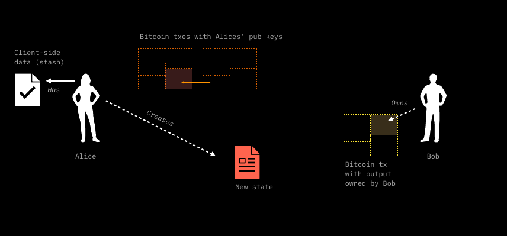

# Contract Operations

## State Transitions and their mechanics

The approach followed in this paragraph is the same as that developed in the [TxO2 Client-side Validation chapter](../commitment-layer/commitment-schemes.md#txo2-client-side-validation) using our beloved cryptographic characters Alice and Bob. This time the explanation contains an important difference: Bob is not simply validating the client-side validated data that Alice shows him. He is actually asking Alice to add some additional data that **will give Bob some degree of ownership** over the contract expressed as a hidden reference to one of his bitcoin [UTXOs](../annexes/glossary.md#utxo). Let's see how the process works in practice for a [State Transition](state-transitions.md#state-transitions-and-their-mechanics) (one of the [Contract Operations](state-transitions.md)):

1. Alice has a [stash](../annexes/glossary.md#stash) of client-side validated data, which in turn references UTXOs on Bitcoin owned by her. This means that in her client-side validate data there is a [seal definition](../annexes/glossary.md#seal-definition) that points to one of her UTXOs&#x20;

<figure><figcaption><p>At the beginning of the State Transition, Alice possesses a certain stash and a UTXO. The idea behind the operation is that she will pass some digital rights in her possession to  Bob. </p></figcaption></figure>

2. Bob, in turn, also has unspent UTXOs. These UTXOs are completely unrelated to Alice's, which means that there is no direct spending event that creates a link between them.&#x20;

<figure><figcaption><p><strong>Bob also owns some UTXOs. Moreover, they are unrelated to Alice's. This UTXO is a fundamental requirement to complete the State Transition.</strong></p></figcaption></figure>

3. Bob, through some informational data, encoded in an [invoice](../annexes/glossary.md#invoice), instructs Alice to create a **New state** that follows the rules of the contract and which embeds a **new seal definition** pointing to his UTXO in a concealed form (more on that later). In this way, Alice assigns Bob **some ownership** of the new state: for example, ownership of a certain amount of tokens.  &#x20;

<figure><figcaption><p><strong>Bob, cooperates with Alice in the State Transition by providing the data necessary for Alice to build the new state.</strong>  </p></figcaption></figure>

1. After that, Alice, using some [PSBT](state-transitions.md) wallet tool, prepares a transaction which spends the UTXOs that were indicated by the previous seal definition (the one that granted her ownership of some elements of the contracts). This transaction, which is a **witness transaction**, embeds in its output a commitment to the new state data that uses [Opret](../commitment-layer/commitment-schemes.md#opret) or [Tapret](../commitment-layer/commitment-schemes.md#tapret) rules depending on the method chosen. As explained earlier, Opret or Tapret commitments are derive from an [MPC](../commitment-layer/commitment-schemes.md#mpc-tree-construction) tree which can collect more than one contract's state transition.
2. Before transmitting the transaction thus prepared, Alice passes to Bob a data packet called [Consignment](state-transitions.md) which contains the organized stash of client-side data already in possession of Alice in addition to the new state. Bob, at this point through the tools coded in [RGB-core library](https://github.com/RGB-WG) and [client-side validation library](state-transitions.md):
   * **validates the data contained in the RGB Consignment**;
   * through the [Anchors](../commitment-layer/commitment-schemes.md#anchors), **verifies the chronological ordering of the** [**witness transactions**](state-transitions.md) and the relate commitments to RGB data contained herein.
3.  After checking the correctness of the Consignment, Bob can give the "go-ahead" (e.g., by GPG signature) to Alice and have her broadcast the witness transaction. Once confirmed, such **witness transaction** represents the conclusion of the [State Transition](state-transitions.md) from Alice to Bob.&#x20;

    <figure><figcaption><p><strong>Indeed, the new state points to Bob's UTXO by assigning him the digital property once in Alice's possession. The new state is committed in the witness transaction that spends the UTXO, which in turn proves Alice's ownership over the digital property that is passed to Bob. The spending of the UTXO by Alice marks the completion of the State Transition embedding the same level of anti-dual-spending security as Bitcoin.</strong> </p></figcaption></figure>

It's useful to see the full details of a DAG of two RGB contract operations - ([Genesis](../annexes/glossary.md#genesis) + a State Transition) - both from the RGB client-side components, which will be covered in the next few paragraphs, and from the _connection points_ to the Bitcoin Blockchain which embeds the seal definition and the witness transaction.


Just to give an introduction to the context of the above diagram, let us introduce terminology that will be discussed later in detail:

* the [Assignment construct](components-of-a-contract-operation.md#assignments-of-an-owned-state), which is used as Input by another RGB State Operation directed to Alice (in this example the Genesis) is responsible for two things:
  * the [Seal Definition](components-of-a-contract-operation.md#seal-definition) which points to a specific UTXO (in this example Bob's).
  * the association of the _Seal Definition_ to specific sets of data called [Owned States](components-of-a-contract-operation.md#owned-states) which, depending on the properties of the contract, can be chosen from several properties. To give a simple example, the amount of tokens transferred is a common kind of Owned State.
* [Global States](components-of-a-contract-operation.md#global-state), on the other hand, reflect general and **public properties** of a contract that maintain consistency in the evolution and state changes of the contract.

As mentioned earlier, a **State Transition** represents the main form among **Contract Operations** (in addition to [Genesis](state-transitions.md#genesis) and [State Extension](state-transitions.md#state-extensions)). The **State Transitions** refer to one or more previously defined state(s) - in genesis or another State Transition - and update them to a **New State**. As an interesting scalability feature of RGB, multiple **State Transitions** can be aggregated in a **Transaction Bundle**, so that **each bundling operation** fits one and only one contract leaf in the [MPC tree](../commitment-layer/commitment-schemes.md#mpc-tree-construction).


All the data participating in the State Transition, aggregated and hashed, enters the [Transaction Bundle](state-transitions.md#transition-bundle) which, finally, is hashed and committed to the MPC Tree contract leaf as [BundleId](state-transitions.md#bundleid). Thanks to [DBC](../commitment-layer/commitment-schemes.md#deterministic-bitcoin-commitment---dbc) the MPC Tree is committed to a tapret or opret output that, at the same time, closes the seal definition of the spent Bitcoin UTXOs and embedded a new seal definition defined through the new assignment of the the Owned State. The [Anchor](../commitment-layer/commitment-schemes.md#anchors) represents the _connection point_ between the commitment inside Bitcoin Blockchain (whose library and structure are colored in orange) and the RGB client-side validation structure (whose library and components are colored red).

In the following paragraphs we will delve into all the elements and the process involved in the  the State Transition commitment operation. All topics discussed from now on belong to RGB Consensus, which is encoded in the [RGB Core](https://github.com/RGB-WG/rgb-core/) Library.

## Transition Bundle

As an important general feature of RGB protocol, it is possible to bundle **different State Transitions belonging to the same contract** (i.e. having the same `ContractId` which is nothing more than an elaboration of the `OpId` of the Genesis operation). In simplest cases, such as the one shown above between Alice and Bob, a Transition Bundle consists of a single state transition.

However, RGB embeds into its design support for _Multi-payer operations_ such as Coinjoins and Lightning Channel openings, where multiple paying parties (besides Alice) own the same asset. With Transition Bundles, each party can decide to asynchronously and privately construct a State Transaction that transfers ownership of the contract to one (i.e. Bob) or many counterparties (in a _many-to-many_ relationship), group these State transitions into Transition Bundle and, following [RGB rules for MPC and DBC](../commitment-layer/commitment-schemes.md), constructs a single [witness transaction](../annexes/glossary.md#witness-transaction) which closes all the [seal definitions](../annexes/glossary.md#seal-definition) referenced by the bundle's State Transitions.

### BundleId

The `BundleId` to be inserted in the leaf of the [MPC](state-transitions.md), is [obtained](https://github.com/RGB-WG/rgb-core/blob/vesper/doc/Commitments.md#bundle-id) from a tagged hash of the strict serialization of the `InputMap` field of the bundle in the following way:

`BundleId = SHA-256(SHA-256(urn:lnp-bp:rgb:bundle#2024-02-03) || SHA-256(urn:lnp-bp:rgb:bundle#2024-02-03) || InputMap)`

An `InputMap` associated to the i-th `input_i` in the set `i = {0,1,..,N-1}` that references the j-th `OpId` in the set `j = {0,1,..,K}` is a construct built as follows:

```
InputMap = 

         N               input_0    OpId(input_0)    input_1    OpId(input_1)   ...    input_N-1  OpId(input_N-1)    
|____________________| |_________||______________| |_________||______________|       |__________||_______________|
 16-bit Little Endian   32-bit LE   32-byte hash                                         
                       |_________________________| |_________________________|  ...  |___________________________|
                               MapElement1                MapElement2                       MapElementN 
```

where:

* `N` in the total number of inputs of the **witness transaction** that refer to an `OPId(input_i)` in the set `{0,1,...,i}`.
* `OpId(input_j)` is the Operation Identifier of the j-th State Transition included in the Transaction Bundle associated with i-th input of the witness transaction. Each State Transition can have more than one input so that `K <= N`.

By referring to each input only once in an orderly manner, the possibility to double-spend the same seal definition in two different state transitions is effectively prevented.

## State Generation and Active State

The basic topic of state transitions, just covered in the previous sections, allows the transfer of ownership of certain state properties from one party to another. However, state transitions are not the only type of operation possible in RGB protocol, since they are an element of the larger set of **Contract Operations**. In particular, in RGB we have at our disposal three types of contract operations available, indicated in the `OpType` construct:

* **State Transition**
* **Genesis**
* **State Extension**

The last two can be referred to as **State Generation** operations, and in the following paragraphs we will explore their properties.

The following figure shows all three contract operations along with their position in a DAG related to an RGB contract, sorted by their respective anchors in the Bitcoin Blockchain: Genesis is in <mark style="color:green;">green</mark>, State Transitions are in <mark style="color:red;">red</mark>, State Extensions are in <mark style="color:blue;">blue</mark>.

<figure><figcaption><p><strong>A DAG related to an RGB contract and the different contract operations. In orange the blocks of Bitcoin's Blockchain in which the commitments are stored and linked to client-side data via anchors.</strong></p></figcaption></figure>

It is important to note that the main difference between ordinary State Transitions and the two State Generation Operations lies in the lack of the closing part of the seal. For this reason, **both Genesis and State Extensions require a State Transition that closes the particular seal definition constructed by them**.

Another obvious, but crucial, aspect to keep in mind is that the **Active State** is the last state at the end of the [DAG](state-transitions.md) of contract operations that reference themselves, in the order committed on the Bitcoin Blockchain, starting from the Genesis. All other states associated with spent UTXOs are no longer valid but are critical to the validation process.

### Genesis

Genesis represents the **initial data block of each RGB contract.** It is constructed by a [contract issuer](../annexes/glossary.md#contract-participant) and any state transitions or state extensions must eventually be connected to it through the DAG of the contract operations.\
In Genesis, according to the rules defined in the [Schema](state-transitions.md), are defined the various properties related to the contract states that will be built on the Genesis state, both of [owned](state-transitions.md) type and of [global](state-transitions.md) type.

To give an example, in the case of a contract defining the creation of a token, the following are inscribed in Genesis:

* the number of tokens issued in the genesis and their owner (the owner of the UTXO referred to in the seal definition);
* the maximum number of tokens to be issued in total;
* the possibility of re-issuance and the designed party that has this right.

As a natural implication, Genesis does not refer to any previous state transition, nor does it close any previously defined seal. As mentioned above, to be effectively validated in the history of the chain, a Genesis must be referenced by a first state transition (e.g. a auto-spend to the issuer or a first round of distribution), which finalizes the "first ownership" of the contract through an anchor to the Bitcoin Blockchain.

### State Extensions

This type of operation represents a **new feature** in the smart contract realm. With state extensions, **some **_**digital right**_** defined in the contract can be redeemed by some specifically defined parties or by the occurrence of some precise events**. This contract operation is used to confer some complex rights to other parties than the contract issuer (who is the Genesis creator), such as those related to:

* _Distributed issuance_ of some token.
* _Token swap_.
* _Re-issuance events_ that may involve bitcoin / other assets _burning_ to some specific address(es).

In the RGB taxonomy, the digital right that is redeemed in State Extensions is called [Valency](../annexes/glossary.md#valency), and, at the client-side level, is treated as an assignment that is referenced in an RGB input. In this case, this particular piece of "input" is called [Redeem](components-of-a-contract-operation.md#redeems). Like Genesis, the **State Extensions do not close any seals,** instead, **they define a new seal**. They redeem Valencies defined in Genesis or state transitions and, in turn, must be closed by a subsequent State Transition.

<figure><figcaption><p><strong>Mechanism of operation of State Extensions. In this example, the State Extension redeems some Valencies from the Genesis and defines a new single-use seal that will then be closed by a subsequent State Transition.</strong></p></figcaption></figure>

Following the figure above, we can have an example of the mechanism of operation of state extension in practice:

* As a first step, the contract issuer defines some kind of valency (e.g., an issuance right) in Genesis. For example, the valency may grant a secondary issuance of a token defined in the contact, only if authorized by a valid signature related to a specific public key embedded in the valency.
* A entitled party constructs a state extension that references this valency in the redemption part of the transaction. At the same time, an entitlement along with a seal definition pointing to a UTXO is constructed as an assignment in the same state extension. Following the example, the state extension will include a public key signature defined in the valency and assign the new amount of tokens issued to a Bitcoin UTXO as the seal definition.
* The seal definition specified in the state extension is closed through a State Transition constructed by the owner of the UTXO to which the seal definition pointed. In this way, the state owner is able to spend the newly issued tokens on itself or other parties.

***