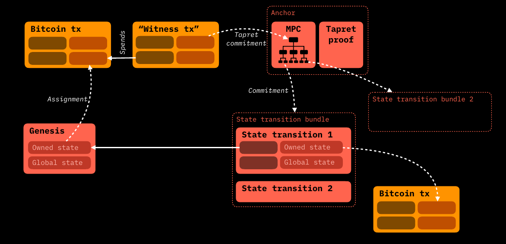

# State Transitions

Before addressing the technical implementation of **states** and their related data structure, it is important to recall that the **ordered sequence of seal definition and the following seal closure**  is meant to provide the ability to implement properly the most important operation of the client-side validated domain: **State Transition**.   
In the following paragraphs, after a brief introduction to **smart contracts** and **state**  we will devote our attention to the mechanism behind **State Transitions** from the the Client-side perspective and the related *point of contacts* which tether such operation with the Bitcoin Blockchain commitments discussed in the [Client-side Validation with Bitcoin](csv-w-btc.md) section.  


## Introduction to Smart Contracts and their States

Since RGB allows for the implementation of **smart contracts** in Bitcoin, it's the right time to give a definition of what actually a smart contract is. 

> A smart contract is an agreement which is automatically enforced between parties

This means that the enforcement of the conditions agreed between the parties **does not require human intervention** and that such enforcement is done by mathematics and computing means. 

In addition to that, a question arises. In order to achieve the highest degree of automatization, decentralization and privacy it is possible to forfeit centralized registry storing contract ownership and information? The affirmative answer lie back at the origins.
 
 

Once upon a time contracts, for examples those of securities, where **bearer instruments**. Indeed, the generalized use of assets ledgers which in fact imply a custody relation with some institution controlling both the ledger and storing the contract on behalf of the client represents a quite recent development of economic history. **The bearer nature of contracts is in fact a centuries-old tradition.** This kind of philosophy is at the core of RGB architecture, as the bearer rights of each rightful party are contained in form of data inside the contract and they can be modified and enforced digitally, following the rule of the contract itself. 

In RGB design, a wider range of issues regarding programmability of smart contract have been taken into account, in particular:
1. A contract may be associated to a *digital asset* or a *token*, but it's **not limited to it**. A wider range of applications and extensions of the *smart contract* concept can be implemented in RGB. 
2. Differently from other public blockchain's approach to smart contracts, in **RGB there is a clear separation among the different parties related to a contract and the related rights**: e.g. the creator of the contract and the different kind of users interacting in some ways with the contract. This include in particular the differentiation between:
    * the possibility to *observe* some properties or operations performed by other parties over the contract
    * the possibility to *perform a set of operations* permitted by the contract

**No other counterpart can interact or even observe** the operation performed on the contract, if not allowed by the authorized parties. Inside RGB this characteristics means that there is always an **owner** which is a party which possesses the right to perform some operation on the contract, which are defined by the contract itself. 

These combined properties allow for the achievement of 2 among the most important properties at the core of RGB value proposition which are: **scalability** and **censorship resistance** at unprecedented levels.

In order to achieve this goals, a RGB contract is composed by 2 main components:
* **State**
* **Business Logic (Behavior)** 

In fact the Business Logic of the contract represent the rules that allows the entitled party (the owner) to change the state of the contract. We will explore later that the **Business Logic** is embedded in a particular structure of the contract called the [Schema]().


At this point, without going into the specific implementation details of RGB, which will be covered later, a first and basic definition of [State]() is required. Simply put:

> A State can be defined as a unique configuration of information / data that represents the conditions of a contract in some precise moment in time.

Thus a State Transition, in general terms, represents any **update of data** from an **old state** to a **new state** following the **rules inscribed into the contract** constituting its **Business Logic**. 


The chain of state transitions is the ordered path that make contract data evolve from the very **first contract definition**, called the [**Genesis**]() up to the [**Terminal State**]() representing the most updated state at the tip of the [DAG](terminology/glossary.md#directed-acyclic-graph---dag) of state transitions.

The order relation among the state transitions in maintained thanks to the commitments that anchors the client-side validated data to the Bitcoin Blockchain which, in turn, provides, timestamping capabilities and **source of ordering**.


## State Transitions and Contract Operations

### Mechanics of State Transitions

The approach followed in this paragraph is the same as the one developed in the [TxO2 Client-side Validation](/csv-w-btc.md#txo2-client-side-validation) using our beloved cryptographic characters Alice and Bob. This time the explanation contains an important difference: this time Bob is not simply validating the client-side validated data that Alice shows him. He is effectively asking Alice to add some additional data which **will give Bob some degree of ownership** over the contract expressed as a hidden reference to one of his bitcoin UTxO. Let's see how the process works in practice.

Alice has a [stash]() of client side validated data, which themselves reference to some Bitcoin UTXO owned by her. This means that in her client-side validate data there is a **seal definition** pointing to one of her UTXOs. 


Bob, in turn, possesses some unspent UTXO as well. This UTXO is completely unrelated to Alice's, meaning that there is no direct spending event making a connection between them. 

<!---

-->


Bob, through some information data, encoded in an **[invoice]()**, instruct Alice to create a **New state** which follows the contract rules and which embed a **new seal definition** which points to the his UTXO in a concealed form. This way Alice is assigning Bob **some ownership** of the new state (e.g. the property of a certain amount of tokens). 


After that, Alice using some [PSBT]() wallet tool, prepares a transaction which spend the UTXO which were pointed by the previous seal definition (the one that has passed the ownership to her). This transaction, which is a **witness (seal closing) transaction**,  embeds in his output a commitment to the new state data which uses [Opret](/csv-w-btc.md#opret) or [Tapret](/csv-w-btc.md#tapret) rules depending on the method chosen. As explained previously, the Opret or Tapret commitment derive from a [MPC](/csv-w-btc.md#mpc-tree-construction) tree which can collect more than one contract's state transition. 

Before broadcasting the transaction prepared in this way she passes to Bob a package of data called [consignment]() which contain the stash of client side validated already in possession of alice in addition to the new state.


After checking the correctness of the consignment Bob can give "green light" (for example by means of GPG signing) to Alice to let her broadcast the transaction. When confirmed, the **witness (seal closure) transaction** represent the conclusion of the state transition from Alice to Bob. 


It's helpful to see the full details of the state transition both from the RGB client-side components, which will be covered in the next paragraphs, and the *connection points* to the Bitcoin Blockchain which embed the seal definition and the witness seal closure transaction



Just to give some context introduction, from the above diagram we introduce some terminology which will be covered later in detail. 

the [**Assignment**]() construct, which is in fact an output of a different RGB State Operation directed to Alice (in this example the [**Genesis**](), which represents the first transition of any contract), is responsible for 2 things:
* the **seal definition** pointing at a specific UTXO.  
* the association of the *seal* to specific sets of data called **Owned States** which, depending on the contract properties, can be chosen among several properties. Just to give a simple example the amount of token transferred is a common kind of Owned State. 

[**Global States**]() on the contrary reflects general and public properties of a contract that maintain consistency in the evolution and state changes of the contract.

Multiple **State Transition**, which represent the core RGB client-side validated operation, can be aggregated in a **Transaction Bundle**, so that **each bundling operation fits one and only one contract leaf in the [MPC tree](/csv-w-btc.md#mpc-tree-construction).  

A single State Transition, at client side levels, contains always 2 elements:
* the reference to one ore more assignments of previous State Operation, expressed in form of **Inputs**
* The new assignments of some **Owned states** to other Bitcoin UTXOs belonging to the new State Owner.


All the data which participate in the State Transition are aggregated and hashed and fits into the Transaction Bundle which, finally, is hashed and committed in the contract leaf of the MPC Tree. Thanks to [DBC](/csv-w-btc.md#deterministic-bitcoin-commitment---dbc) the MPC Tree is committed into a tapret or opret output which, at the same time, closes the seal definition of the spent Bitcoin UTXOs and embedded a new seal definition defined through the new assignment of the the Owned State. The [Anchor](/csv-w-btc.md#anchors) represent the connection point between the commitment inside Bitcoin Blockchain (whose library and structure are colored in orange) and the RGB client-side validate structure (whose library and components are colored in red). 

In the following paragraphs we will explore in depth all the elements and the process involved in the commitment operation of the State Transition. All the topic covered from now on belong to RGB Consensus which is coded into the [RGB Core](https://github.com/RGB-WG/rgb-core/) Library.

  
### Transition Bundle 

As an important general feature of RGB protocol, it is possible to group together **several State Transitions belonging to the same contract** (i.e. having the same `contract_id`). In the most simple case, as the one shown above between Alice and Bob, a transition bundle is composed by a single state transition.

 However, RGB embeds in its design the support for *Multi-payer operations* such as Coinjoins and Lightning Channel openings, where multiple paying parties (in addition to Alice) possess the same asset. With Transition Bundles, each party can decide to construct asynchronously and privately a State Transaction transferring the contract ownership to one (i.e. Bob) or many counterparts (in a *many-to-many* relation), group those State transition in a Bundle and, following [RGB rules for MPC and DBC](/csv-w-btc.md), construct a single Witness Seal Closure Transaction, closing all the seal definitions referenced in the State transition of the bundle.   

The [Transaction Bundle Structure](https://github.com/RGB-WG/rgb-core/blob/master/src/contract/bundle.rs#L70) is composed by a map composed by the following elements:
* The ordered list of `Op_id` identifying each State Transition inside the bundle, followed by the ordered state transition data called `Bundle_item`.
* Each `Bundle_item` contains: 
  *  The ordered list of Inputs `V_in` of the Bitcoin Witness Transaction referencing the seal definition being spent (closed) by each Input of the State Transition.
  *  A marker, either `0` or `1` indicating the status of the state transition in a `concealed` or `revealed` form (more details later) 

By referencing each Input `V_in` in an ordered way, the possibility to double-spend the same seal definition is two different state transitions is prevented in an effective way.

In order to obtain the `bundle_id` to be inserted in the leaf of the MPC, a Merkle tree of the `op_id` is constructed in a deterministic way  <to complete>


### Contract Operations and Active State

The fundamental topic of state transitions, which was just described in the previous sections, allows general capabilities for the transfer of the ownership of some state properties from one party to another. However, state transitions are not the only kind operation possible in RGB protocol, as they are an element of the broader set of **Contract Operations**. In particular, in RGB we have at our disposal 3 types of contract operation available:     

* **State Transition** 
* **Genesis** 
* **State Extension**

The latter two can be defined as **State Generation** operation, and in the following paragraphs we will explore their properties.

In the figure below, all 3 contract operation are shown together with their position in a DAG pertaining to an RGB contract, which is ordered according to the respective anchors in the Bitcoin Blockchain. Genesis is in green, State Transitions are in Red, State Extensions are in blue.


It is important to note that the main difference between ordinary State Transitions and both two State Generation Operations lie in the lack of seal closure part. For this reason, **both Genesis and State Extensions need a State Transition that closes the particular seal definition constructed by them**.


Another evident yet fundamental aspect to take into account is that the **Active State** is the last state at the tip of the [DAG]() of contract operation that reference themselves, in the order committed to the Bitcoin Blockchain, from the Genesis.

#### Genesis 

Genesis represent the **starting state of every RGB contract**, it is constructed by a [contract issuer]() and every state transition or state extensions must be eventually connected to it through the DAG of contract operations.  
In Genesis, according to the rules defined in a contract template called [Schema](), are defined the various property related to the contract states which will be constructed upon the Genesis state, both of [owned]() type and of [global]() type. 

To give an example, in the case of a contract defining the creation of a token, in Genesis are inscribed:
* the number of token issued in the genesis and their owner (the owner of the UTXO referenced in the seal definition)
* the maximum number of token to be issued in total
* the possibility of re-issuance and the designed party that have this rights

As a natural implication, Genesis does no reference any previous state transition, nor it closes any previously defined seal. As mentioned above, in order to be effectively validated on the on-chain history, a Genesis shall be referenced by a first state transition (e.g. a self-spend to the issuer or a first distribution round), which finalizes the "first ownership" of the contract through an anchor to the Bitcoin Blockchain. 

#### State Extensions

This kind of smart contract operation represents quite a **new feature** in the smart contract realm.
With state extensions, **some *digital rights* defined in the contract can be redeemed by some specifically defined parties or by the occurrence of some precise events**. This contract operation is used to confer some complex rights to other parties different from the contract issuer (which is the creator of the Genesis) for example those related to:

* *Distributed issuance* of some token. 
* *Token swap*. 
* *Re-issuance events* which can involve bitcoin / other assets *burning* to some specific address(es). 


In RGB taxonomy, the digital right been being redeemed in State Extensions is called a [Valency](), and, at the client-side level, it is treated in the same ways as as an [assignment]() being referenced in an RBB input. In this case, such particular "input" part is called a [Redeem](). As Genesis, state extensions do not close any seal. They redeem valencies defined in Genesis or in state transitions  in turn, must be closed by a subsequent state transition. 


Following the figure above we can have an example of the working mechanism of state extension in practice:
* As a first step, some kind of valency (e.g. a issuance right) is defined in the Genesis by the contract issuer. For example, the valency can grant a bounded-amount secondary issuance of a token defined in the contact, only if authorized by a valid signature related to a specific public key embedded in the valency.
* A rightful party construct a state extension referencing this valency in the redeem part of the operation. At the same time, some owned right together with some seal definition pointing at an UTXO is constructed as assignments in the same state extension. Following the example, the state extension include a signature of the public key defined in the valency and assign the new amount of token issued to a Bitcoin UTXO as a seal definition.      
* The seal definition specified in the state extension is closed through a State Transition constructed by the UTXO owner, which the seal definition pointed at. So the owner of the state is able to spend the newly issued tokens to himself or to other parties.


### Components of a Contract Operation

Let's now deep-dive in all the components of a contract operation, which are able to change the state of the contact and are eventually client-side verified by the rightful recipient in a deterministic way. 

```
                       +-------------------------------------------------------------------------------------------------------+
                       |                                                                                                       |
                       |  +----------------------+               +-----------------+                +-----------------------+  |                      
                       |  | Fast-forward Version |               | Transition Type |                | ContractId | SchemaId |  |                      
                       |  +----------------------+               +-----------------+                +-----------------------+  |           
                       |                                                                                                       |
                       |  +------------------------------------------+   +--------------------------------------------------+  |
                       |  | Metadata                                 |   | Global State                                     |  |
                       |  |                                          |   | +---------------------+                          |  |
                       |  | +-------------------------------------+  |   | | +------+ +--------+ |                          |  |
                       |  | |          Structured Data            |  |   | | | Type | |  Data  | |   ...   ...   ...        |  |
                       |  | +-------------------------------------+  |   | | +------+ +--------+ |                          |  |
                       |  |                                          |   | +---------------------+                          |  |
                       |  +------------------------------------------+   +--------------------------------------------------+  |            +------+
                       |                                                                                                       +------------> OpId |
                       |  +------------------------------------------+   +--------------------------------------------------+  |            +------+
                       |  | Inputs                                   |   | Assignments                                      |  |
                       |  |                                          |   |                                                  |  |
                       |  | +--------------------------------------+ |   | +----------------------------------------------+ |  |
                       |  | | Input #1                             | |   | | Assignment #1                                | |  |
        +------+       |  | | +---------------+ +------+ +-------+ | |   | | +------+ +-------------+ +-----------------+ | |  |         +-------------+
        | OpId +--------------> Previous_OpId | | Type | | Index | | |   | | | Type | | Owned State | | Seal Definition +----------------> Bitcoin TXO |
        +------+       |  | | +---------------+ +------+ +-------+ | |   | | +------+ +-------------+ +-----------------+ | |  |         +-------------+
                       |  | +--------------------------------------+ |   | +----------------------------------------------+ |  |
                       |  |                                          |   |                                                  |  |
                       |  | +--------------------------------------+ |   | +----------------------------------------------+ |  |
                       |  | | Input #2                             | |   | | Assignment #2                                | |  |
        +------+       |  | | +---------------+ +------+ +-------+ | |   | | +------+ +-------------+ +-----------------+ | |  |         +-------------+
        | OpId +--------------> Previous_OpId | | Type | | Index | | |   | | | Type | | Owned State | | Seal Definition +----------------> Bitcoin TXO |
        +------+       |  | | +---------------+ +------+ +-------+ | |   | | +------+ +-------------+ +-----------------+ | |  |         +-------------+
                       |  | +--------------------------------------+ |   | +----------------------------------------------+ |  |
                       |  |                                          |   |                                                  |  |
                       |  |         ...           ...      ...       |   |     ...          ...             ...             |  |
                       |  |                                          |   |                                                  |  |
                       |  +------------------------------------------+   +--------------------------------------------------+  |
                       |                                                                                                       |
                       |  +------------------------------------------+   +--------------------------------------------------+  |
                       |  | Redeems of Valencies                     |   | Valencies                                        |  |
                       |  |                                          |   |                                                  |  |            
                       |  | +----------------------------+           |   |                                                  |  |   
        +------+       |  | | +---------------+ +------+ |           |   |  +------+  +------+  +------+                    |  |            
        | OpId +--------------> Previous_OpId | | Type | | ...   ... |   |  | Type |  | Type |  | Type |  ...   ...   ...   |  |    
        +------+       |  | | +---------------+ +------+ |           |   |  +------+  +------+  +------+                    |  |    
                       |  | +----------------------------+           |   |                                                  |  |   
                       |  |                                          |   |                                                  |  |    
                       |  |                                          |   |                                                  |  |    
                       |  +------------------------------------------+   +--------------------------------------------------+  |    
                       |                                                                                                       |    
                       +-------------------------------------------------------------------------------------------------------+
```

With the help of the comprehensive diagram above it's important to point out that any contract operation is composed by some components related to the  **New State** and some components related to the **Old State** being updated. The components of the **New state**, which we will be exploring one by one in a dedicated paragraph, are:

* **Assignments** in which are defined:
  * Seals
  * Owned State 
* **Global State**
* **Valencies**

The **Old State** is referenced through:
* **Inputs** connected to previous assignments of the related old states
* **Redeems** which are a reference to previously defined [Valencies]()

In addition to this subdivision we also have:
* **Fast-forward Version** a 2-byte integer indicating the version of the contract used which can be updated according to some issuer choices.  
* **Transition Type** indicating one out of: **State Transition** / **Genesis** / **State Extension**
* **ContractId / SchemaId** the 32-byte referencing the `OpId` of the Genesis of the contract. If the contract operation is itself a Genesis, in place of the ContractId a SchemaId, which is a hash fingerprint of the used contract [Schema]().  
* **Metadata** allowing for the declaration of temporary variables useful for complex contract validation but which doesn't need to be registered as state properties.

#### OpId

Each Contract Operation is identified by a 32-byte hash called `OpId`, which is, indeed, the ordered SHA-256 hashing of the following elements: <to complete>  

#### Contract State

Before addressing each state component, it's fundamental to clarify through which elements a contract state is expressed in the RGB protocol. Specifically, in RGB, the **State** of a contract is fully expressed by:
* A single **Global State** 
* One or more **Owned State(s)** which can belong to either 2 different categories:
  * Private States
  * Public States


Global State are embedded in state transition as a single component block, while Owned State are defined inside the assignment component together with a Seal Definition.

##### Global State

The purpose of Global State can be summarized by the following sentence:**"nobody owns, everyone knows"** as it defines some general characteristic of the contract which must be publicly visible. A Global State is always a public state, and can be written in Genesis by the contract issuer and later changed in state transition or in state extensions by a rightful party defined in the genesis itself.

As an important feature, the Global State is usually made available by the contract issuers or  by contract participants and distributed through public networks both centralized or decentralized (e.g. Websites, IPFS, Nostr, Torrent, etc.). It's important to point out that the **availability** of the global state is incentivized only by economic means of usage and diffusion of the contract: the involved parties are interested and bears the cost of the storage solution which means the accessibility of such kind of data.

Every Component of a Global State is composed by one ore more elements which embeds:

* A `Type` which embeds a deterministic [semantic definition]();
* The actual Data.

For example A Global State of newly issued token written in Genesis, dependent on the [`Non inflatable Asset Schema`]() and  [Contract Interface]() `RGB 20` , [contains](https://github.com/RGB-WG/rgb/blob/master/examples/rgb20-demo.yaml) generally, as common `Types`:
* the `ticker`;
* the Full name of the token: `name`;
* the precision of decimal figures: `precision`;
* the maximum supply of the token: `issuedSupply`;
* the date of issuance: `created`;
* a text with some Legal disclaimer: `terms`


##### Assignments

Assignments are the fundamental constructs that are responsible for the **Seal Definition** operation and the related **Owned State** which such the Seal Definition is bounded to. They are the core parts which allows for the **rightful transfer** of some digital property described in the Owned State, to a New Owner identified by the possession of a specific Bitcoin UTXO. Assignment can be compared to Outputs of Bitcoin Transaction, but embeds eventually more capabilities and potentialities. 

Each Assignment is composed by the following main components:
* The `Type` which is the semantic identifier of the digital property being stored in the Assignment (e.g. the `assetOwner` used in token transfers)
* the `Seal Definition`
* The `Owned State`
  


##### Revealed / Concealed form

As a peculiar feature of RGB, both Seal Definition and Owned State can be expressed in a `Revealed` or `Concealed` form. This is particularly useful for maintaining high privacy and scalability in both state transition construction and subsequent validation, in a selective way, by the different parties that may be involved in the contract. Indeed, the constructs in `Revealed`` form can be used to validate the same data that were inserted in a previous state transition(s) with their hash digest representing the concealed form of the construct. 
In the picture below, all 4 combination of Reveal/Conceal form are shown:


As the concealment methodology of each constructs can vary, we will discuss the respective forms for each construct when needed. As a final remark of this paragraph, per RGB consensus rules **the `OpId` of the state transition is always calculated from the concealed data** 

##### Seal Definition

[Seal Definition](https://github.com/RGB-WG/rgb-core/blob/master/src/contract/seal.rs) in its *revealed* form, is itself a structure composed by 4 fields: `txptr` `vout` `blinding` `method`. 
* **txptr** is a more complex object than a simple Bitcoin Transaction hash. In particular it can have two forms, either:
  * `Graph seal` is the most straightforward case where an existing UTXO (having a specific `txid`) is referred as seal definition.
  * `Genesis seal` which is a "self-referenced" definition, meaning that the **The transaction used as a seal definition coincides with the witness transaction including the present assignment**. As the final `txid` of the transaction depends on all the data of the state transition, including `txptr` it would be impossible to calculate it due to the circular reference implied. In practice the `Genesis Seal` is a void field which has become necessary to handle several situation in which an external UTXO is not available: a notable situation is the generation and update of Lightning Network commitment transactions. 
*  **vout** is the transaction output of the transaction id inserted in `txptr` (if it's `Graph seal`). `txptr` together with `vout` form the standard *outpoint* representation.
* **blinding** is a 8-byte random number, which allows for the effective concealment of the data of the seal once hashed, improving resistance to brute-force attacks. 
* **method** is a 1-byte field which indicate the seal closing method, which will be used in the related [witness transaction](/terminology/glossary.md#--). It's either [tapret](/csv-w-btc.md#tapret) or [opret](/csv-w-btc.md#tapret).

The *concealed* form of the Seal Definition is simply the ordered SHA-256 hash of the the 4 field.

    

##### Owned States

This second component of the Assignment is responsible for the definition and storage of the data assigned by the Seal Definition. 
Before proceeding with the characteristics of Owned States, it is important to point out that the Conceal/Reveal feature, differently from Global State where it is not present, allows for the definition of two forms of Owned States:
* **Public**: where the related data must always kept and transferred in revealed form by their owner recursively. For example it can be applied to some image file which must be bounded to ownership, but always publicly shown)   
* **Private**: where data are kept concealed and revealed only if they part of the history for validation purposes. For example the number of token transferred in a token contract is generally kept in private form.

In RGB, an Owned State can be defined with only one among 4 State Type: `Declarative`, `Fungible`, `Structured`, `Attachments`, each of which come with its concealed and Revealed form:
* **Declarative** is a State Type with **no data**, representing some form of governance rights which can be executed by a contract party. For example it can be used for voting rights. Concealed and Revealed form of it coincides.
* **Fungible**. It's the State Type that allows for the transfer of fungible units such those of a token contract. In Revealed form it consists of two fields: an `amount` and a `blinding` factor, while in concealed form it is transformed in a 1-field structure containing a [`Pedersen commitment`](https://link.springer.com/chapter/10.1007/3-540-46766-1_9) which reference the `amount` and the `blinding` factor of the revealed form. In a future upgrade it would be possible to implement ZK cryptographic proofs such as [`Bulletproof`](https://crypto.stanford.edu/bulletproofs/) which will be able to demonstrate that inside the same State Transition the sum of `Inputs` referencing a fungible state equates the sum of fungible `Owned States` without revealing the actual amounts. 
* **Structured** is a state that can host collections of bounded and ordered data of arbitrary content which can be used for complex validation schemes of the contract. It's maximum storage size is bounded to 64 kB at maximum. The Revealed data is simply the byte serialized data *blob* and the concealed form is the SHA-256 hash of that data blob.
* **Attachments** is uses to attach arbitrary file with a defined purpose, such as media files, audio files, texts, binaries, etc.). The actual file is kept separated by the state type data themselves, as in revealed form the Attachment structure contains 3 fields: the SHA-256 `file hash`, the MIME `media type` and a `salt` factor which guarantee additional privacy. In concealed form the State Type is the ordered SHA-256 hash of the 3 fields just described.  

In the following diagram, a summary of the 4 State Types and both their Concealed and Revealed forms is shown:


In the table a summary of the characteristics of each State Type is provided:

| Item                | **Declarative** | **Fungible**                      | **Structured**        | **Attachments**  |
|---------------------|-----------------|-----------------------------------|-----------------------|------------------|
| **Data**            | None            | 64-bit signed/unsigned integer    | Any strict data type  | Any file         |
| **Type info**       | None            | Signed/unsigned                   | Strict Types          | MIME type        |
| **Confidentiality** | Not Required    | Pedersen commitment               | Hashing with blinding | Hashed file id   |
| **Size limits**     | N/A             | 256 Byte                          | Up to 64 kByte        | Up to ~500 GByte |

#### Inputs 

In a similar fashion to Bitcoin Transactions, Input represent the "other half" of the Assignment construct. They have the fundamental role of referencing the Assignments of a previous State Transition. Inputs are not present in Genesis and State Extension Operation and are composed by the following fields:
* `Prev_OpID` containing the Operation ID of the Assignment being referenced;
* `Type` the semantic identifier related to the contract property being referenced 
* `Index` the index number of the Assignment being referenced inside the list of Assignment of the `Prev_OpId`. The `Index` is implicitly calculated from the lexicographical ordering hash of the **Concealed Seal** of the assignment referenced.      

The RGB validation procedure, beside checking the correct closure of the Seal, is also responsible to check the consistency between inputs and outputs especially for `Fungible` state where the amount of token of each input of a specific `Type` and `Fungible State Type` must match the number of token in the Assignments of the same state transition.


#### Metadata

Metadata construct is a particular field in which contains all the information which are not useful to be stored as a part of the contract state history. It has a size limit of 64 KiB, and can be used, for example, to host temporary data of complex contract validation procedure by the [AluVm]() engine. 

#### Valencies

Valencies are a unique-in-its-kind construct which can be present in all 3 forms of Contract Operations. Basically are a set of digital rights that can be recalled and "put in effect" by a subsequent state transition. 


#### Redeems


#### Operation and States


## Features of RGB State

#### 


### Strict Type System

The state represent a set of conditions which are expressed in form of data and which are embedded in the contract itself.

In RGB, this set of data is actually a **set of arbitrary rich data** which:
* are **strongly typed**, which means that **each variable possesses a clear type definition (e.g. u8) and both lower and upped bounds**.
* can be **nested**, meaning that a type can be constructed from other types.
* can be organized in `lists` `sets` or `maps`


In order to properly encode data into the state in a reproducible way a [Strict Type System](https://www.strict-types.org/) together with [Strict Encoding](https://github.com/rust-amplify/rust-amplify) has been adopted in RGB. This means that:
* The encoding of the data is done according to a precise [schema](#terminilogy/glossary.md#schema) which, unlike JSON or YAML, define a precise structure and layout of the data thus allowing also for deterministic ordering of each data element herein.
* The ordering of the elements inside every collection (i.e. in lists, sets or maps) is deterministic as well.
* Boundaries (lower and higher) are defined for every variable and for the number of element in a collection (the so called **Confinement**).
* All data field are byte-aligned.
* The serialization and hashing of the data is performed in a deterministic way (Strict Encoding) allowing for creating **reproducible commitments** of the data irrespective of the system on which such operation is performed.
* The creation of the data according to the schema is **performed through a simple description language which compile in Binary form** from Rust Language. In the future extension to other languages will be supported.
* Additionally, the compiling according to the Strict Type System produces 2 types of outputs:
  * A **Memory Layout at compile time**
  * **Associated Semantic identifiers** to the memory layout (i.e. commitment to each field's name of the data)  
   For instance, this kind of construction is able to make detectable the change of a single variable name, which **doesn't change the memory layout** but which **do change the semantics**.
* Finally, Strict Type System allows for **versioning** of the compilation schema, thus enabling the tracking of consensus changes in contracts and in the compilation engine.
  
In order to have a visual comparison of Strict Encoding with other data structure systems and programming language, the following picture can be useful:


As a matter of fact Strict Encoding is defined in both an extremely pure functional level (thus very far away from Oriented Object Programming (OOP) philosophy) and at a very low level (nearly hardware definition, so far away from more abstract structures and languages).

### Size limitation

Regarding the **data concurring to state validation**, the RGB protocol consensus rule apply a **maximum size limit** of 2^16 bite (64kB):
* To the size of **any data type** participating in state validation (e.g. a maximum of 65536 x `u8`, 32768 x `u16`, etc...)
* To the **number of elements of each collection** employed in state validation.
This has been designed in order to:
* Avoid unlimited growth of the client side-validate data per each state transition.
* Ensures that this size fits the size of the register of a particular virtual machine [AluVM]() which is capable of complex validation purposes working alongside RGB.


### The Validation != Ownership Paradigm in RGB 

One of the most important features of RGB in respect to the majority of blockchain-based smart contract systems rests on the **clear separation between the validation task and ownership property** which are defined by the protocol at the most fundamental level.


In practice:
* The **Validation** task, performed by users and observers of the protocol, guarantees **in which way(s) the properties of a smart contract may change** and thus the internal consistency and adherence of state transitions to the smart contract rule. This process belong entirely accomplished by RGB-specific libraries.
* The **Ownership** property, which, through the seal definition pointing to a Bitcoin UTXO, **defines who can change the state**. The security level of this property, depends entirely upon the security model of Bitcoin itself.

This kind of separation prevents the possibility of mix the non-Turing complete capabilities of smart contract with the public access of contract states which is embedded in nearly all blockchains with advanced programming capabilities. On the opposite, **the usage of these common "mixed" architectures, have led to frequent and notable episodes of hacks** where yet unknown vulnerabilities of smart contracts have been exploited by publicly accessing the contract state encoded in the blockchain.

Additionally, by relying on Bitcoin transaction structure, RGB can exploit the features of the Lightning Network in a straightforward way.

### RGB specific libraries

Repository:

* https://github.com/RGB-WG/rgb-core which contains all the engine for contract construction and validation.

