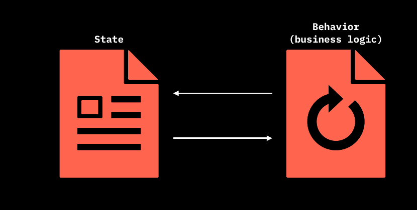
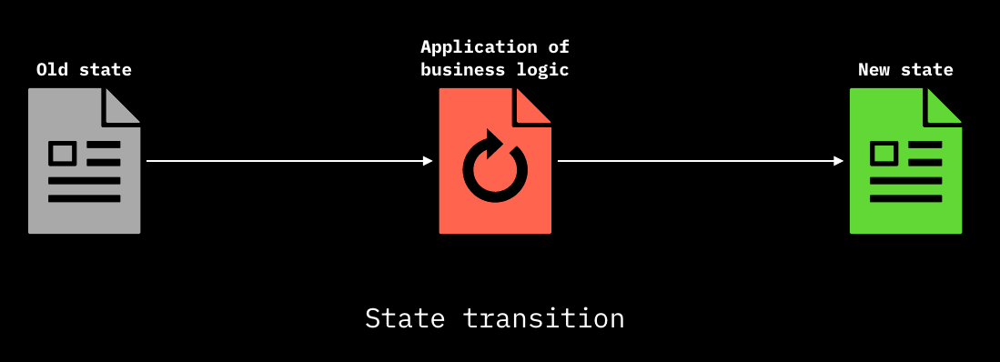
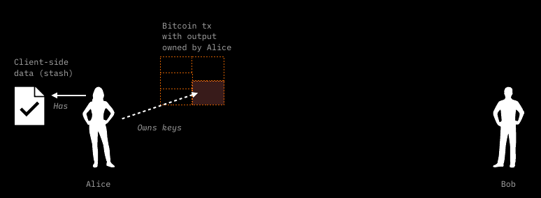
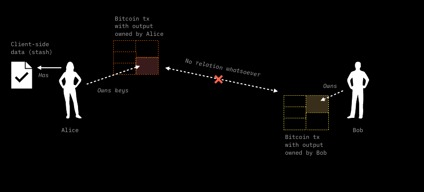
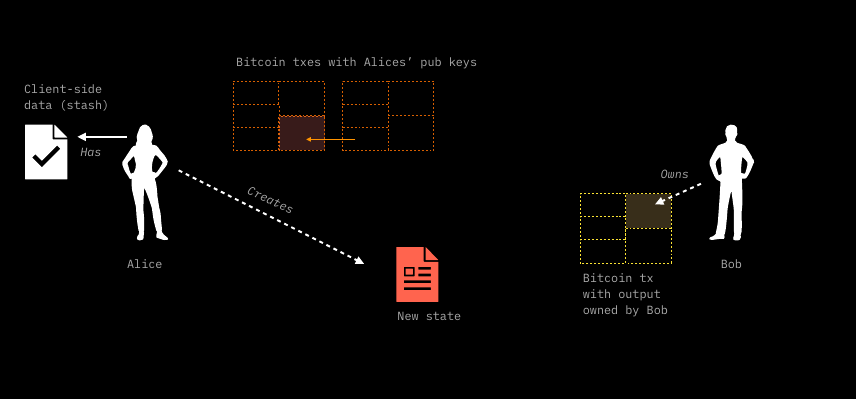
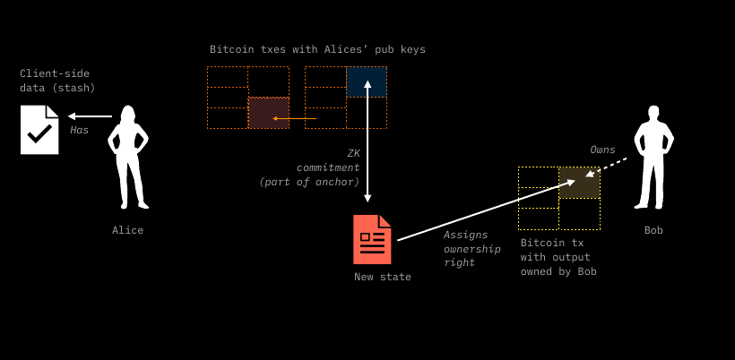
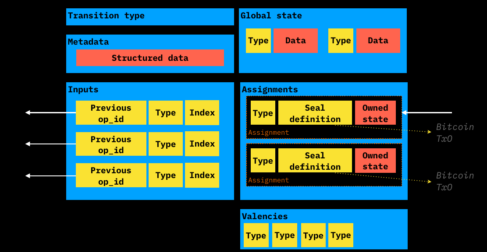

# State Transitions

Before addressing the technical implementation of **states** and their related data structure, it is important to recall that the **ordered sequence of seal definition and the following seal closure**  is meant to provide the ability to implement properly the most important operation of the client-side validated domain: **State Transition**.   
In the following paragraphs, after a brief introduction to **smart contracts** and **state**  we will devote our attention to the mechanism behind **State Transitions** from the the Client-side perspective and the related *point of contacts* which tether such operation with the Bitcoin Blockchain commitments discussed in the [Client-side Validation with Bitcoin](csv-w-btc.md) section.  

## Smart Contracts

Since RGB allows for the implementation of **smart contracts** in Bitcoin, it's the right time to give a definition of what actually a smart contract is. 

> A smart contract is an agreement which is automatically enforced between parties

This means that the enforcement of the conditions agreed between the parties **does not require human intervention** and that such enforcement is done by mathematics and computing means. 

In addition to that, a question arises. In order to achieve the highest degree of automatization, decentralization and privacy it is possible to forfeit centralized registry storing contract ownership and information? The affirmative answer lie back at the origins.
 
 

Once upon a time contracts, for examples those of securities, where **bearer instruments**. Indeed, the generalized use of assets ledgers which in fact imply a custody relation with some institution controlling both the ledger and storing the contract on behalf of the client represents a quite recent development of economic history. **The bearer nature of contracts is in fact a centuries-old tradition.** This kind of philosophy is at the core of RGB architecture, as the bearer rights of each rightful party are contained in form of data inside the contract and they can be modified and enforced digitally, following the rule of the contract itself. 

In RGB design, a wider range of issues regarding programmability of smart contract have been taken into account, in particular:
1. A contract may be associated to a *digital asset* or a *token*, but it's **not limited to it**. A wider range of applications and extensions of the *smart contract* concept can be implemented in RGB. 
2. Differently from other public blockchain's approach to smart contracts, in **RGB there is a clear separation among the different parties related to a contract and the related rights**: e.g. the creator of the contract and the different kind of users interacting in some ways with the contract. This include in particular the differentiation between:
    * the possibility to *observe* some properties or operations performed by other parties over the contract
    * the possibility to *perform a set of operations* permitted by the contract

**No other counterpart can interact or even observe** the operation performed on the contract, if not allowed by the authorized parties. Inside RGB this characteristics means that there is always an **owner** which is a party which possesses the right to perform some operation on the contract, which are defined by the contract itself. 

These combined properties allow for the achievement of 2 among the most important properties at the core of RGB value proposition which are: **scalability** and **censorship resistance** at unprecedented levels.

In order to achieve this goals, a RGB contract is composed by 2 main components:
* **State**
* **Business Logic (Behavior)** 

In fact the Business Logic of the contract represent the rules that allows the entitled party (the owner) to change the state of the contract.

## Introduction to Contract States

At this point a first de[State]() is required, without going into the specific implementation details of RGB which will be covered later. Simply put:

> A State can be defined as a unique configuration of information / data that represents the conditions of a contract in some precise moment in time.

Thus a State Transition, in general terms, represents any **update of data** from an **old state** to a **new state** following the **rules inscribed into the contract** constituting its **Business Logic**. 

The chain of state transitions is the ordered path that make contract data evolve from the very **first contract definition**, called the [**Genesis**]() up to the [**Terminal State**]() representing the most updated state at the tip of the [DAG](terminology/glossary.md#directed-acyclic-graph---dag) of state transitions.

The order relation among the state transitions in maintained thanks to the commitments that anchors the client-side validated data to the Bitcoin Blockchain which, in turn, provide, timestamping and **source of ordering**.

## State Transition 

The approach followed in this paragraph is the same as the one developed in the [TxO2 Client-side Validation](/csv-w-btc.md#txo2-client-side-validation) using our beloved cryptographic characters Alice and Bob. This time the explanation contains an important difference: this time Bob is not simply validating the client-side validated data that Alice shows him. He is effectively asking Alice to add some additional data which **will give Bob some degree of ownership** over the contract expressed as a hidden reference to one of his bitcoin UTxO. Let's see how the process works in practice.

Alice has a [stash]() of client side validated data, which themselves reference to some Bitcoin UTXO owned by her. This means that in her client-side validate data there is a **seal definition** pointing to one of her UTXOs. 

Bob, in turn, possesses some unspent UTXO as well. This UTXO is completely unrelated to Alice's meaning that there is no direct spending event between them. 

<!---

-->

Bob, trough some information data, encoded in an **[invoice]()**, instruct Alice to create a **New state** which follows the contract rules and which embed a **new seal definition** which points to the his UTXO in a concealed form. This way Alice is assigning Bob **some ownership** of the new state (e.g. the property of a certain amount of tokens). 

After that, Alice using some [PSBT]() wallet tool, prepares a transaction which spend the UTXO which were pointed by the previous seal definition (the one that passes the ownership to her). This transaction, which is a **witness (seal closing) transaction**,  embeds in his output a commitment to the new state data which uses [Opret](/csv-w-btc.md#opret) or [Tapret](/csv-w-btc.md#tapret) rules depending on the method chosen. As explained previously, the Opret or Tapret commitment derive from a [MPC](/csv-w-btc.md#mpc-tree-construction) tree which can collect more than one contract's state transition. 

Before broadcasting the transaction prepared in this way she passes to Bob a package of data called [consignement]() which contain the stash of client side validated already in possession of alice in addition to the new state.

After checking the correctness of the consignement Bob can give "green light" (for example by means of GPG signing) to Alice to let her broadcast the transaction. When confirmed, the **witness (seal closing) transaction** represent the conclusion of the state transition from Alice to Bob. 

## Transition Bundle 

## Transitions Type

In order to describe each component of the RGB state, in the diagram above is represented the complete block layout of an arbitrary type [state transition] which can be one out of 3 **Transition Types**:

* **Genesis**
* **State Transition**
* **State Extension**

## RGB State

The state represent a set of conditions which are expressed in form of data and which are embedded in the contract itself.

In RGB, this set of data is actually a **set of arbitrary rich data** which:
* are **strongly typed**, which means that **each variable possesses a clear type definition (e.g. u8) and both lower and upped bounds**.
* can be **nested**, meaning that a type can be constructed from other types 
* can be organized in `lists` `sets` or `maps`

An additional element is that the contract states are constructed in order to be **atomic** so that their **ownership** is always a well defined property, which is **reflected in the ownership of the UTxO** embedded in the seal definition.

## Components of State in Transitions

The **State**, which is actually the ** New updated State** enforced by a State Transition is constituted by the following components:

* **Assignements** in which are defined:
  * Seals
  * Owned State 
* **Global State**
* **Metadata**
* **Valencies**

The **Old State** is referenced through:
* **Inputs**
* **Redeems** which are a reference to previously defined Valencies

#### Assignements

##### Seals

##### Owned States

#### Global State

#### Metadata

#### Valencies

#### Inputs 

#### Redeems

### Features of RGB State

### Strict Type System

In order to properly encode data into the state in a reproducible way a [Strict Type System](https://www.strict-types.org/) together with [Strict Encoding]() has been adopted in RGB. This means that:
* The encoding of the data is done according to a precise [schema](#terminilogy/glossary.md#schema) which, unlike JSON or YAML, define a precise structure and layout of the data thus allowing also for deterministic ordering of each data element herein.
* The ordering of the elements inside every collection of elemets (i.e. in lists, sets or maps) is deterministic as well.
* Bounduaries (lower and higher) are defined for every variable and for the number of element in a collection (the so called **Confinement**).
* All data field are byte-alligned.
* The serialization and hashing of the data is performed in a deterministic way (Strict Encoding) allowing for creating **reproducible commitments** of the data irrespective of the system on which such operation is performed.
* The creation of the data according to the schema is **performed through a simple description language which compile in Binary form** from Rust Language. In the future extension to other languages will be supported.
* Additionally, the compiling according to the Strict Type System produces 2 types of outputs:
  * A **Memory Layout at compile time**
  * **Associated Semantic identifiers** to the memory layout (i.e. commitment to each field's name of the data)  
   For instance, this kind of construction is able to make detectable the change of a single variable name, which **doesn't change the memory layout** but which **do change the semantics**.
* Finally, Strict Type System allows for **versioning** of the compilation schema, thus enabling the tracking of consensus changes in contracts and in the compilation engine.
  
In order to have a visual comparison of Strict Encoding with other data structure systems and programming language, the following picture can be useful:

As a matter of fact Strict Encoding is defined in both an extremely pure functional level (thus very far away from Oriented Object Programming (OOP) philosophy) and at a very low level (nearly hardware definition, so far away from more abstract structures and languages).

### Size limitation

The RGB protocol consensus rule apply a **maximum size limit** of 2^16 bite (64kB):
* To the size of **any data type** (e.g. a maximum of 65536 x `u8`, 32768 x `u16`, etc...) 
* To the **number of elements of each collection**, including the collection which represent the state itself (**?**)
This has been designed in order to:
* Avoid unlimited growth of the client side-validate data per each state transition.
* Ensures that this size fits the size of the register of a particular virtual machine [AluVM]() which is capable of complex validation purposes working alonside RGB.

