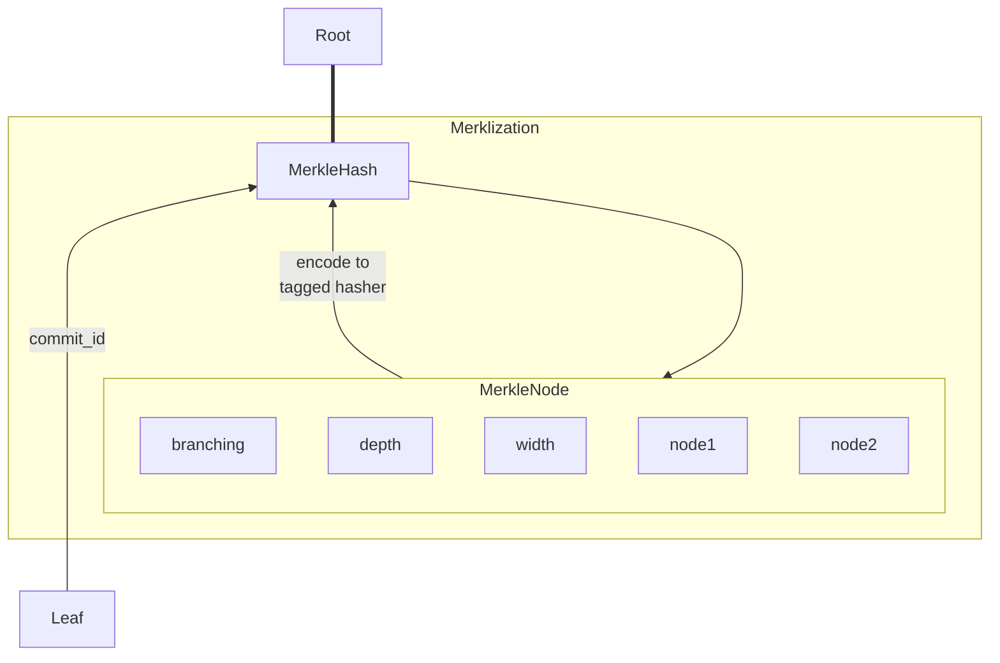

# testpage1

Before Text ...

<figure><figcaption>
RGB contract shard
</figcaption></figure>

After text

```mermaid
flowchart BT
    subgraph Merklization
        direction LR
        subgraph MerkleNode
            branching
            depth
            width
            node1
            node2
        end
        MerkleNode -- encode to\ntagged hasher --> MerkleHash
    end
    MerkleHash ---> MerkleNode
    MerkleHash === Root
    Leaf -- commit_id ----> MerkleHash
```

